<!--
  README.md is GENERATED from readme_src/*.md by scripts/build_readme.py.
  Edit the section files, not this file. Figures are generated by
  scripts/generate_diagrams.py. Do not hand-edit images.
-->

<div align="center">

# 💧 SMART WATER MONITORING & PURIFICATION SYSTEM

### A rugged, traceable, offline-first, renewable-powered water-quality monitoring and diagnostic platform for remote, rural, mining-affected and infrastructure-limited regions


<sub><i>Concept render (AI-generated illustration) for communication only. It is not a photograph of built hardware and does not show a tested design.</i></sub>

<br/>

`RUGGED` · `TRACEABLE` · `OFFLINE-FIRST` · `TAMPER-RESISTANT` · `ENERGY-AWARE` · `RENEWABLE-POWERED` · `SIMPLE TO OPERATE` · `MODULAR` · `TESTABLE` · `SCALABLE`

<br/>

| Project stage | Firmware | Edge | Cloud | Dashboard | Debugger | Power | Test suite |
|:---:|:---:|:---:|:---:|:---:|:---:|:---:|:---:|
| **PROTOTYPE** | ESP32 / C++ | Raspberry Pi / Python 3.11+ | Firebase | Web (React + TS) | Web + CLI | Solar + Wind hybrid | pytest · Unity · Playwright |

</div>

---

> [!IMPORTANT]
> **Honest status statement.** This repository documents a **prototype** that is designed so it can grow into a field deployment. It is **not** certified to any industrial, electrical-safety, EMC, ingress-protection (IP), drinking-water or cybersecurity standard. No IP rating, "military-grade" rating or regulatory compliance is claimed. Electrical ratings that have not been decided are marked **`TBD / CONFIGURABLE`**. Figures marked **SIMULATED** come from deterministic simulators in this repository, **not** from field measurements.

> [!WARNING]
> **Measurement scope.** The system measures **water-quality parameters**: pH, turbidity, TDS, EC and temperature. It does **not** chemically identify contaminants. pH, TDS, EC and turbidity **cannot** detect arsenic, lead, mercury, fluoride, nitrate, pesticides or pathogens. Screening for a specific contaminant needs a **dedicated detection or screening subsystem** (for example a field test kit, a colorimetric or electrochemical analyser, or laboratory analysis). The architecture has a place for one (see [§ 9.6](#96-dedicated-contaminant-screening-subsystem-optional-separate)), but the prototype does not include one.

---

## 📑 Table of Contents

<details open>
<summary><b>Part A: Understanding the system</b></summary>

1. [Problem Statement](#1-problem-statement)
2. [Solution Overview](#2-solution-overview)
3. [Engineering Principles & Honest Claims Policy](#3-engineering-principles--honest-claims-policy)
4. [System Architecture](#4-system-architecture)
5. [Data Flow](#5-data-flow)
6. [Power Flow & Hybrid Renewable Architecture](#6-power-flow--hybrid-renewable-architecture)
7. [Communication Architecture](#7-communication-architecture)
8. [Hardware Architecture](#8-hardware-architecture)
9. [Industrial & Environmental Design](#9-industrial--environmental-design)

</details>

<details open>
<summary><b>Part B: Data, verification and trust</b></summary>

10. [Raw Data Model: Preserve Everything](#10-raw-data-model-preserve-everything)
11. [Raspberry Pi: Trusted Edge Layer](#11-raspberry-pi-trusted-edge-layer)
12. [Data Verification Engine](#12-data-verification-engine)
13. [Data Integrity & Tamper Resistance](#13-data-integrity--tamper-resistance)
14. [Operating Modes](#14-operating-modes)
15. [Offline-First Operation](#15-offline-first-operation)
16. [Firebase Cloud Design](#16-firebase-cloud-design)
17. [Security](#17-security)

</details>

<details open>
<summary><b>Part C: User interfaces</b></summary>

18. [Industrial Engineer Dashboard](#18-industrial-engineer-dashboard)
19. [Industrial Debugger](#19-industrial-debugger)

</details>

<details open>
<summary><b>Part D: Energy</b></summary>

20. [Weather-Resilient Energy Management](#20-weather-resilient-energy-management)
21. [Power Monitoring](#21-power-monitoring)
22. [Power Failover & Load Priority](#22-power-failover--load-priority)

</details>

<details open>
<summary><b>Part E: Repositories and the 17-phase build</b></summary>

23. [Repository Structure (8 repositories)](#23-repository-structure-8-repositories)
24. [Development Method: 17 Phases](#24-development-method-17-phases)
25. [Phase 1: Repository Architecture](#phase-1-repository-architecture)
26. [Phase 2: ESP32 Sensor Acquisition](#phase-2-esp32-sensor-acquisition)
27. [Phase 3: ESP32 → Raspberry Pi Communication](#phase-3-esp32--raspberry-pi-communication)
28. [Phase 4: Raspberry Pi Raw-Data Storage](#phase-4-raspberry-pi-raw-data-storage)
29. [Phase 5: Verification Engine](#phase-5-verification-engine)
30. [Phase 6: Offline Queue](#phase-6-offline-queue)
31. [Phase 7: Firebase Synchronisation](#phase-7-firebase-synchronisation)
32. [Phase 8: Dashboard](#phase-8-dashboard)
33. [Phase 9: Industrial Debugger](#phase-9-industrial-debugger)
34. [Phase 10: Solar Power Subsystem](#phase-10-solar-power-subsystem)
35. [Phase 11: Wind Power Subsystem](#phase-11-wind-power-subsystem)
36. [Phase 12: Hybrid Energy Management](#phase-12-hybrid-energy-management)
37. [Phase 13: Battery Backup](#phase-13-battery-backup)
38. [Phase 14: Operating Modes](#phase-14-operating-modes)
39. [Phase 15: Full System Integration](#phase-15-full-system-integration)
40. [Phase 16: Testing](#phase-16-testing)
41. [Phase 17: Documentation](#phase-17-documentation)

</details>

<details open>
<summary><b>Part F: Field operations</b></summary>

42. [Verified Sensor Deployment](#42-verified-sensor-deployment)
43. [Calibration Procedures](#43-calibration-procedures)
44. [Maintenance](#44-maintenance)
45. [Troubleshooting Guide](#45-troubleshooting-guide)
46. [Comprehensive Test Plan](#46-comprehensive-test-plan)

</details>

<details open>
<summary><b>Part G: Honest assessment and the road ahead</b></summary>

47. [Prototype vs Future Industrial Capability](#47-prototype-vs-future-industrial-capability)
48. [Limitations](#48-limitations)
49. [Risk Register](#49-risk-register)
50. [Future Scalability](#50-future-scalability)
51. [Figure Generation (Python)](#51-figure-generation-python)
52. [Contributing, Git Workflow & Commit Conventions](#52-contributing-git-workflow--commit-conventions)
53. [Glossary](#53-glossary)
54. [Appendices](#54-appendices)
55. [License & Acknowledgements](#55-license--acknowledgements)

</details>

---

## 🔗 Subsystem Repositories

| # | Repository | Responsibility | Primary language | Status |
|:-:|---|---|---|---|
| 1 | [`smart-water-main`](https://github.com/YOUR-ORG/smart-water-main) | Architecture, documentation, shared schemas, repository links (**this repo**) | Markdown, Python (figures) | Prototype |
| 2 | [`smart-water-esp32`](https://github.com/YOUR-ORG/smart-water-esp32) | Field-node firmware: acquisition, calibration, modes, health, local alerts | C++ (Arduino core / PlatformIO) | Prototype |
| 3 | [`smart-water-raspberry-pi`](https://github.com/YOUR-ORG/smart-water-raspberry-pi) | Edge gateway: receiver, validator, storage, sync, diagnostics | Python 3.11+ | Prototype |
| 4 | [`smart-water-dashboard`](https://github.com/YOUR-ORG/smart-water-dashboard) | Engineer dashboard (simple, read-mostly UI) | TypeScript / React | Prototype |
| 5 | [`smart-water-debugger`](https://github.com/YOUR-ORG/smart-water-debugger) | Industrial service and diagnostic tool (web + CLI) | TypeScript, Python CLI | Prototype |
| 6 | [`smart-water-firebase`](https://github.com/YOUR-ORG/smart-water-firebase) | Firestore rules, indexes, Cloud Functions, emulator tests | TypeScript | Prototype |
| 7 | [`smart-water-power`](https://github.com/YOUR-ORG/smart-water-power) | Hybrid power management logic, power telemetry, models | C++ / Python | Prototype |
| 8 | [`smart-water-testing`](https://github.com/YOUR-ORG/smart-water-testing) | Integration, HIL, end-to-end and security tests; test reports | Python, TypeScript | Prototype |

> Replace `YOUR-ORG` with your GitHub organisation. A machine-readable copy is in [`repository-links.md`](repository-links.md).

---

## ⚡ Quick Start (documentation build)

```bash
git clone https://github.com/YOUR-ORG/smart-water-main.git
cd smart-water-main
python3 -m venv .venv && source .venv/bin/activate
pip install -r requirements-docs.txt          # matplotlib, numpy, pytest

# 1. Run the reference verification-engine tests
python -m pytest -q reference/tests

# 2. Regenerate every figure in diagrams/
python scripts/generate_diagrams.py

# 3. Rebuild this README from readme_src/
python scripts/build_readme.py
```

Expected output:

```text
..................                                                       [100%]
18 passed in 0.13s
Generating diagrams -> .../smart-water-main/diagrams
  wrote diagrams/01_system_architecture.png
  ...
  wrote diagrams/26_scaling_write_volume.png
done.
README.md written (N lines)
```

---

## 🧭 System at a Glance

```text
              ☀ SOLAR
                 │
                 ▼
           ┌─────────────┐
           │             │
           │   HYBRID    │◄──── 🌬 WIND
           │    POWER    │
           │ MANAGEMENT  │
           └──────┬──────┘
                  │
                  ▼
              🔋 BATTERY
                  │
       ┌──────────┴──────────┐
       │                     │
       ▼                     ▼
 ESP32 SENSOR NODE      RASPBERRY PI
       │                     │
       │  RAW DATA           │
       └──────────┬──────────┘
                  │
                  ▼
          DATA VERIFICATION
                  │
                  ▼
            LOCAL STORAGE
                  │
                  ▼
              FIREBASE
                  │
                  ▼
        INDUSTRIAL DASHBOARD
                  │
                  ▼
          ON-SITE ENGINEER

 Alongside:  INDUSTRIAL DEBUGGER
             → Sensor diagnostics
             → Node diagnostics
             → Communication diagnostics
             → Data verification diagnostics
             → Power diagnostics
             → Maintenance diagnostics
```

---

# PART A: UNDERSTANDING THE SYSTEM

## 1. Problem Statement

### 1.1 Context

Communities in remote, rural and mining-affected regions often rely on groundwater, open wells, hand pumps, storage tanks or surface streams. In these places:

- **Water-quality changes can go unnoticed** for days or weeks. Sampling is manual, infrequent and depends on someone travelling to site.
- **Grid power is unreliable or missing.** Monitoring equipment that needs mains power is impractical.
- **Connectivity is intermittent.** Cellular coverage may be weak, congested or absent for hours.
- **Maintenance visits are rare.** Equipment must keep running, and report its own health, between visits.
- **Data is hard to trust.** Paper logs and single "SAFE / UNSAFE" indicators can't be audited, can't show *why* a decision was made, and can be edited after the fact.
- **Mining activity** can change water chemistry, for example through acid mine drainage that affects pH and dissolved solids, and through suspended sediment that affects turbidity. Changes in these general parameters can be an *early indication* that a more specific investigation is needed.

### 1.2 What goes wrong with typical student IoT prototypes

| Typical prototype behaviour | Field consequence |
|---|---|
| Sends data straight to the cloud and stores nothing locally | Every connectivity outage loses data permanently |
| Stores only "SAFE / UNSAFE" | No traceability; the decision can't be re-evaluated when thresholds change |
| Uses hard-coded thresholds of unknown origin | Wrong decisions presented with false confidence |
| Claims that TDS/pH "detects arsenic" | Scientifically false and potentially dangerous |
| Lets anyone edit the database | Records can be falsified with no trace |
| Assumes a USB power bank or mains supply | Stops working after hours or days in the field |
| No self-diagnostics | A disconnected sensor reports a plausible-looking constant value for weeks |
| Breadboard in a plastic lunch box | Corrosion, condensation and loose wires within weeks outdoors |

### 1.3 Problem definition

> **Design a monitoring platform that continuously collects water-quality parameter data from verified sensors, keeps every raw reading traceably, checks every reading against documented rules, keeps working without the internet or the grid, reports its own health, and gives an on-site engineer a simple, trustworthy view, without making claims the hardware can't support.**

### 1.4 Stakeholders

| Stakeholder | Needs | How the system serves them |
|---|---|---|
| On-site engineer / technician | Clear current state; what to do next; alerts that can be trusted | Simple dashboard, local buzzer/LED alerts, guided maintenance actions |
| Service engineer | Deep diagnostics without guesswork | Separate industrial debugger |
| Supervisor / programme manager | Historical, auditable records across sites | Firebase history, audit log, exports |
| Community / water users | Early warning that the water needs further investigation | Local alert; escalation path to authorities (process, not automated diagnosis) |
| Administrator | Control over configuration and access | Role-based access, audited configuration changes |
| Researchers / auditors | Trustworthy raw data | Raw values preserved, hash-chained, verification reasons stored |

### 1.5 Scope

| In scope (prototype) | Out of scope (prototype) |
|---|---|
| pH, turbidity, TDS, EC, temperature monitoring | Chemical identification of specific contaminants |
| Rule-based verification of data quality | Declaring water "potable" or "certified safe" |
| Offline storage and later synchronisation | Real-time guaranteed delivery over cellular |
| Solar + wind hybrid charging into one battery | Guaranteed operation in every weather condition |
| Engineer dashboard and service debugger | Consumer mobile app |
| Local audible/visual alerts | Automatic shut-off of community water supply (future, needs a safety review) |
| Purification-stage *monitoring hooks* (e.g. pre/post filter readings) | Design of a certified purification plant |

> **About "Purification" in the project name.** The platform monitors water around a purification stage, for example with sensor sets before and after a filter, and exposes a low-priority load channel (P4) for purification auxiliaries such as a small pump or UV-lamp controller. It does **not** claim to make water potable. Any purification hardware must be specified, validated and approved separately.

---

## 2. Solution Overview

### 2.1 Core concept

```text
WATER SOURCE
    ↓
VERIFIED SENSORS            pH · Turbidity · TDS · EC · Temperature
    ↓
ESP32 FIELD NODE            acquisition, calibration, node health, modes, local alert
    ↓
RAW SENSOR DATA             JSON frame: node_id, sensor_ids, timestamp, seq, raw values
    ↓
RASPBERRY PI EDGE GATEWAY   receiver, timestamping, schema check
    ↓
DATA VALIDATION + LOCAL STORAGE   verification engine, append-only SQLite, outbox queue
    ↓
FIREBASE CLOUD              Auth, Firestore, Security Rules, Cloud Functions
    ↓
ENGINEER DASHBOARD          simple UI  (+ separate INDUSTRIAL DEBUGGER)
```

### 2.2 Power concept

```text
SOLAR ENERGY  +  WIND ENERGY
        ↓
HYBRID RENEWABLE POWER MANAGEMENT
        ↓
BATTERY STORAGE
        ↓
ESP32 + SENSORS + RASPBERRY PI + COMMUNICATION
```

### 2.3 Key capabilities

| # | Capability | Summary | Section |
|:-:|---|---|---|
| 1 | Verified deployment | 12-gate commissioning checklist before a node is marked `DEPLOYED / VERIFIED` | [§42](#42-verified-sensor-deployment) |
| 2 | Raw-first data | Original readings stored unchanged, with IDs, timestamps, mode, power and comms status | [§10](#10-raw-data-model-preserve-everything) |
| 3 | Documented verification | 19 rule IDs across 11 rule families; every result records *which* rule fired and *why* | [§12](#12-data-verification-engine) |
| 4 | Tamper resistance | Append-only tables, hash chain, role-based access, correction-by-audit-event | [§13](#13-data-integrity--tamper-resistance) |
| 5 | Offline-first | Local queue, idempotent sync, deterministic record IDs; no duplicates | [§15](#15-offline-first-operation) |
| 6 | Three operating modes | NORMAL (~5 min), LOW-POWER/BURST, EMERGENCY (high rate, local-first) | [§14](#14-operating-modes) |
| 7 | Hybrid renewable power | Solar and wind, each through its own controller, into a shared battery | [§6](#6-power-flow--hybrid-renewable-architecture) |
| 8 | Energy awareness | Measured V/I per source, load-priority shedding, hysteresis-based mode switching | [§22](#22-power-failover--load-priority) |
| 9 | Simple dashboard | Five tabs: Live, Nodes, Power, Alerts, History | [§18](#18-industrial-engineer-dashboard) |
| 10 | Industrial debugger | Service tool with sensor/node/edge/comms/power/verification panels and exportable diagnostic reports | [§19](#19-industrial-debugger) |
| 11 | Testability | Every test case written as INPUT → PROCESS → EXPECTED → ACTUAL → PASS/FAIL | [§46](#46-comprehensive-test-plan) |

### 2.4 What makes this "field-grade" rather than "demo-grade"

| Concern | Demo-grade approach | This project's approach |
|---|---|---|
| Data loss on outage | Accepted | Designed out: local append-only store plus outbox |
| Trust in data | Implicit | Explicit: every record carries a verification result and a reason |
| Editing history | Possible | Blocked by Security Rules and DB triggers; corrections are audit events |
| Sensor failure | Silent | Detected: missing, out-of-range, stuck and inconsistent rules |
| Power | Assumed | Measured, budgeted, prioritised, mode-switched |
| Clock | Assumed correct | Validated: skew, monotonicity, RTC/NTP/GSM time sources |
| Configuration | Hard-coded | Versioned config files; thresholds `TBD / CONFIGURABLE` |
| Claims | Aspirational | Bounded: explicit limitations section and SIMULATED labels |

---

## 3. Engineering Principles & Honest Claims Policy

### 3.1 Ten engineering principles

1. **Raw data is sacred.** Never overwrite, never delete, never "clean" a raw reading in place.
2. **Verification is classification, not truth.** The engine classifies readings against documented rules. It does not decide whether a chemical measurement is scientifically "true".
3. **Every rule is documented.** A rule that isn't in the [Rule Catalogue](#124-verification-rule-catalogue) doesn't exist in code.
4. **No invented thresholds.** Water-quality attention bands are disabled by default and must come from a verified source or an explicit project decision, recorded in configuration with its source.
5. **Offline is the normal case.** Cloud connectivity is a bonus, not a dependency.
6. **Local safety first.** Emergency alerts must work with no internet.
7. **Measure, don't assume.** Power generation comes from voltage and current sensors, never inferred from the weather.
8. **Least privilege.** Engineers can view and acknowledge. They can't rewrite history.
9. **Configurable, not hard-coded.** Every electrical rating, interval and threshold lives in configuration.
10. **Test before you claim.** A capability is "supported" only when a documented test passes.

### 3.2 Claims policy

| ❌ Never write | ✅ Write instead |
|---|---|
| "Detects arsenic / heavy metals" | "Monitors water-quality parameters; contaminant screening requires a dedicated detection method" |
| "Water is SAFE" | "All configured parameters within configured bands; verification PASSED" |
| "IP67 waterproof" | "Designed for outdoor use with gasketed enclosure; ingress rating **not tested**" |
| "Military-grade security" | "Reasonable security practices: authentication, RBAC, TLS where supported, audit logging" |
| "Works in all weather" | "Designed to improve energy availability under variable weather; operation depends on measured generation and battery reserve" |
| "Industrial certified" | "Prototype; certification path described in §47" |
| "Battery lasts 30 days" | "Autonomy = usable capacity ÷ average load; both `TBD / CONFIGURABLE`, measured during Phase 13" |
| "Toxic level: TDS > X" | "ABN-001 attention band for TDS: `TBD / CONFIGURABLE`, source: ________" |

### 3.3 Terminology used in this document

| Term | Meaning in this project |
|---|---|
| **Water-quality parameter monitoring** | Continuous measurement of pH, turbidity, TDS, EC and temperature |
| **Verification** | Applying documented data-quality rules to a raw reading and recording the outcome |
| **Screening** | A dedicated, separate method aimed at a specific contaminant (not part of the core sensor set) |
| **Attention band** | Project-configured range outside which a reading is flagged `ABNORMAL` for human follow-up. It is not a safety verdict |
| **Sensor operating range** | The range the sensor hardware can physically report (from its datasheet). Values outside it suggest a sensor fault |
| **Prototype** | Built and tested at bench or pilot scale; not certified |
| **Industrial deployment capability** | A future target that needs further engineering, testing and certification |
| **`TBD / CONFIGURABLE`** | A value not decided yet; must be set in configuration before deployment |

---

## 4. System Architecture

### 4.1 Architecture diagram

<p align="center">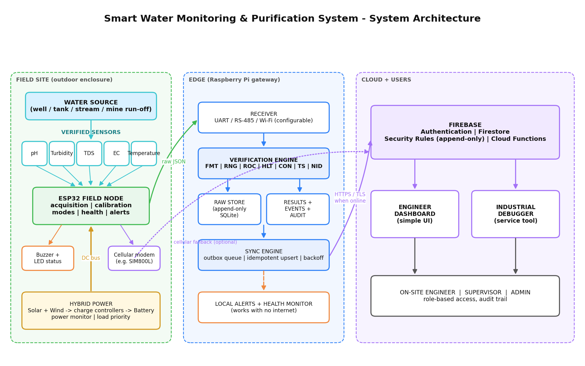</p>

<sub>Figure 4.1: Generated by <code>scripts/generate_diagrams.py → fig_system_architecture()</code>.</sub>

### 4.2 Layered view

```text
┌───────────────────────────────────────────────────────────────────────────────┐
│ L6  PRESENTATION   Engineer Dashboard (simple)  │  Industrial Debugger (deep) │
├───────────────────────────────────────────────────────────────────────────────┤
│ L5  CLOUD          Firebase Auth · Firestore · Security Rules · Functions     │
├───────────────────────────────────────────────────────────────────────────────┤
│ L4  SYNC           Outbox queue · idempotent upsert · exponential backoff     │
├───────────────────────────────────────────────────────────────────────────────┤
│ L3  EDGE TRUST     Receiver · Verification Engine · Append-only store · Audit │
├───────────────────────────────────────────────────────────────────────────────┤
│ L2  FIELD NODE     ESP32: acquisition · calibration · modes · health · alerts │
├───────────────────────────────────────────────────────────────────────────────┤
│ L1  SENSING        pH · Turbidity · TDS · EC · Temperature  (+ optional       │
│                    dedicated screening subsystem, separate)                   │
├───────────────────────────────────────────────────────────────────────────────┤
│ L0  ENERGY         Solar + Wind → controllers → Battery → protected load bus  │
└───────────────────────────────────────────────────────────────────────────────┘
```

### 4.3 Responsibility matrix

| Function | ESP32 node | Raspberry Pi edge | Firebase | Dashboard | Debugger |
|---|:-:|:-:|:-:|:-:|:-:|
| Read sensors | **R** | | | | |
| Apply calibration coefficients | **R** | V | | | V |
| Generate record ID & sequence | **R** | V | | | |
| Local buzzer/LED alert | **R** | C | | | |
| Timestamp on receipt | | **R** | | | |
| Schema / format validation | basic | **R** | rules | | |
| Verification engine | | **R** | | view | view |
| Raw storage (authoritative) | ring buffer | **R** | replica | | |
| Offline queue | ring buffer | **R** | | | view |
| Cloud persistence | | | **R** | | |
| Access control | | local | **R** | enforced | enforced |
| Power telemetry | **R** (measure) | aggregate | store | view | view |
| Mode decision | **R** | advise | | view | view |
| Audit log | | **R** (local) | **R** (cloud) | view | view |

*R = responsible, V = verifies, C = contributes.*

### 4.4 Why both an ESP32 and a Raspberry Pi?

| Aspect | ESP32 | Raspberry Pi |
|---|---|---|
| Role | Real-time field I/O, deep sleep, deterministic sampling | Trusted processing, storage, sync, diagnostics |
| Power profile | Very low in deep sleep (measure on your board) | Much higher; can't practically deep-sleep like an MCU |
| Storage | Small flash; ring buffer only | SD/SSD; database-scale storage |
| OS | Bare-metal / FreeRTOS | Linux (systemd services) |
| Failure isolation | Keeps sensing and local alerting if the Pi is down | Keeps storing and verifying if the cloud is down |
| Update frequency | Rare (OTA with care) | More frequent (packages, services) |

The split means that a failure at any single layer doesn't stop sensing:

```text
Cloud down   → Pi stores + queues          → no data loss
Pi down      → ESP32 ring-buffers + alerts → bounded data loss protection
Modem down   → Pi stores + queues          → no data loss
Grid absent  → hybrid renewables + battery → designed-for condition
Battery low  → LOW-POWER mode, load shedding (P3/P4 first)
```

### 4.5 Deployment topologies

| Topology | Description | When to use |
|---|---|---|
| **T1: Co-located** | ESP32 and Pi in the same enclosure, UART link | Single-site pilot (default prototype) |
| **T2: Star** | Several ESP32 nodes → one Pi gateway over RS-485 or Wi-Fi | Several sampling points within tens to hundreds of metres |
| **T3: Node-direct** | ESP32 + cellular modem → Firebase; no Pi | Very low-power sites; loses edge verification (the cloud function runs the same engine) |
| **T4: Hybrid** | T1/T2 with cellular fallback directly from the ESP32 | High-value sites where the Pi is a single point of failure |

> **Default for this project: T1, with T4's fallback path optional.**

### 4.6 Interfaces summary

| Interface | From → To | Physical | Protocol | Status |
|---|---|---|---|---|
| IF-01 | Sensors → ESP32 | Analog / 1-Wire / I²C (sensor dependent) | Electrical | `TBD / CONFIGURABLE` per sensor |
| IF-02 | ESP32 → Pi | UART (3.3 V TTL) or RS-485 transceiver | Framed JSON + CRC-16 | Prototype: UART |
| IF-03 | ESP32 → Modem | UART | AT commands | Optional |
| IF-04 | Pi → Firebase | Ethernet/Wi-Fi/cellular router or USB modem | HTTPS (TLS) via Firebase Admin SDK | Prototype |
| IF-05 | Power monitor → ESP32 | I²C | Register reads | `TBD / CONFIGURABLE` |
| IF-06 | ESP32 → Buzzer/LEDs | GPIO (via transistor driver) | Digital | Prototype |
| IF-07 | Dashboard → Firebase | Internet | HTTPS / WebSocket (Firestore SDK) | Prototype |
| IF-08 | Debugger → Pi | LAN / local Wi-Fi AP | HTTP (local API, token auth) | Prototype |

---

## 5. Data Flow

### 5.1 End-to-end pipeline

<p align="center">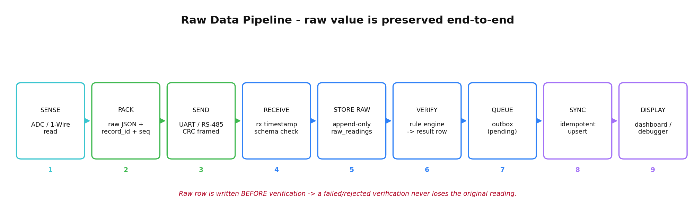</p>

<sub>Figure 5.1: Raw data pipeline. The raw row is committed before verification runs.</sub>

### 5.2 Step-by-step

| Step | Where | Action | Output | Failure handling |
|:-:|---|---|---|---|
| 1 | ESP32 | Read each sensor N times, median filter (N configurable) | Raw electrical/converted values | Missing sensor → field set to `null`, never a fake value |
| 2 | ESP32 | Apply stored calibration coefficients (version-tagged) | Engineering-unit values + `cal_version` | Missing calibration → `cal_state: "UNCALIBRATED"` flag |
| 3 | ESP32 | Build frame: IDs, device timestamp, `boot_id`, `seq`, mode, power, comms | Raw JSON | Buffered in RTC/flash ring buffer |
| 4 | ESP32 → Pi | Send framed JSON with CRC-16 | Bytes on the wire | No ACK → retry, then keep in ring buffer |
| 5 | Pi | Check CRC, parse JSON, stamp `received_ts` | Parsed message | Bad CRC → `frame_error` event, NACK |
| 6 | Pi | **INSERT raw row** (append-only) + `raw_sha256` + chain hash | `raw_readings` row | DB error → local file spool (last resort) |
| 7 | Pi | Run verification engine | `verification_results` row | Engine exception → `ENGINE_ERROR` event; raw is already safe |
| 8 | Pi | Raise events/alerts from results | `events` rows, buzzer command | Local alert works offline |
| 9 | Pi | Enqueue raw + result + events into `sync_outbox` | `PENDING` rows | — |
| 10 | Pi → Cloud | Sync engine batches, upserts by deterministic ID | Firestore docs | Backoff; stays `PENDING` |
| 11 | Cloud | Security Rules reject updates/deletes on raw and audit | Immutable replica | Rule violation → denied + logged |
| 12 | UI | Dashboard subscribes; debugger queries edge API | Views | Stale-data banner if last sync is too old |

### 5.3 Raw frame (wire format, schema v1)

```json
{
  "schema_version": 1,
  "record_id": "SWN-0001-00017-00004521",
  "node_id": "SWN-0001",
  "boot_id": 17,
  "seq": 4521,
  "sensor_ids": {
    "ph": "PH-01", "turbidity_ntu": "TU-01", "tds_ppm": "TD-01",
    "ec_us_cm": "EC-01", "temperature_c": "TP-01"
  },
  "timestamp": "2026-09-23T05:12:05Z",
  "time_source": "RTC",
  "mode": "NORMAL",
  "raw": {
    "ph": 7.214,
    "turbidity_ntu": 4.81,
    "tds_ppm": 212.4,
    "ec_us_cm": 426.1,
    "temperature_c": 26.42
  },
  "raw_electrical": {
    "ph_mv": 1412.0, "turbidity_mv": 3021.0, "tds_mv": 611.0, "ec_mv": 702.0
  },
  "cal_version": { "ph": "2026-09-01T10:00Z#3", "ec": "2026-09-01T10:20Z#2" },
  "power": {
    "battery_v": 12.84, "battery_state": "CHARGING", "source": "SOLAR",
    "solar_w": 7.3, "wind_w": 0.0, "load_w": 3.4
  },
  "comm": { "link": "UART", "modem": "REGISTERED", "rssi_csq": 17, "retries": 0 },
  "fw": "0.4.2+a1b2c3"
}
```

> **Why `raw_electrical`?** Keeping the pre-calibration electrical value (millivolts) alongside the engineering value means a later calibration correction can be *re-computed* from the original signal, and filed as an audit event, without touching the raw record.

### 5.4 Identifier strategy

| Identifier | Format | Generated by | Uniqueness guarantee |
|---|---|---|---|
| `node_id` | `SWN-NNNN` | Provisioning (admin) | Registry in Firebase `nodes/` |
| `sensor_id` | `<TYPE>-<NN>` + serial in registry | Provisioning | Registry per node |
| `boot_id` | uint, incremented and persisted in NVS on every boot | ESP32 | Monotonic per node |
| `seq` | uint32, reset on boot | ESP32 | Monotonic within a boot |
| `record_id` | `<node_id>-<boot_id:05d>-<seq:08d>` | ESP32 | Globally unique (node × boot × seq) |
| `result_id` | `<record_id>#v<engine_version>` | Pi | One result per record per engine version |
| `event_id` | UUIDv7 (time-ordered) | Pi | Random + time |
| `audit_id` | UUIDv7 | Pi / Cloud Function | Random + time |

Because the `record_id` is deterministic, **the same reading always maps to the same Firestore document**. A re-sent frame after a lost ACK, or a re-synced batch after a timeout, overwrites nothing and creates no duplicate. See [§15](#15-offline-first-operation).

### 5.5 Data retention (defaults, configurable)

| Store | Retention | Rationale |
|---|---|---|
| ESP32 ring buffer | Last N frames (N = `TBD / CONFIGURABLE`, flash-limited) | Survive a Pi outage |
| Pi `raw_readings` | Indefinite (rotate to archive files when storage > threshold) | Authoritative local record |
| Pi `sync_outbox` | Until ACKED + 7 days | Debugging sync issues |
| Pi log files | 30 days, rotated | Troubleshooting |
| Firestore `readings` | Indefinite (or export to cold storage) | Cloud history |
| Firestore `audit` | Indefinite | Traceability |

---

## 6. Power Flow & Hybrid Renewable Architecture

### 6.1 Architecture

<p align="center">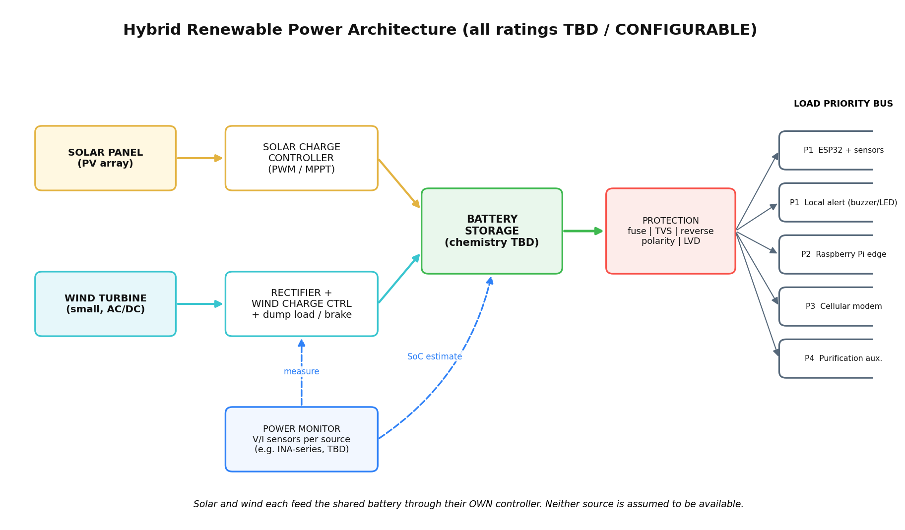</p>

<sub>Figure 6.1: Hybrid renewable power architecture. All ratings are <code>TBD / CONFIGURABLE</code>.</sub>

```text
SOLAR PANEL  ──►  SOLAR CHARGE CONTROLLER (PWM/MPPT)       ──┐
                                                             ├──►  BATTERY  ──►  PROTECTION  ──►  LOAD-PRIORITY BUS
WIND TURBINE ──►  RECTIFIER + WIND CHARGE CONTROLLER       ──┘                   (fuse, TVS,      P1 ESP32 + sensors
                  (+ dump load / brake for over-speed)                          reverse-pol.,     P1 Local alert
                                                                                 LVD)              P2 Raspberry Pi
                          POWER MONITOR (V/I per source, battery, load)                            P3 Cellular modem
                                                                                                   P4 Purification aux.
```

### 6.2 Design rules

1. **One controller per source.** Solar and wind have very different electrical behaviour. PV is a current-limited DC source; a small turbine gives variable-frequency AC (or wild DC) and must never be left open-circuit at high wind speed. Never connect a turbine to a solar-only controller.
2. **Common battery.** Both controllers charge the same battery. The controllers, battery chemistry and charge profiles must be compatible (for example the same absorption/float set-points). `TBD / CONFIGURABLE`.
3. **Wind over-speed protection.** The wind controller must provide a dump (diversion) load and/or electrical braking, and the turbine should support mechanical furling where available.
4. **Measured, not assumed.** Each source has its own voltage/current measurement. The system never *infers* generation from the weather.
5. **Low-voltage disconnect (LVD).** A hardware LVD protects the battery from deep discharge, independently of the firmware.
6. **Protection on every branch.** Fuses sized for the conductor, TVS diodes on long cable runs, reverse-polarity protection, and a common earth/bonding point.

### 6.3 Source availability scenarios

| # | Solar | Wind | Battery role | System behaviour |
|:-:|:-:|:-:|---|---|
| 1 | ✅ available | ❌ unavailable | Charges from solar surplus; supplies at night | NORMAL if SoC is healthy |
| 2 | ❌ unavailable | ✅ available | Charges from wind surplus | NORMAL if wind covers the load |
| 3 | ✅ available | ✅ available | Charges fastest | NORMAL; purification aux (P4) may be enabled |
| 4 | ❌ unavailable | ❌ unavailable | **Sole supply**: BATTERY → LOAD | NORMAL until `LOW_ENTER`, then LOW-POWER; CRITICAL sheds P2–P4 |

> **No source is assumed to always be available.** The four scenarios are tested explicitly (see [Power tests PW-01…PW-09](#466-power-tests)).

### 6.4 Illustrative 4-day behaviour (simulated)

<p align="center">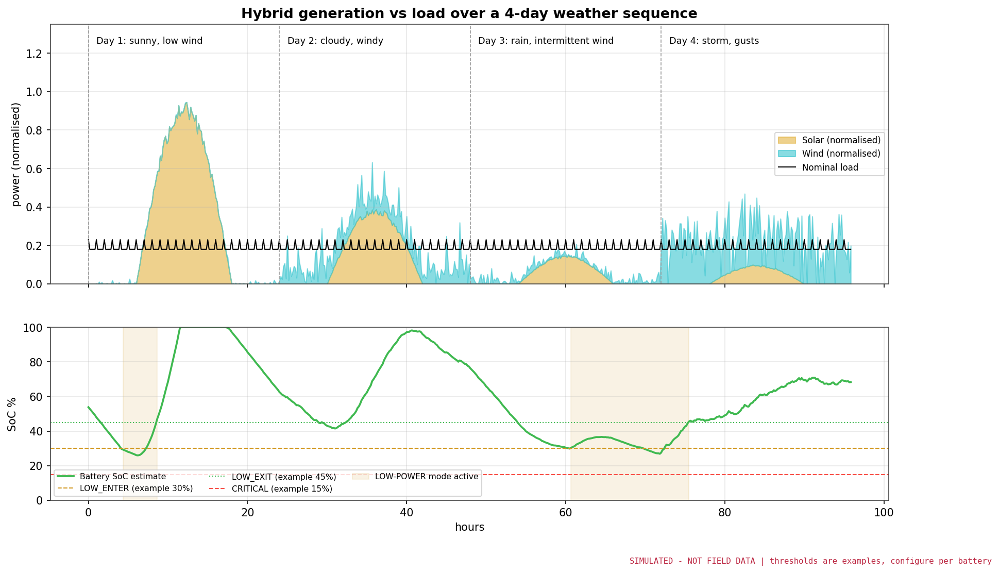</p>

<sub>Figure 6.2: SIMULATED four-day weather sequence (sunny → cloudy/windy → rain → storm), with an illustrative battery-state estimate and LOW-POWER mode activation. Units are normalised; thresholds are examples only.</sub>

<p align="center">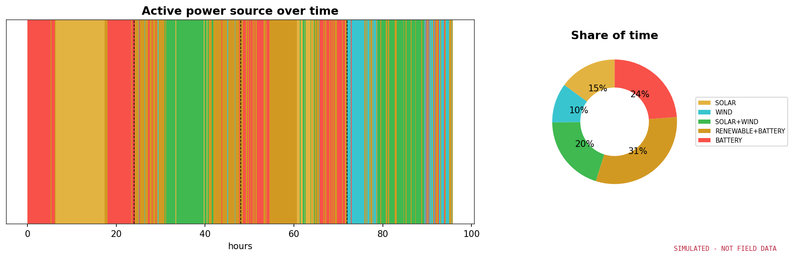</p>

<sub>Figure 6.3: SIMULATED active power source over time, and share of time per source.</sub>

**Reading these figures:**

- Day 1 (sunny, low wind): solar charges the battery during daylight; the battery carries the night.
- Day 2 (cloudy, windy): wind makes up for reduced solar and the battery stays healthy.
- Day 3 (rain, intermittent wind): generation often falls below load, so the battery discharges. If SoC falls below `LOW_ENTER`, LOW-POWER mode reduces load.
- Day 4 (storm): gusty wind contributes, but over-speed protection can brake the turbine, so wind generation drops to zero during the strongest gusts. This is why weather alone can't predict generation.

### 6.5 Energy budget template

> Fill this in with **measured** values from Phase 13. Do not use datasheet "typical" figures for deployment decisions.

| Load | Priority | Active current (A) | Active time per hour (s) | Sleep current (A) | Avg power (W) |
|---|:-:|:-:|:-:|:-:|:-:|
| ESP32 + sensor excitation | P1 | TBD | TBD | TBD | TBD |
| Buzzer / LEDs (alert only) | P1 | TBD | event | 0 | TBD |
| Raspberry Pi (idle / active) | P2 | TBD | 3600 | n/a | TBD |
| Cellular modem (idle / TX burst) | P3 | TBD | TBD | TBD | TBD |
| Purification auxiliary | P4 | TBD | TBD | 0 | TBD |
| Controller + monitor self-consumption | — | TBD | 3600 | — | TBD |
| **Total average load** | | | | | **TBD** |

```text
Daily energy need (Wh/day)   E_load  = P_avg_total × 24
Usable battery energy (Wh)   E_usable = V_nominal × C_Ah × DoD_allowed × η_discharge
Autonomy (days, no input)    A = E_usable / E_load
Required daily harvest       E_harvest ≥ E_load / (η_charge × η_controller)
```

All variables are `TBD / CONFIGURABLE` and must be measured or taken from the purchased components' datasheets.

---

## 7. Communication Architecture

### 7.1 Paths

```text
PRIMARY (local, always)           CLOUD (when available)              FALLBACK (optional, T4)
ESP32                              Raspberry Pi                         ESP32
  │ UART / RS-485                    │ HTTPS/TLS                           │ UART (AT)
  ▼                                  ▼                                     ▼
Raspberry Pi                       Router / USB modem                   Cellular module (e.g. SIM800L)
  │                                  │                                     │ GPRS/2G (region-dependent)
  ▼                                  ▼                                     ▼
Local storage (SQLite)             Firebase                             Relay endpoint / Firebase
```

> **Cellular note.** SIM800L-class modules are 2G/GPRS devices. **2G networks are being shut down in several countries and regions**, so check local operator support before choosing a module. A 4G LTE Cat-M1/NB-IoT/Cat-1 module is the likely upgrade path and is kept behind the same `CommLink` interface. SIM800L-class modules also draw **high peak current during transmit bursts** and need a supply that can deliver it, with bulk capacitance close to the module (value `TBD / CONFIGURABLE` from the module datasheet).

### 7.2 Local link framing (ESP32 → Pi)

```text
┌──────┬──────┬────────┬───────────────────────────┬────────┬──────┐
│ 0x02 │ VER  │ LEN(2) │ JSON payload (UTF-8)       │ CRC16  │ 0x03 │
│ STX  │ 0x01 │ BE u16 │ ≤ 1024 bytes (configurable)│ CCITT  │ ETX  │
└──────┴──────┴────────┴───────────────────────────┴────────┴──────┘
Pi replies:  ACK <record_id>\n   or   NACK <reason>\n
```

- CRC-16/CCITT-FALSE over `VER | LEN | payload`.
- The ESP32 retries up to `link.max_retries` times (default 3) with `link.retry_backoff_ms`.
- Frames that are never ACKed stay in the ESP32 ring buffer and are replayed, oldest first, after the link recovers.
- The Pi treats a replayed `record_id` that it already stored as **ACK without re-insert** (idempotent).

### 7.3 Cloud link

- Firebase Admin SDK (Python) on the Pi, authenticated with a **service account whose key file never enters Git** (loaded from the `GOOGLE_APPLICATION_CREDENTIALS` path or a secret store).
- Batched writes (≤ 500 operations per batch, per Firestore limits). Default batch size: 100.
- Document ID = `record_id`, which makes writes idempotent.
- Exponential backoff: `delay = min(max_delay, base × 2^attempt) + jitter`.

### 7.4 Communication status model

| State | Meaning | Detected by | Dashboard display |
|---|---|---|---|
| `LINK_OK` | ESP32 ↔ Pi frames ACKed | Pi receiver | Node ONLINE |
| `LINK_DEGRADED` | CRC errors or retries above threshold | Pi receiver counters | Node ONLINE (warning) |
| `LINK_DOWN` | No frame for > `heartbeat_timeout` | Pi watchdog | Node OFFLINE |
| `CLOUD_OK` | Last sync < `sync_stale_after` | Sync engine | Synced |
| `CLOUD_QUEUED` | Records pending, network down | Sync engine | "N records queued" |
| `CLOUD_AUTH_ERROR` | Credentials rejected | Sync engine | Debugger only + admin alert |
| `MODEM_NOT_REGISTERED` | AT+CREG not registered | ESP32 / Pi | Debugger: cellular panel |

---

## 8. Hardware Architecture

> **All electrical specifications below are `TBD / CONFIGURABLE` unless stated otherwise.** Part families are given as *examples* to aid prototyping; they aren't endorsements or verified selections.

### 8.1 Bill of materials (functional)

| Subsystem | Item | Example / family | Qty | Specification | Notes |
|---|---|---|:-:|---|---|
| Processing | ESP32 dev board or module | ESP32-WROOM-32 class | 1 | TBD / CONFIGURABLE | Prefer modules with external antenna option if Wi-Fi is used |
| Sensing | pH probe + interface board | Analog pH kit (glass electrode) | 1 | Range per datasheet | Needs isolation from other probes (see 8.4) |
| Sensing | Turbidity sensor | Optical (IR scatter/transmission) module | 1 | TBD / CONFIGURABLE | Many low-cost modules are *not* nephelometric; treat readings as relative unless calibrated against formazin standards |
| Sensing | TDS sensor | Analog TDS probe + board | 1 | TBD / CONFIGURABLE | TDS is usually *derived* from conductivity |
| Sensing | EC sensor | Conductivity probe (K = TBD) + board | 1 | TBD / CONFIGURABLE | Temperature compensation required |
| Sensing | Temperature sensor | Waterproof DS18B20 class | 1 | TBD / CONFIGURABLE | 1-Wire, needs pull-up |
| Signal integrity | Isolated power / signal for analog probes | Isolated DC-DC + isolated ADC or isolator | per probe | TBD / CONFIGURABLE | Prevents probe cross-talk through the water |
| Signal integrity | External ADC (optional) | 16-bit I²C ADC class | 1 | TBD / CONFIGURABLE | The ESP32's internal ADC is non-linear; external ADC recommended |
| Timekeeping | RTC with battery | DS3231 class | 1 | TBD / CONFIGURABLE | Keeps time without network |
| Communication | Cellular module | SIM800L (2G) or LTE Cat-M1/NB-IoT module | 1 | Peak current per datasheet | Check network availability |
| Communication | External antenna + surge arrestor | Band-appropriate | 1 | TBD / CONFIGURABLE | Mount outside enclosure |
| Edge | Raspberry Pi | Pi 4 / Pi 5 / CM4 class | 1 | TBD / CONFIGURABLE | Industrial-temperature SBCs exist for later stages |
| Edge storage | High-endurance microSD or USB SSD | — | 1 | TBD / CONFIGURABLE | SSD preferred for write endurance |
| Power | Solar PV panel | Mono/poly | 1+ | W, Voc, Isc: TBD | |
| Power | Solar charge controller | PWM or MPPT | 1 | TBD / CONFIGURABLE | Must match battery chemistry |
| Power | Small wind turbine | 3-blade micro turbine | 1 | TBD / CONFIGURABLE | With furling/brake |
| Power | Wind charge controller / rectifier + dump load | — | 1 | TBD / CONFIGURABLE | Never leave turbine unloaded |
| Power | Rechargeable battery | Chemistry TBD (e.g. LiFePO₄ or sealed lead-acid) | 1 | Capacity: TBD | **Capacity is not specified in this document** |
| Power | Battery management / protection | BMS (for lithium), LVD | 1 | TBD / CONFIGURABLE | |
| Power | Power monitors | INA219/INA226/INA3221 class (I²C) | 3–4 | Shunt values TBD | Solar, wind, battery, load |
| Power | DC-DC converters | Buck (12 V→5 V, 5 V→3.3 V) | 2+ | TBD / CONFIGURABLE | Pi needs a stable, adequately rated 5 V |
| Power | Load switches | High-side MOSFET switches | 3 | TBD / CONFIGURABLE | For P2, P3, P4 shedding |
| Protection | Fuses / holders, TVS diodes, reverse-polarity MOSFET | — | set | TBD / CONFIGURABLE | |
| Alerts | Buzzer (active), LEDs (G/Y/R) + drivers | — | 1 + 3 | TBD / CONFIGURABLE | Panel-mount, sealed if possible |
| Enclosure | Weather-resistant enclosure, cable glands, breather vent | Polycarbonate / GRP class | 1 | **No IP rating claimed** | See §9 |
| Mounting | Pole, brackets, sensor guard pipe | Galvanised steel / PVC | set | TBD | |

### 8.2 ESP32 pin allocation (default, configurable)

> These defaults live in `smart-water-esp32/config/pins.h` and can be changed. They avoid ESP32 strapping pins and keep analog inputs on **ADC1**, because ADC2 can't be used while Wi-Fi is active.

| Function | Default GPIO | Interface | Notes |
|---|:-:|---|---|
| pH analog | 36 (VP) | ADC1_CH0 | Input-only pin |
| Turbidity analog | 39 (VN) | ADC1_CH3 | Input-only pin |
| TDS analog | 34 | ADC1_CH6 | Input-only pin |
| EC analog | 35 | ADC1_CH7 | Input-only pin |
| Temperature (1-Wire) | 4 | 1-Wire | 4.7 kΩ pull-up (typical, verify) |
| I²C SDA | 21 | I²C | Power monitors, RTC, external ADC |
| I²C SCL | 22 | I²C | |
| UART2 TX → Pi RX | 17 | UART2 | 3.3 V logic |
| UART2 RX ← Pi TX | 16 | UART2 | |
| Modem TX/RX | 25 / 26 | UART1 (remapped) | Optional |
| Modem reset | 27 | GPIO | Optional |
| Buzzer | 13 | GPIO → transistor | |
| LED green / yellow / red | 32 / 33 / 14 | GPIO | |
| Load switch P2 (Pi) | 18 | GPIO | Default ON |
| Load switch P3 (modem) | 19 | GPIO | |
| Load switch P4 (aux) | 23 | GPIO | Default OFF |
| Sensor excitation enable | 5 | GPIO | Power sensors only while sampling (strapping pin: must be HIGH at boot; verify board) |

### 8.3 Block wiring (logical)

```text
                  ┌─────────────────────────── 12 V (nominal, TBD) DC BUS ─────────────────────────────┐
                  │                                                                                    │
     [BATTERY]──[FUSE]──[REV-POL]──[LVD]──┬──[BUCK 5V]──[LOAD SW P2]──► Raspberry Pi                    │
                                          ├──[BUCK 5V/4V]──[LOAD SW P3]──► Cellular modem              │
                                          ├──[BUCK 3V3]──► ESP32 ──► [EXC EN]──► sensor boards         │
                                          └──[LOAD SW P4]──► Purification auxiliary                    │
                                                                                                       │
 [INA #1 solar]──I²C─┐   [INA #2 wind]──I²C─┐   [INA #3 battery]──I²C─┐   [INA #4 load]──I²C─┐         │
                     └──────────────────────┴─────────────────────────┴──────────────────────┴──► ESP32 I²C
```

### 8.4 Analog sensor interference

Several low-cost pH, EC and TDS modules share a common ground through the water. If they're powered at the same time from the same supply, the probes can interfere with each other and give wrong readings. Mitigations, in order of preference:

1. **Galvanic isolation** of each analog probe (isolated DC-DC plus isolated signal path).
2. **Time-multiplexed excitation**: power one conductivity-type probe at a time, and let it settle for `TBD / CONFIGURABLE` ms before reading.
3. **Physical separation** of the probes in the flow cell.

This is verified by test **SN-06** (cross-interference): each probe's reading must stay within tolerance when the other probes are switched on or off.

### 8.5 Hardware configuration file (example)

```yaml
# smart-water-esp32/config/hardware.example.yaml  (copied to hardware.yaml, not secret)
node:
  id: SWN-0001                 # assigned at provisioning
  topology: T1
sensors:
  ph:          { id: PH-01, interface: adc1, pin: 36, samples: 15, settle_ms: TBD }
  turbidity:   { id: TU-01, interface: adc1, pin: 39, samples: 15, settle_ms: TBD }
  tds:         { id: TD-01, interface: adc1, pin: 34, samples: 15, settle_ms: TBD, excitation_group: B }
  ec:          { id: EC-01, interface: adc1, pin: 35, samples: 15, settle_ms: TBD, excitation_group: C, cell_k: TBD }
  temperature: { id: TP-01, interface: onewire, pin: 4 }
adc:
  type: internal               # internal | ads1115 | ...
  attenuation_db: 11
power_monitor:
  solar:   { type: TBD, i2c_addr: TBD, shunt_ohm: TBD }
  wind:    { type: TBD, i2c_addr: TBD, shunt_ohm: TBD }
  battery: { type: TBD, i2c_addr: TBD, shunt_ohm: TBD }
  load:    { type: TBD, i2c_addr: TBD, shunt_ohm: TBD }
battery:
  chemistry: TBD               # LiFePO4 | SLA | ...
  nominal_v: TBD
  capacity_ah: TBD             # NOT specified by this project
  soc_method: voltage_lut      # voltage_lut | coulomb_count | bms
link:
  pi:    { type: uart, baud: 115200, max_retries: 3, retry_backoff_ms: 250 }
  modem: { enabled: false, type: sim800l, apn_env: MODEM_APN }
```

---

## 9. Industrial & Environmental Design

> **No IP rating, certification or "military-grade" claim is made.** The measures below are *design intent*. Their effectiveness must be verified through the tests in [§46.9](#469-environmental--enclosure-tests-future--pilot) before anyone relies on them.

### 9.1 Enclosure concept

<p align="center">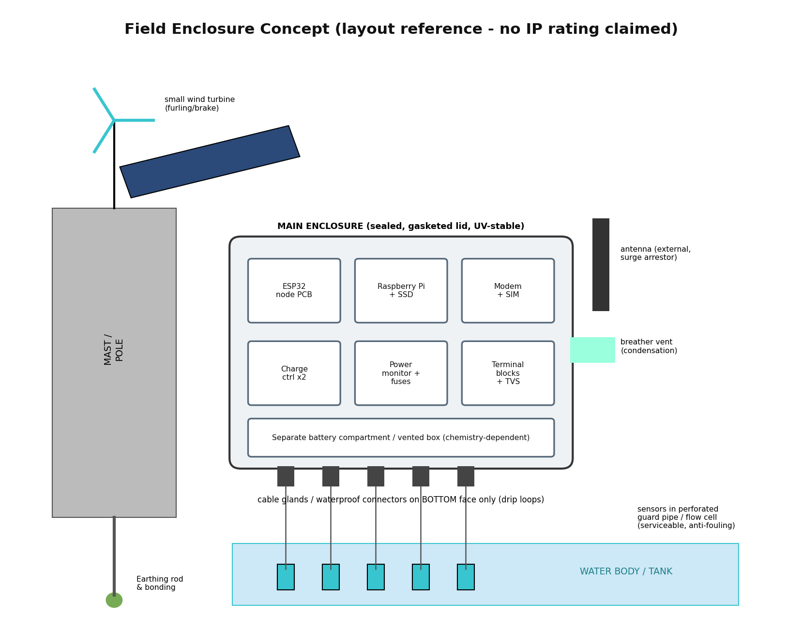</p>

<sub>Figure 9.1: Layout reference generated in Python. Not a mechanical drawing.</sub>

### 9.2 Environmental threat → design response

| Threat | Effect on system | Design response | Verification (planned) |
|---|---|---|---|
| **Dust** | Connector contamination, fan/vent clogging, optical sensor fouling | Sealed enclosure, gasketed lid, no fans (passive cooling), dust caps on unused connectors | Visual inspection after pilot period; dust exposure test (future) |
| **Rain** | Water ingress, short circuits, corrosion | Cable glands on the bottom face only, drip loops, sloped rain hood, sealed connectors | Hose/spray test (informal, not a rated test) |
| **Humidity / condensation** | Corrosion, leakage currents, ADC drift | Breather/pressure-equalisation vent, desiccant pack, conformal coating on PCBs (optional) | Humidity logging inside enclosure (internal RH sensor, optional) |
| **Temperature variation** | Component derating, battery performance change, sensor drift | Sun shield, light-coloured enclosure, battery in a separate compartment, temperature compensation for EC/TDS | Internal temperature logging |
| **Solar UV** | Plastic embrittlement, cable jacket degradation | UV-stable enclosure material, UV-rated cable, conduit | Periodic inspection |
| **Electrical noise** | ADC noise, false readings, resets | Shielded sensor cables, star grounding, ferrites, filtering, median sampling, isolated analog front-ends | Noise-floor measurement in SN tests |
| **Lightning / surge** | Component destruction | Surge arrestor on antenna, TVS on long lines, earthing rod and bonding | Design review (surge testing is future work) |
| **Long-duration operation** | SD-card wear, memory leaks, clock drift | SSD or high-endurance SD, WAL mode, watchdogs on ESP32 and Pi, RTC with NTP/GSM sync | 7-day and 30-day soak tests |
| **Remote location** | Slow maintenance response | Self-diagnostics, remote debugger, low-power fallback | Integration tests |
| **Limited maintenance** | Sensor fouling, drift | Guard pipe, anti-fouling approach (TBD), calibration reminders | Maintenance schedule (§44) |
| **Theft / vandalism** | Loss of equipment | Tamper-resistant fasteners, lockable enclosure, height mounting, optional door switch | Door-open event test |
| **Animals / insects** | Chewed cables, nests | Conduit, sealed glands, mesh on vents | Inspection |
| **Wind loading** | Mast/turbine damage | Guyed mast, turbine furling/brake | Structural review (future) |

### 9.3 Cable & connector practice

- Use **waterproof circular connectors** (where applicable) for sensors, so a probe can be swapped without opening the main enclosure.
- **Cable glands** sized to the cable outer diameter; unused glands blanked.
- **Drip loops** below every entry point.
- Sensor cables run in **flexible conduit** to the guard pipe.
- **Label** every cable at both ends with a sensor ID that matches the registry (`PH-01` and so on).
- Keep **power and analog signal cables separate**, and cross them at 90° where they must cross.

### 9.4 Sensor protection

| Measure | Purpose |
|---|---|
| Perforated guard pipe / flow cell | Physical protection, reduced debris, stable immersion depth |
| Probe holders with depth stop | Repeatable positioning after maintenance |
| Wet storage caps for pH probe during transport | Glass electrodes must not dry out |
| Anti-fouling strategy (wiper, shade, or cleaning schedule) | Turbidity and EC surfaces foul over time: `TBD / CONFIGURABLE` |
| Quick-release mounts | Faster maintenance |

### 9.5 Serviceability

- All field-replaceable units (FRUs) are reachable without removing the enclosure from the pole.
- Each FRU has a **debugger procedure** (see [§19](#19-industrial-debugger)) to verify it after replacement.
- Maintenance actions are **logged as events** (who, when, what), and are never used to alter raw data.

| FRU | Replace without tools? | Post-replacement check |
|---|:-:|---|
| pH probe | ✅ (connector) | Calibration + DIAG-SN-PH |
| Turbidity / EC / TDS probe | ✅ (connector) | Calibration + DIAG-SN-xx |
| Temperature probe | ✅ | Comparison against reference thermometer |
| ESP32 board | ❌ (screwdriver) | Provision node ID, firmware check, full diagnostic |
| Raspberry Pi / SSD | ❌ | Restore config, DB integrity check, sync test |
| Modem / SIM | ❌ | Registration + signal check |
| Battery | ❌ | Voltage, polarity, charge test |

### 9.6 Dedicated contaminant screening subsystem (optional, separate)

The core sensors measure **general water-quality parameters**. If a project needs screening for a specific contaminant (for example arsenic in some groundwater regions, or heavy metals near mining sites), treat it as a **separate subsystem**:

```text
┌──────────────────────────────────────────────────────────────────────────────┐
│ DEDICATED SCREENING SUBSYSTEM (optional, NOT part of the prototype)          │
│                                                                              │
│  Method examples (to be selected with domain experts):                       │
│   • Field test kits (manual, result entered as a SCREENING event)            │
│   • Automated colorimetric / electrochemical analyser (vendor-specific)      │
│   • Scheduled sample collection → accredited laboratory analysis             │
│                                                                              │
│  Integration:                                                                │
│   • Results stored in a SEPARATE `screening_results` collection              │
│   • Each result records: method, analyte, value, unit, LOD, operator/device, │
│     sample ID, chain-of-custody reference                                    │
│   • Core verification engine NEVER infers analyte presence from pH/TDS/EC    │
└──────────────────────────────────────────────────────────────────────────────┘
```

Core-parameter changes, such as a sudden pH drop or a sharp EC rise, may **prompt** screening under a project procedure. They are never reported as detection of a contaminant.

---

# PART B: DATA, VERIFICATION AND TRUST

## 10. Raw Data Model: Preserve Everything

### 10.1 Principle

> The system **never** stores only `SAFE / UNSAFE`. It stores the **original reading** and, separately, the **verification result** that refers to it.

### 10.2 Mandatory raw fields

| Field | Type | Required | Source | Example |
|---|---|:-:|---|---|
| `record_id` | string | ✅ | ESP32 | `SWN-0001-00017-00004521` |
| `node_id` | string | ✅ | ESP32 (provisioned) | `SWN-0001` |
| `sensor_ids` | map | ✅ | ESP32 (provisioned) | `{"ph":"PH-01",...}` |
| `timestamp` (device) | ISO-8601 UTC | ✅ | ESP32 RTC | `2026-09-23T05:12:05Z` |
| `received_ts` | ISO-8601 UTC | ✅ | Pi | `2026-09-23T05:12:06.214Z` |
| `raw.ph` | float \| null | ✅ | pH sensor | `7.214` |
| `raw.turbidity_ntu` | float \| null | ✅ | Turbidity sensor | `4.81` |
| `raw.tds_ppm` | float \| null | ✅ | TDS sensor | `212.4` |
| `raw.ec_us_cm` | float \| null | ✅ | EC sensor | `426.1` |
| `raw.temperature_c` | float \| null | ✅ | Temperature sensor | `26.42` |
| `mode` | enum | ✅ | ESP32 | `NORMAL` \| `LOW_POWER` \| `EMERGENCY` |
| `power` | object | ✅ | ESP32 power monitor | battery V, source, W per source |
| `comm` | object | ✅ | ESP32 | link, retries, modem state |
| `verification_status` | enum | ✅ (in result table) | Pi engine | `VALID` … |
| `raw_electrical` | object | recommended | ESP32 | mV values before calibration |
| `cal_version` | map | recommended | ESP32 | calibration record IDs |
| `fw` | string | recommended | ESP32 | `0.4.2+a1b2c3` |
| `raw_sha256` | hex | ✅ | Pi | canonical-JSON SHA-256 |
| `chain_hash` | hex | ✅ | Pi | `H(prev_chain ‖ raw_sha256)` |

**`null` is a first-class value.** A disconnected sensor produces `null`, never `0`, never "the last value", and never an interpolated guess.

### 10.3 Data model overview

<p align="center">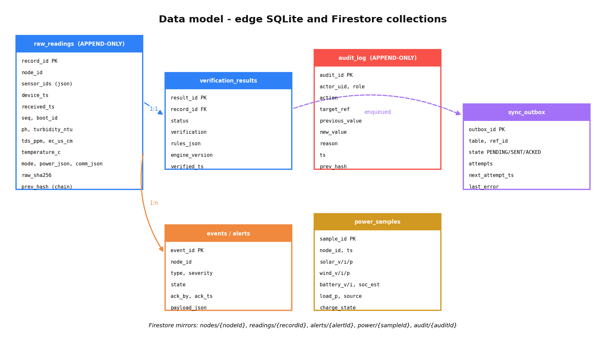</p>

<sub>Figure 10.1: Edge SQLite tables and their Firestore mirrors.</sub>

### 10.4 Edge SQLite schema (DDL)

```sql
-- smart-water-raspberry-pi/database/schema.sql
PRAGMA journal_mode = WAL;
PRAGMA foreign_keys = ON;

CREATE TABLE IF NOT EXISTS nodes (
    node_id          TEXT PRIMARY KEY,
    location_id      TEXT NOT NULL,
    deployment_state TEXT NOT NULL CHECK (deployment_state IN
                     ('PROVISIONED','COMMISSIONING','READY_FOR_DEPLOYMENT','DEPLOYED_VERIFIED','MAINTENANCE','RETIRED')),
    sensor_ids_json  TEXT NOT NULL,
    fw_version       TEXT,
    registered_ts    TEXT NOT NULL
);

CREATE TABLE IF NOT EXISTS raw_readings (
    record_id        TEXT PRIMARY KEY,
    node_id          TEXT NOT NULL REFERENCES nodes(node_id),
    boot_id          INTEGER NOT NULL,
    seq              INTEGER NOT NULL,
    sensor_ids_json  TEXT NOT NULL,
    device_ts        TEXT NOT NULL,
    received_ts      TEXT NOT NULL,
    mode             TEXT NOT NULL,
    ph               REAL,
    turbidity_ntu    REAL,
    tds_ppm          REAL,
    ec_us_cm         REAL,
    temperature_c    REAL,
    raw_electrical_json TEXT,
    cal_version_json TEXT,
    power_json       TEXT NOT NULL,
    comm_json        TEXT NOT NULL,
    fw_version       TEXT,
    payload_json     TEXT NOT NULL,        -- full original message, verbatim
    raw_sha256       TEXT NOT NULL,
    prev_chain_hash  TEXT NOT NULL,
    chain_hash       TEXT NOT NULL,
    UNIQUE (node_id, boot_id, seq)
);
CREATE INDEX IF NOT EXISTS ix_raw_node_ts ON raw_readings(node_id, device_ts);

-- Append-only enforcement at the database layer
CREATE TRIGGER IF NOT EXISTS trg_raw_no_update
BEFORE UPDATE ON raw_readings
BEGIN SELECT RAISE(ABORT, 'raw_readings is append-only'); END;

CREATE TRIGGER IF NOT EXISTS trg_raw_no_delete
BEFORE DELETE ON raw_readings
BEGIN SELECT RAISE(ABORT, 'raw_readings is append-only'); END;

CREATE TABLE IF NOT EXISTS verification_results (
    result_id        TEXT PRIMARY KEY,           -- <record_id>#v<engine_version>
    record_id        TEXT NOT NULL,              -- no FK: INVALID frames may lack a raw row
    node_id          TEXT,
    status           TEXT NOT NULL CHECK (status IN
                     ('VALID','INVALID','ABNORMAL','SUSPECTED_SENSOR_ERROR','COMMUNICATION_ERROR')),
    verification     TEXT NOT NULL CHECK (verification IN ('VERIFICATION_PASSED','VERIFICATION_FAILED')),
    rules_json       TEXT NOT NULL,
    raw_snapshot_json TEXT NOT NULL,
    raw_sha256       TEXT NOT NULL,
    engine_version   TEXT NOT NULL,
    config_hash      TEXT NOT NULL,
    verified_ts      TEXT NOT NULL
);
CREATE TRIGGER IF NOT EXISTS trg_vr_no_update BEFORE UPDATE ON verification_results
BEGIN SELECT RAISE(ABORT, 'verification_results is append-only'); END;
CREATE TRIGGER IF NOT EXISTS trg_vr_no_delete BEFORE DELETE ON verification_results
BEGIN SELECT RAISE(ABORT, 'verification_results is append-only'); END;

CREATE TABLE IF NOT EXISTS events (
    event_id     TEXT PRIMARY KEY,
    node_id      TEXT,
    ts           TEXT NOT NULL,
    category     TEXT NOT NULL,     -- SENSOR | COMM | POWER | VERIFICATION | MAINTENANCE | SYSTEM | DEPLOYMENT
    type         TEXT NOT NULL,     -- e.g. SENSOR_DISCONNECTED, BATTERY_LOW
    severity     TEXT NOT NULL CHECK (severity IN ('INFO','WARNING','ALARM','CRITICAL')),
    is_alert     INTEGER NOT NULL DEFAULT 0,
    record_ref   TEXT,
    payload_json TEXT
);

CREATE TABLE IF NOT EXISTS alert_state_log (   -- alert lifecycle, append-only
    id           INTEGER PRIMARY KEY AUTOINCREMENT,
    event_id     TEXT NOT NULL REFERENCES events(event_id),
    prev_state   TEXT,
    new_state    TEXT NOT NULL CHECK (new_state IN ('RAISED','LOCAL_ALERTED','NOTIFIED','ACKNOWLEDGED','RESOLVED','CLOSED')),
    actor        TEXT NOT NULL,
    note         TEXT,
    ts           TEXT NOT NULL
);

CREATE TABLE IF NOT EXISTS power_samples (
    sample_id    TEXT PRIMARY KEY,
    node_id      TEXT NOT NULL,
    ts           TEXT NOT NULL,
    solar_v REAL, solar_i REAL, solar_p REAL,
    wind_v  REAL, wind_i  REAL, wind_p  REAL,
    battery_v REAL, battery_i REAL, soc_est REAL,
    load_p  REAL,
    source  TEXT NOT NULL,
    charge_state TEXT NOT NULL CHECK (charge_state IN ('CHARGING','DISCHARGING','IDLE','FAULT','UNKNOWN'))
);

CREATE TABLE IF NOT EXISTS audit_log (
    audit_id       TEXT PRIMARY KEY,
    ts             TEXT NOT NULL,
    actor_uid      TEXT NOT NULL,
    actor_role     TEXT NOT NULL,
    action         TEXT NOT NULL,
    target_ref     TEXT NOT NULL,
    previous_value TEXT,
    new_value      TEXT,
    reason         TEXT NOT NULL,
    prev_hash      TEXT NOT NULL,
    hash           TEXT NOT NULL
);
CREATE TRIGGER IF NOT EXISTS trg_audit_no_update BEFORE UPDATE ON audit_log
BEGIN SELECT RAISE(ABORT, 'audit_log is append-only'); END;
CREATE TRIGGER IF NOT EXISTS trg_audit_no_delete BEFORE DELETE ON audit_log
BEGIN SELECT RAISE(ABORT, 'audit_log is append-only'); END;

CREATE TABLE IF NOT EXISTS sync_outbox (
    outbox_id        INTEGER PRIMARY KEY AUTOINCREMENT,
    collection       TEXT NOT NULL,    -- readings | results | alerts | power | audit | events
    doc_id           TEXT NOT NULL,
    payload_json     TEXT NOT NULL,
    state            TEXT NOT NULL DEFAULT 'PENDING' CHECK (state IN ('PENDING','SENT','ACKED','DEAD')),
    attempts         INTEGER NOT NULL DEFAULT 0,
    next_attempt_ts  TEXT NOT NULL,
    last_error       TEXT,
    created_ts       TEXT NOT NULL,
    UNIQUE (collection, doc_id)
);
CREATE INDEX IF NOT EXISTS ix_outbox_state ON sync_outbox(state, next_attempt_ts);
```

> **Defence in depth.** SQLite triggers stop *accidental* or *application-level* modification. Someone with root access to the Pi could still alter the file, which is why the hash chain (§13.4) and cloud replication exist: tampering becomes **detectable**, even where it can't be made impossible.

### 10.5 Corrections: never edit, always append

If a reading is later found to be wrong, for example because the calibration was applied incorrectly:

```text
raw_readings[SWN-0001-00017-00004521]  ─── unchanged forever
         ▲
         │ target_ref
audit_log[01J8…]  action = "CORRECTION_ANNOTATION"
                  previous_value = {"ph": 7.214, "cal_version": "#3"}
                  new_value      = {"ph_corrected": 7.051, "cal_version": "#4"}
                  reason         = "pH buffer 7.00 was expired; recalibrated 2026-09-24, re-derived from raw_electrical.ph_mv"
                  actor_uid      = "admin:u_8f2…", actor_role = "ADMIN"
```

The dashboard shows the original value and an **"annotated"** badge linking to the audit record. It never silently swaps the number.

---

## 11. Raspberry Pi: Trusted Edge Layer

### 11.1 Responsibilities (15)

| # | Responsibility | Service / module | Output |
|:-:|---|---|---|
| 1 | Receive raw data from the ESP32 | `receiver/serial_receiver.py` | parsed frames |
| 2 | Timestamp incoming data | `receiver/` | `received_ts` |
| 3 | Validate message format | `validator/schema.py` | FMT-* hits |
| 4 | Check sensor identity | `validator/identity.py` | NID-* hits |
| 5 | Check expected data ranges | `validator/rules/range.py` | RNG-001 hits |
| 6 | Detect missing values | `validator/rules/missing.py` | MIS-001 hits |
| 7 | Detect impossible values | `validator/rules/format.py` | FMT-005 hits |
| 8 | Detect sudden abnormal changes | `validator/rules/rate.py` | ROC-001 hits |
| 9 | Run predefined formulas/algorithms | `algorithms/` | temperature compensation, TDS/EC consistency, rolling statistics |
| 10 | Store raw data locally | `storage/raw_store.py` | `raw_readings` |
| 11 | Store verification results | `storage/result_store.py` | `verification_results` |
| 12 | Store diagnostic events | `diagnostics/events.py` | `events` |
| 13 | Queue unsynchronised cloud data | `sync/outbox.py` | `sync_outbox` |
| 14 | Synchronise when connectivity returns | `sync/engine.py` | Firestore docs |
| 15 | Monitor system health | `diagnostics/health.py` | CPU, disk, temperature, service status |

### 11.2 What the Pi does **not** do

- It does **not** decide whether water is safe to drink.
- It does **not** "correct" readings.
- It does **not** infer contaminants from general parameters.
- It does **not** delete records to free space. Instead it archives them to compressed files, with hashes, and raises a storage alert.

### 11.3 Services (systemd)

| Unit | Purpose | Restart policy | Depends on |
|---|---|---|---|
| `sw-receiver.service` | Serial receiver + storage + verification | `always`, 5 s | local FS |
| `sw-sync.service` | Outbox → Firebase | `always`, 10 s | network-online (soft) |
| `sw-health.service` | Health metrics, watchdog, disk checks | `always` | — |
| `sw-api.service` | Local read-only API for the debugger (LAN) | `always` | receiver DB |
| `sw-alert.service` | Local alert fan-out (GPIO buzzer on Pi, optional) | `always` | receiver |

```ini
# smart-water-raspberry-pi/deploy/systemd/sw-receiver.service
[Unit]
Description=Smart Water - serial receiver, raw store and verification engine
After=local-fs.target
StartLimitIntervalSec=0

[Service]
Type=simple
User=swedge
Group=swedge
WorkingDirectory=/opt/smart-water
EnvironmentFile=/etc/smart-water/edge.env
ExecStart=/opt/smart-water/.venv/bin/python -m swedge.receiver
Restart=always
RestartSec=5
WatchdogSec=60
NoNewPrivileges=true
ProtectSystem=strict
ReadWritePaths=/var/lib/smart-water /var/log/smart-water
PrivateTmp=true

[Install]
WantedBy=multi-user.target
```

### 11.4 Edge configuration (example)

```yaml
# smart-water-raspberry-pi/config/edge.example.yaml
edge:
  gateway_id: GW-01
  db_path: /var/lib/smart-water/edge.db
  archive_dir: /var/lib/smart-water/archive
  storage_alert_percent: 80
receiver:
  port: /dev/serial0
  baud: 115200
  max_frame_bytes: 1024
  heartbeat_timeout_s: 900          # > 2× the longest configured sampling interval
verification:
  config_file: /etc/smart-water/verification.yaml
sync:
  enabled: true
  batch_size: 100
  base_delay_s: 2
  max_delay_s: 900
  jitter_s: 3
  stale_after_s: 1800
  dead_after_attempts: 0            # 0 = never mark DEAD automatically
health:
  interval_s: 60
  cpu_temp_warn_c: 70               # TBD / CONFIGURABLE
api:
  bind: 0.0.0.0
  port: 8088
  token_env: SW_DEBUG_API_TOKEN     # value lives in /etc/smart-water/edge.env (never in Git)
```

---

## 12. Data Verification Engine

### 12.1 Contract

```text
            ┌──────────────────────────────┐
RAW SENSOR  │                              │  VERIFICATION RESULT
DATA  ─────►│    VERIFICATION ENGINE       │──────────────────────►  status, verification,
(unchanged) │  (pure function + per-node   │                         rules_triggered[ {rule_id,
            │   short history)             │                         parameter, status, reason} ],
            └──────────────────────────────┘                         verified_at, raw_snapshot,
                                                                     raw_sha256, engine_version
```

**Output fields (required):** verification status · reason · rule triggered · timestamp · original raw value.
**The raw input object is never mutated.** Unit test `test_raw_value_not_modified` enforces this.

### 12.2 Decision flow

<p align="center">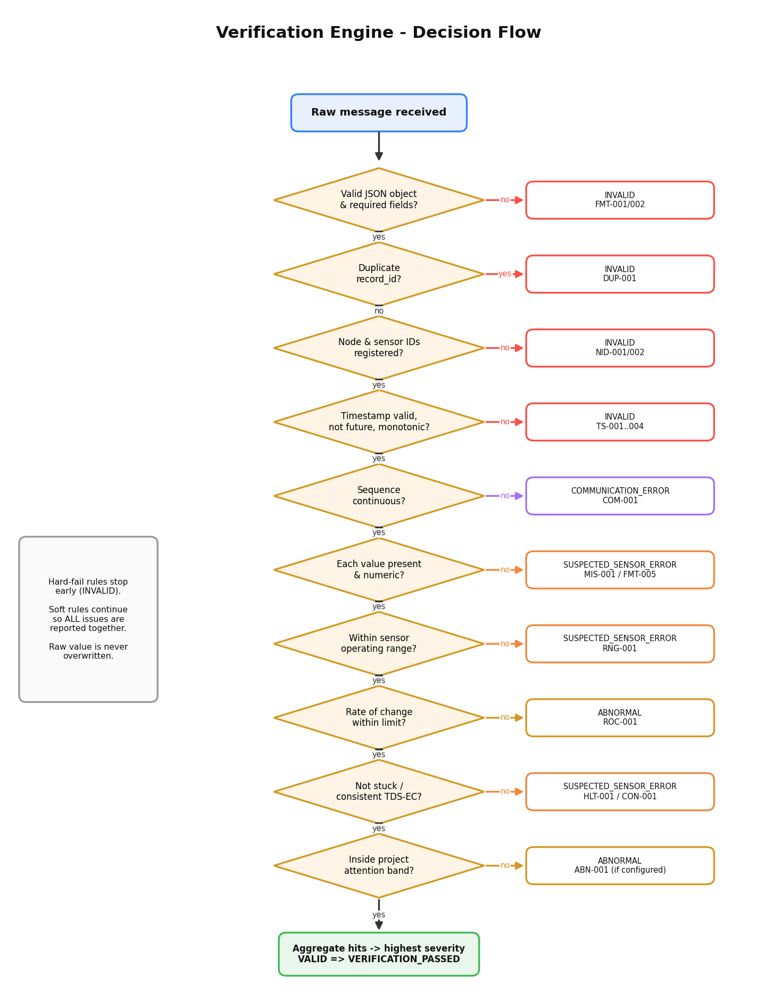</p>

<sub>Figure 12.1: Verification decision flow. Hard-fail rules stop early; soft rules all run so that every issue is reported together.</sub>

### 12.3 Classification outputs

| Status | Meaning | Typical cause | Verification |
|---|---|---|---|
| `VALID` | No rule triggered | Normal operation | `VERIFICATION_PASSED` |
| `ABNORMAL` | Data is structurally fine but behaves unusually (sudden change, outside a *configured* attention band) | Real water event **or** sensor event; human follow-up needed | `VERIFICATION_FAILED` |
| `SUSPECTED_SENSOR_ERROR` | Value missing, outside sensor operating range, stuck, or inconsistent with related sensors | Disconnected/fouled/failed sensor | `VERIFICATION_FAILED` |
| `COMMUNICATION_ERROR` | Sequence gap: messages lost | Link noise, buffer overflow, reboot during send | `VERIFICATION_FAILED` |
| `INVALID` | Structurally unusable: malformed, duplicate, unregistered, bad timestamp | Firmware bug, spoofing attempt, clock fault | `VERIFICATION_FAILED` |

**Severity order** used to aggregate several hits into one overall status:
`VALID (0) < ABNORMAL (1) < SUSPECTED_SENSOR_ERROR (2) < COMMUNICATION_ERROR (3) < INVALID (4)`

> The overall status is the most severe hit, but **all** hits are stored in `rules_triggered`, so no information is lost by aggregating.

### 12.4 Verification Rule Catalogue

> Every rule implemented in code must appear here with the same ID. Thresholds are **configuration**, not code.

| Rule ID | Family | Check | Triggers when | Result status | Hard-fail? | Config keys |
|---|---|---|---|---|:-:|---|
| **FMT-001** | Format | Message type | Payload isn't a JSON object | INVALID | ✅ | — |
| **FMT-002** | Format | Required fields | Any of `schema_version, record_id, node_id, sensor_ids, timestamp, seq, mode, raw, power, comm` missing | INVALID | ✅ | — |
| **FMT-003** | Format | Schema version | `schema_version` not supported | INVALID | | `supported_schema_versions` |
| **FMT-004** | Format | Raw block | `raw` isn't an object | INVALID | ✅ | — |
| **FMT-005** | Format | Numeric type | Parameter value is non-numeric, boolean or NaN | INVALID | | — |
| **DUP-001** | Duplicate | Record uniqueness | `record_id` already processed | INVALID | ✅ | — |
| **NID-001** | Node identity | Registered node | `node_id` not in registry (when a registry is configured) | INVALID | | `registered_nodes` |
| **NID-002** | Node identity | Registered sensors | A `sensor_id` isn't registered to this node | INVALID | | `registered_nodes[*].sensor_ids` |
| **TS-001** | Timestamp | Parse | Timestamp missing, malformed or without a timezone | INVALID | | — |
| **TS-002** | Timestamp | Future | Device timestamp > received time + `max_clock_skew_s` | INVALID | | `max_clock_skew_s` |
| **TS-003** | Timestamp | Stale | Device timestamp older than `max_age_s` | INVALID | | `max_age_s` |
| **TS-004** | Timestamp | Monotonic | Timestamp ≤ previous accepted timestamp for this node | INVALID | | — |
| **COM-001** | Communication | Sequence continuity | `seq > last_seq + 1` within the same boot | COMMUNICATION_ERROR | | — |
| **MIS-001** | Missing | Presence | Parameter value is `null`/absent | SUSPECTED_SENSOR_ERROR | | — |
| **RNG-001** | Range | Sensor operating range | Value outside the **sensor's** configured operating range | SUSPECTED_SENSOR_ERROR | | `ranges.<param>` |
| **ROC-001** | Rate of change | Plausible dynamics | `|Δvalue| / Δt(min) > max_rate_per_min.<param>` | ABNORMAL | | `max_rate_per_min.<param>` |
| **HLT-001** | Sensor health | Stuck value | Identical value for `stuck_value_window` consecutive samples | SUSPECTED_SENSOR_ERROR | | `stuck_value_window` |
| **CON-001** | Consistency | TDS ↔ EC | `|TDS − k·EC| / (k·EC) > tds_ec_tolerance` | SUSPECTED_SENSOR_ERROR | | `tds_ec_factor`, `tds_ec_tolerance` |
| **ABN-001** | Attention band | Project band | Value outside a **project-configured** attention band (disabled by default) | ABNORMAL | | `attention_bands.<param>` + `source` |

**Rule families: 11. Rule IDs: 19.** All are implemented in [`reference/edge/verification_engine.py`](reference/edge/verification_engine.py) and covered by [`reference/tests/test_verification_engine.py`](reference/tests/test_verification_engine.py).

### 12.5 Rule rationale

<details>
<summary><b>FMT: Format validation</b></summary>

*Is the message correctly structured?* Malformed frames can come from electrical noise that gets past the CRC (rare), from firmware bugs, or from deliberate injection. They're rejected as `INVALID`, and the **payload is still logged** in the event store for debugging. It isn't written into `raw_readings`, because it can't be trusted as a reading.
</details>

<details>
<summary><b>RNG: Range validation</b></summary>

*Is the value within the configured sensor operating range?* This is **not** a water-safety check. A pH of 15.2 can't come from a working 0–14 pH sensor, so the likely explanation is a sensor or wiring fault. The ranges must come from the **datasheet of the sensor actually installed**.
</details>

<details>
<summary><b>ROC: Rate-of-change validation</b></summary>

*Did the parameter change unrealistically quickly?* Water bodies have physical inertia. A jump of several pH units in 5 minutes is more likely a sensor event (air bubble, probe removed, cable fault) than a real change. It **could** also be a real event, such as a contamination slug. That's why ROC-001 is classified `ABNORMAL` (human follow-up) rather than `INVALID`. Rates are normalised per minute, so the rule works the same way in all three operating modes.
</details>

<details>
<summary><b>HLT: Sensor health</b></summary>

*Is the sensor responding?* A disconnected analog input often floats or rails to a constant value, and a frozen driver repeats the last reading. Readings that are *exactly* identical over N samples are suspicious for noisy analog sensors. N must be tuned per sensor. A digital temperature sensor with 0.0625 °C resolution in a very stable tank may legitimately repeat, so tune `stuck_value_window` for each parameter where needed.
</details>

<details>
<summary><b>CON: Consistency check</b></summary>

*Are related measurements behaving consistently according to predefined rules?* TDS meters usually derive TDS from conductivity using a conversion factor k (often in the range of roughly 0.5–0.7, depending on water composition; **`TBD / CONFIGURABLE`, determine for your site**). If the separate TDS and EC probes disagree beyond a tolerance, at least one of them is probably faulty or fouled.
</details>

<details>
<summary><b>TS: Timestamp validation</b></summary>

*Is the timestamp valid?* Requires timezone-aware ISO-8601, a timestamp not in the future (beyond the skew allowance), not older than the maximum age, and monotonic per node. The ESP32 uses an RTC; the Pi's `received_ts` is always stored as an independent second clock.
</details>

<details>
<summary><b>NID: Node ID validation</b></summary>

*Is the data associated with a registered node?* Nodes and their sensors are provisioned in a registry. Frames from unknown nodes or with swapped sensor IDs are rejected. This catches mis-wired replacements and basic spoofing.
</details>

<details>
<summary><b>COM / DUP: Communication and duplicates</b></summary>

A gap in `seq` means frames were lost; the reading itself may be fine. A repeated `record_id` means a retransmission. It's rejected as a duplicate but **acknowledged**, so the ESP32 stops retrying.
</details>

<details>
<summary><b>ABN: Attention bands (opt-in)</b></summary>

Disabled by default. When enabled, every band **must** carry a `source` field (for example a named standard, a regulator's guidance document, or a documented project decision with its date and approver). The engine refuses to load a band without a source (Phase 5 config validation).
</details>

### 12.6 Verification configuration (example)

```yaml
# /etc/smart-water/verification.yaml   (version-controlled as verification.example.yaml)
engine_version: 0.1.0
supported_schema_versions: [1]
ranges:                     # SENSOR OPERATING RANGES from datasheets — NOT safety limits
  ph:            [0.0, 14.0]
  turbidity_ntu: [0.0, TBD]
  tds_ppm:       [0.0, TBD]
  ec_us_cm:      [0.0, TBD]
  temperature_c: [TBD, TBD]
max_rate_per_min:           # TBD / CONFIGURABLE — tune from baseline data
  ph: 0.5
  turbidity_ntu: 200
  tds_ppm: 100
  ec_us_cm: 200
  temperature_c: 2.0
stuck_value_window: 6
tds_ec_factor: TBD          # determine per site
tds_ec_tolerance: 0.35
max_clock_skew_s: 300
max_age_s: 604800
attention_bands:            # DISABLED unless a verified source is supplied
  ph:            { enabled: false, low: null, high: null, source: null }
  turbidity_ntu: { enabled: false, low: null, high: null, source: null }
  tds_ppm:       { enabled: false, low: null, high: null, source: null }
  ec_us_cm:      { enabled: false, low: null, high: null, source: null }
  temperature_c: { enabled: false, low: null, high: null, source: null }
```

### 12.7 Engine behaviour on a simulated stream

The reference engine was run over a **simulated** 24-hour stream (288 samples at 5-minute intervals), with six injected faults:

| Injected at sample | Fault | Expected rule |
|:-:|---|---|
| 60 | pH jumps to 9.9 | ROC-001 |
| 120–123 | Turbidity sensor returns `null` | MIS-001 |
| 150 | TDS = 1450 (outside the 0–1000 placeholder range) | RNG-001 |
| 200 | 3 frames lost (seq jumps) | COM-001 |
| 230–237 | Temperature frozen at 25.00 | HLT-001 |
| 260 | TDS multiplied by 1.9 | CON-001 |

<p align="center">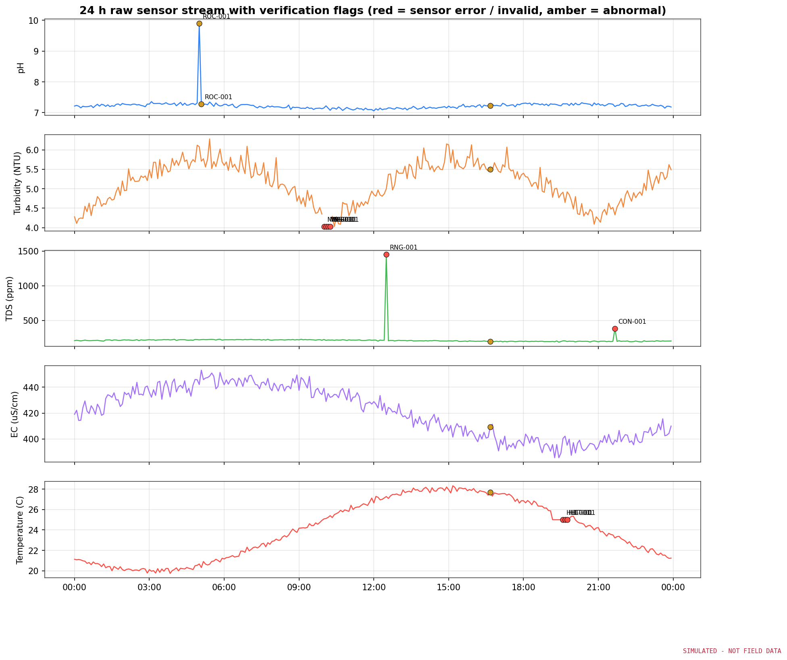</p>

<sub>Figure 12.2: SIMULATED raw stream. Markers show records where the engine raised a rule hit.</sub>

<p align="center">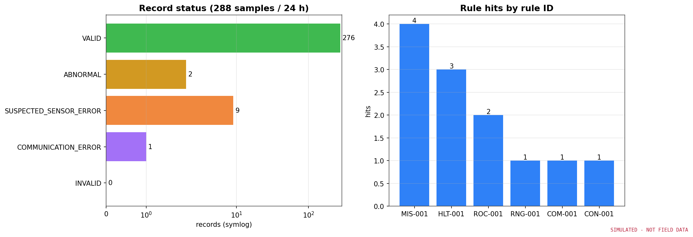</p>

<sub>Figure 12.3: SIMULATED status distribution and rule-hit counts. Every injected fault was detected by the expected rule (asserted in <code>test_simulated_stream_triggers_expected_rules</code>).</sub>

> Note how one physical event can trigger several rules. The pH jump at sample 60 raises ROC-001 both on the way up and on the way back down. The CON-001 injection also raises ROC-001 for TDS. That's intended: the engine reports every rule a record breaks, and the engineer sees the full picture.

### 12.8 Reference implementation (excerpt)

The full file is [`reference/edge/verification_engine.py`](reference/edge/verification_engine.py). Key excerpt:

```python
class VerificationEngine:
    """Stateful per-node verification engine (keeps short history per node)."""

    def verify(self, msg, received_at=None) -> VerificationResult:
        received_at = received_at or datetime.now(timezone.utc)
        hits: List[RuleHit] = []

        # FMT: format validation
        if not isinstance(msg, dict):
            return self._result(None, None, [RuleHit("FMT-001", None, Status.INVALID,
                                "Message is not a JSON object")], {}, received_at)
        missing = [f for f in REQUIRED_FIELDS if f not in msg]
        if missing:
            hits.append(RuleHit("FMT-002", None, Status.INVALID,
                                f"Missing required fields: {', '.join(missing)}"))
            return self._result(msg.get("record_id"), msg.get("node_id"), hits, msg, received_at)
        ...
        # RNG: sensor operating range (NOT a water-safety limit)
        lo, hi = self.cfg["ranges"][p]
        if v < lo or v > hi:
            hits.append(RuleHit("RNG-001", p, Status.SUSPECTED_SENSOR_ERROR,
                                f"{p}={v} outside sensor operating range [{lo}, {hi}]"))
        ...
        # ROC: rate of change, normalised per minute
        rate = abs(v - pv) / minutes
        if rate > self.cfg["max_rate_per_min"][p]:
            hits.append(RuleHit("ROC-001", p, Status.ABNORMAL, ...))
        ...
        return self._result(msg["record_id"], msg["node_id"], hits, msg, received_at)
```

### 12.9 Example result

```json
{
  "record_id": "SWN-0001-00001-00000061",
  "node_id": "SWN-0001",
  "verified_at": "2026-09-01T05:00:03+00:00",
  "status": "ABNORMAL",
  "verification": "VERIFICATION_FAILED",
  "rules_triggered": [
    { "rule_id": "ROC-001", "parameter": "ph", "status": "ABNORMAL",
      "reason": "ph changed 0.54/min (limit 0.5)" }
  ],
  "raw_snapshot": { "ph": 9.9, "turbidity_ntu": 5.12, "tds_ppm": 214.6,
                    "ec_us_cm": 431.0, "temperature_c": 26.83 },
  "raw_sha256": "3f1c…e9a0",
  "engine_version": "0.1.0"
}
```

### 12.10 Engine versioning & re-verification

- Every result stores `engine_version` and `config_hash`.
- When the rules or thresholds change, historical records **may be re-verified**. This creates **new** result rows (`<record_id>#v0.2.0`); the old results stay.
- The dashboard shows the result from the **currently active** engine version by default, and the history view can show all versions.

---

## 13. Data Integrity & Tamper Resistance

### 13.1 Permissions by role

| Action | ENGINEER (on-site) | SERVICE (debugger) | SUPERVISOR | ADMIN | DEVICE (edge) |
|---|:-:|:-:|:-:|:-:|:-:|
| View live data, alerts, diagnostics, history | ✅ | ✅ | ✅ | ✅ | — |
| Acknowledge alerts | ✅ | ✅ | ✅ | ✅ | — |
| Log approved maintenance action | ✅ | ✅ | ✅ | ✅ | — |
| Run diagnostic commands | ❌ | ✅ | ❌ | ✅ | — |
| Start calibration session | ❌ | ✅ | ❌ | ✅ | — |
| Change configuration (thresholds, intervals) | ❌ | ❌ | ❌ | ✅ (audited) | — |
| File correction annotation (audit event) | ❌ | ❌ | ❌ | ✅ (audited, reason required) | — |
| Create raw readings | ❌ | ❌ | ❌ | ❌ | ✅ (create only) |
| **Modify historical raw readings** | ❌ | ❌ | ❌ | ❌ | ❌ |
| **Delete readings** | ❌ | ❌ | ❌ | ❌ | ❌ |
| **Rewrite timestamps** | ❌ | ❌ | ❌ | ❌ | ❌ |
| **Change verification results manually** | ❌ | ❌ | ❌ | ❌ | ❌ |
| **Alter audit records** | ❌ | ❌ | ❌ | ❌ | ❌ |

> Not even ADMIN can edit raw data. The only path is an **annotation** in the audit log.

### 13.2 Enforcement layers

| Layer | Mechanism |
|---|---|
| UI | Edit/delete controls don't exist for raw, results or audit |
| Firebase Auth | Custom claims `role ∈ {engineer, service, supervisor, admin}` |
| Firestore Security Rules | `allow update, delete: if false` on `readings`, `results`, `audit`; create only by the device service account (Admin SDK) or by a Cloud Function |
| Cloud Functions | Audit entries written server-side; the client can't forge `actor_uid` or `ts` |
| Edge SQLite | Append-only triggers |
| Edge OS | Services run as unprivileged `swedge`; DB file owned by `swedge`, mode `0640` |
| Cryptographic | Per-node hash chain on raw records; per-gateway hash chain on the audit log |

### 13.3 Audit event schema

| Field | Description |
|---|---|
| `audit_id` | UUIDv7 |
| `ts` | Server timestamp (cloud) or edge UTC timestamp |
| `actor_uid` | Authenticated user ID (never free text) |
| `actor_role` | Role at the time of the action |
| `action` | e.g. `ALERT_ACK`, `CONFIG_CHANGE`, `CORRECTION_ANNOTATION`, `CALIBRATION_APPLIED`, `NODE_STATE_CHANGE`, `MAINTENANCE_LOGGED`, `LOGIN_FAILED` |
| `target_ref` | Path or ID of the affected object |
| `previous_value` | JSON snapshot before |
| `new_value` | JSON snapshot after |
| `reason` | Required, free text (minimum length enforced) |
| `prev_hash`, `hash` | Chain values |

### 13.4 Hash chain

<p align="center">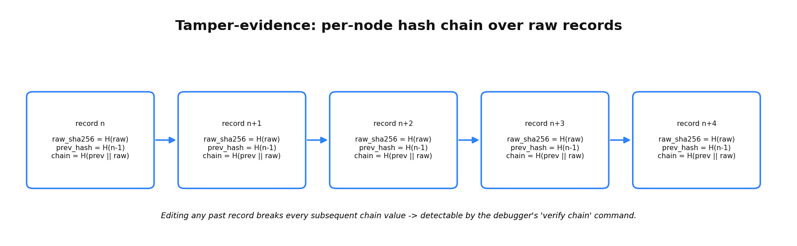</p>

<sub>Figure 13.1: Tamper evidence via a per-node hash chain.</sub>

```python
# swedge/storage/chain.py
import hashlib, json

GENESIS = "0" * 64

def canonical(obj) -> bytes:
    return json.dumps(obj, sort_keys=True, separators=(",", ":")).encode()

def raw_hash(message: dict) -> str:
    return hashlib.sha256(canonical(message)).hexdigest()

def chain_hash(prev_chain: str, raw_sha256: str) -> str:
    return hashlib.sha256(bytes.fromhex(prev_chain) + bytes.fromhex(raw_sha256)).hexdigest()

def verify_chain(rows) -> tuple[bool, str | None]:
    """rows ordered by (boot_id, seq). Returns (ok, first_bad_record_id)."""
    prev = GENESIS
    for r in rows:
        if raw_hash(json.loads(r["payload_json"])) != r["raw_sha256"]:
            return False, r["record_id"]
        if r["prev_chain_hash"] != prev or chain_hash(prev, r["raw_sha256"]) != r["chain_hash"]:
            return False, r["record_id"]
        prev = r["chain_hash"]
    return True, None
```

The debugger's **`verify chain`** command runs `verify_chain()` over a node's history and reports the first broken link, if there is one. Periodically publishing the latest chain head to Firestore (`nodes/{id}.chain_head`) anchors the local chain to a second location.

> **Honest limitation.** A hash chain makes tampering *detectable*; it doesn't make it *impossible*. An attacker with full control of both the edge device and the cloud project could rebuild a consistent chain. Anchoring chain heads to an independent store is a future option ([§50](#50-future-scalability)).

---

## 14. Operating Modes

### 14.1 State machine

<p align="center">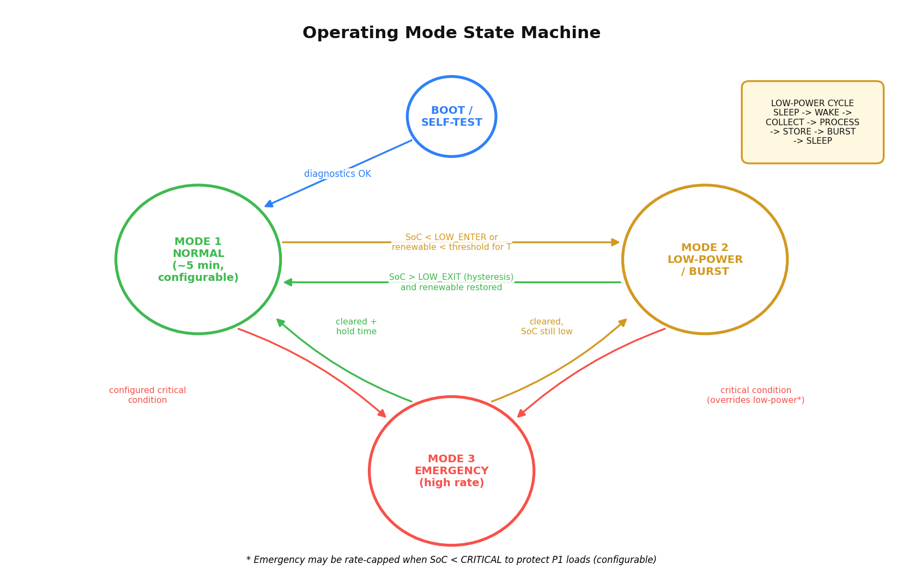</p>

<sub>Figure 14.1: Operating mode state machine with hysteresis.</sub>

### 14.2 Mode summary

| Property | MODE 1: NORMAL | MODE 2: LOW-POWER / BURST | MODE 3: EMERGENCY |
|---|---|---|---|
| Trigger | Default after self-test; power healthy | SoC < `LOW_ENTER` **or** renewable input < threshold for `T_low` | Configured critical condition (see 14.5) |
| Sampling interval | ~5 min (`normal.interval_s = 300`) | `low_power.interval_s` (e.g. 1800) | `emergency.interval_s` (e.g. 30) |
| ESP32 between samples | Light sleep | **Deep sleep** | Awake |
| Raspberry Pi | ON | Duty-cycled or OFF (P2 shed), per profile | ON (unless SoC < CRITICAL) |
| Modem | On-demand | Burst only (batched uplink) | ON / high priority |
| Local alert | On events | On events | **Active pattern** |
| Uplink | When connectivity is available | Batched burst | Immediate attempt, then queued |
| Exit | → LOW-POWER on low energy; → EMERGENCY on critical condition | → NORMAL when SoC > `LOW_EXIT` **and** renewable restored | → previous mode after condition clears + `hold_time_s` |

### 14.3 Mode 2 cycle

```text
      ┌─────────┐
      │  SLEEP  │◄──────────────────────────────────────────────┐
      └────┬────┘                                               │
           │ RTC timer / external wake (e.g. door, float switch)│
           ▼                                                    │
      ┌─────────┐   sensor excitation ON, settle                │
      │  WAKE   │                                               │
      └────┬────┘                                               │
           ▼                                                    │
      ┌──────────────┐  median of N samples per parameter       │
      │ COLLECT DATA │                                          │
      └────┬─────────┘                                          │
           ▼                                                    │
      ┌──────────────────┐  on-node sanity (range/null flags),  │
      │ LOCAL PROCESSING │  emergency trigger evaluation        │
      └────┬─────────────┘                                      │
           ▼                                                    │
      ┌─────────┐  append to RTC-RAM / flash ring buffer        │
      │  STORE  │                                               │
      └────┬────┘                                               │
           ▼                                                    │
      ┌────────────────────┐  every Kth wake (or when buffer ≥  │
      │ TRANSMIT / BURST   │  threshold): power Pi/modem, send  │
      └────┬───────────────┘  buffered frames, await ACKs       │
           └────────────────────────────────────────────────────┘
```

<p align="center">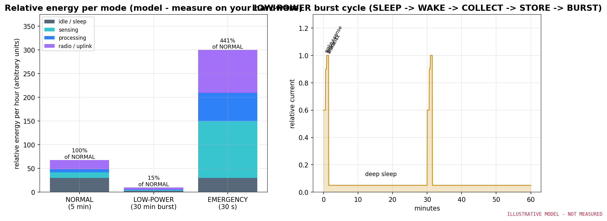</p>

<sub>Figure 14.2: ILLUSTRATIVE relative energy per mode, and the shape of a low-power burst cycle. Real values must be measured on the built hardware (Phase 14).</sub>

### 14.4 Mode configuration (example)

```yaml
# smart-water-esp32/config/modes.example.yaml
normal:
  interval_s: 300                 # ≈ 5 min target, configurable
low_power:
  interval_s: 1800
  burst_every_n_wakes: 4
  burst_when_buffer_ge: 16
  pi_policy: duty_cycle           # on | duty_cycle | off
  enter:
    soc_below_pct: TBD            # LOW_ENTER, battery-chemistry dependent
    renewable_below_w: TBD
    for_s: 900
  exit:
    soc_above_pct: TBD            # LOW_EXIT > LOW_ENTER (hysteresis)
    renewable_above_w: TBD
    for_s: 1800
emergency:
  interval_s: 30
  hold_time_s: 1800               # stay in EMERGENCY at least this long after the trigger clears
  max_duration_s: 21600           # re-evaluate / notify after 6 h
  soc_floor_pct: TBD              # below this, emergency is rate-capped to protect P1 loads
  triggers:                       # ALL thresholds must be configured by the project; none are defaulted
    - { type: rule_hit, rule_id: ABN-001, parameter: any, consecutive: 2 }
    - { type: rule_hit, rule_id: ROC-001, parameter: any, consecutive: 2 }
    - { type: external_input, name: float_switch_high, enabled: false }
    - { type: remote_command, enabled: true }   # supervisor/admin, audited
```

### 14.5 Emergency mode: design constraints

1. **Local-first.** The ESP32 (and Pi, if powered) evaluate triggers locally. The cloud isn't needed to enter or run emergency mode.
2. **No arbitrary "toxic" thresholds.** Emergency triggers use rule hits (e.g. ABN-001), whose bands must be sourced, or explicit external inputs and commands.
3. **Priority order:** 1) rapid sensing → 2) local processing → 3) local alert → 4) data storage → 5) remote transmission when available.
4. **Energy guard.** If SoC < `emergency.soc_floor_pct`, the sampling rate is capped so that P1 loads can keep running. This is itself logged as an event.
5. **Auditability.** Entering and leaving emergency mode are `SYSTEM` events with the triggering rule/record reference.

### 14.6 Mode-selection logic (ESP32, C++)

```cpp
// smart-water-esp32/modes/ModeManager.cpp
#include "ModeManager.h"

Mode ModeManager::evaluate(const PowerStatus& p, const TriggerState& t, uint32_t nowS) {
  // 1) Emergency has priority, but is rate-capped under critical SoC
  if (t.emergencyActive) {
    lastEmergencyS_ = nowS;
    return Mode::EMERGENCY;
  }
  if (current_ == Mode::EMERGENCY && (nowS - lastEmergencyS_) < cfg_.emergency.holdTimeS) {
    return Mode::EMERGENCY;                         // hold time not elapsed
  }

  // 2) Low-power entry/exit with hysteresis and dwell time
  const bool lowEnergy  = p.socPct < cfg_.lowPower.enterSocPct ||
                          p.renewableW < cfg_.lowPower.enterRenewableW;
  const bool recovered  = p.socPct > cfg_.lowPower.exitSocPct &&
                          p.renewableW > cfg_.lowPower.exitRenewableW;

  if (lowEnergy)  { if (!lowSinceS_) lowSinceS_ = nowS; } else lowSinceS_ = 0;
  if (recovered)  { if (!okSinceS_)  okSinceS_  = nowS; } else okSinceS_  = 0;

  if (current_ != Mode::LOW_POWER && lowSinceS_ && nowS - lowSinceS_ >= cfg_.lowPower.enterForS)
    return Mode::LOW_POWER;
  if (current_ == Mode::LOW_POWER && !(okSinceS_ && nowS - okSinceS_ >= cfg_.lowPower.exitForS))
    return Mode::LOW_POWER;

  return Mode::NORMAL;
}
```

---

## 15. Offline-First Operation

### 15.1 Failure scenarios

| Scenario | Data path | Data loss? | User-visible |
|---|---|:-:|---|
| Internet unavailable | ESP32 → Pi → **local storage** → outbox (PENDING) | No | "N records queued" |
| Cellular fails | same as above | No | Modem panel shows `NOT REGISTERED` |
| Firebase temporarily unavailable | same as above | No | Sync state `CLOUD_QUEUED` |
| Firebase credentials revoked | same; outbox grows | No | Admin alert, `CLOUD_AUTH_ERROR` |
| Pi down | ESP32 ring buffer → replay on recovery | Only if the ring buffer overflows | Node OFFLINE on cloud dashboard |
| Pi storage full | Archive old rows to compressed files; alert | No (until archive disk full) | Storage alert |

```text
OFFLINE:   ESP32 ──► Raspberry Pi ──► LOCAL STORAGE (raw + result + outbox PENDING)
RECOVERY:  LOCAL STORAGE ──► SYNC ENGINE ──► FIREBASE (idempotent upsert by record_id)
```

### 15.2 Sequence

<p align="center">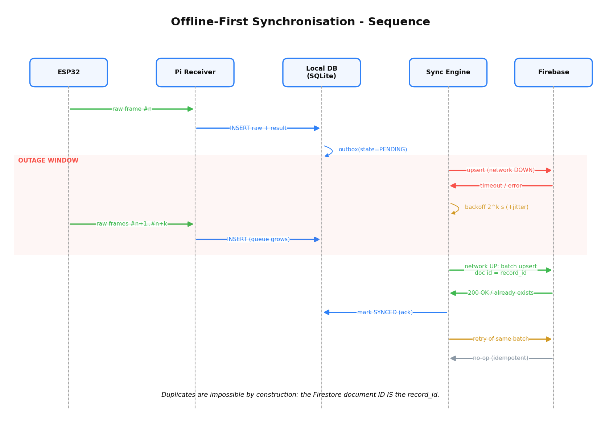</p>

<sub>Figure 15.1: Offline-first synchronisation sequence, including a retry that produces no duplicate.</sub>

### 15.3 Queue behaviour (simulated)

<p align="center">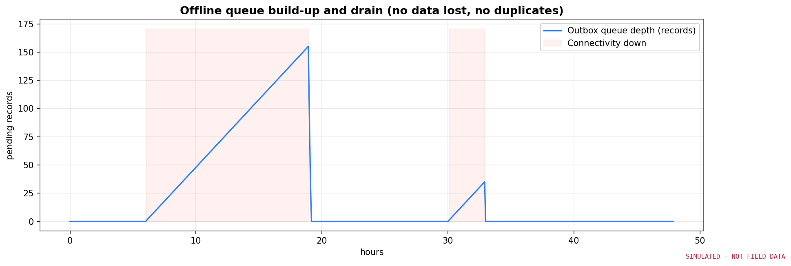</p>

<sub>Figure 15.2: SIMULATED outbox depth during two outages (13 h and 3 h). The queue drains in batches once connectivity returns.</sub>

### 15.4 Duplicate prevention: three layers

| Layer | Mechanism |
|---|---|
| ESP32 → Pi | `record_id` primary key in `raw_readings`; a replayed frame → `DUP-001` + ACK, no second row |
| Outbox | `UNIQUE(collection, doc_id)`: a record can't be enqueued twice |
| Firestore | Document ID **is** `record_id`; `create()` fails with `ALREADY_EXISTS`, which the sync engine treats as success |

### 15.5 Sync engine (reference implementation)

```python
# smart-water-raspberry-pi/src/sync/engine.py
"""Outbox → Firestore synchroniser. Idempotent, resumable, backoff with jitter."""
from __future__ import annotations

import json
import logging
import random
import sqlite3
import time
from datetime import datetime, timedelta, timezone

log = logging.getLogger("swedge.sync")


class CloudUnavailable(Exception):
    """Transient error: network down, timeout, 5xx."""


class CloudAuthError(Exception):
    """Permanent until fixed: credentials rejected."""


def utcnow() -> datetime:
    return datetime.now(timezone.utc)


class SyncEngine:
    def __init__(self, db: sqlite3.Connection, cloud, cfg: dict):
        self.db, self.cloud, self.cfg = db, cloud, cfg
        self.db.row_factory = sqlite3.Row

    def _due_batch(self):
        return self.db.execute(
            "SELECT * FROM sync_outbox WHERE state='PENDING' AND next_attempt_ts <= ? "
            "ORDER BY outbox_id LIMIT ?",
            (utcnow().isoformat(), self.cfg["batch_size"]),
        ).fetchall()

    def _backoff(self, attempts: int) -> float:
        d = min(self.cfg["max_delay_s"], self.cfg["base_delay_s"] * (2 ** attempts))
        return d + random.uniform(0, self.cfg["jitter_s"])

    def run_once(self) -> int:
        batch = self._due_batch()
        if not batch:
            return 0
        docs = [(r["collection"], r["doc_id"], json.loads(r["payload_json"])) for r in batch]
        ids = [r["outbox_id"] for r in batch]
        try:
            self.cloud.upsert_many(docs)             # create-if-absent; ALREADY_EXISTS == success
        except CloudAuthError as e:
            log.error("cloud auth error: %s", e)
            self._defer(batch, str(e), fixed_delay=self.cfg["max_delay_s"])
            raise
        except CloudUnavailable as e:
            log.warning("cloud unavailable (%d queued): %s", len(batch), e)
            self._defer(batch, str(e))
            return 0
        with self.db:
            self.db.executemany("UPDATE sync_outbox SET state='ACKED', last_error=NULL WHERE outbox_id=?",
                                [(i,) for i in ids])
        log.info("synced %d docs", len(ids))
        return len(ids)

    def _defer(self, batch, err: str, fixed_delay: float | None = None):
        with self.db:
            for r in batch:
                delay = fixed_delay if fixed_delay is not None else self._backoff(r["attempts"])
                self.db.execute(
                    "UPDATE sync_outbox SET attempts=attempts+1, last_error=?, next_attempt_ts=? "
                    "WHERE outbox_id=?",
                    (err[:500], (utcnow() + timedelta(seconds=delay)).isoformat(), r["outbox_id"]),
                )

    def pending_count(self) -> int:
        return self.db.execute("SELECT COUNT(*) FROM sync_outbox WHERE state='PENDING'").fetchone()[0]

    def loop(self, stop):
        while not stop.is_set():
            try:
                n = self.run_once()
            except CloudAuthError:
                n = 0
            stop.wait(0.5 if n else 5.0)
```

> **Why `sync_outbox` allows UPDATE when the other tables don't:** the outbox is **operational state**, not evidence. It records *delivery progress*. The evidence tables (`raw_readings`, `verification_results`, `audit_log`) stay append-only.

### 15.6 Ordering guarantees

- Records are delivered **at least once** and stored **exactly once** (because the ID is idempotent).
- Delivery order is *approximately* chronological (outbox FIFO). Consumers sort by `device_ts` and never assume arrival order.
- The dashboard shows a **"data delayed"** banner when `now − last_sync > stale_after_s`.

---

## 16. Firebase Cloud Design

### 16.1 Collections

```text
firestore/
├── nodes/{nodeId}
│     location_id, deployment_state, fw_version, last_comm_ts, power_status,
│     sensor_ids{}, chain_head, gateway_id, commissioned_by, commissioned_ts
├── readings/{recordId}                    ← append-only
│     node_id, device_ts, received_ts, raw{}, raw_electrical{}, mode, power{}, comm{},
│     verification{status, verification, rules[], engine_version}, raw_sha256, chain_hash
├── alerts/{alertId}
│     node_id, ts, type, severity, status, ack{by, ts, note}, record_ref
│     └── events/{eventId}                 ← append-only lifecycle
├── power/{sampleId}                       ← append-only
│     node_id, ts, solar{v,i,p,status}, wind{v,i,p,status}, battery{v,i,soc_est,status},
│     load_p, source, charge_state
├── power_events/{eventId}                 ← append-only
│     node_id, ts, type (SOLAR_UNAVAILABLE | WIND_UNAVAILABLE | BATTERY_LOW | ...), detail
├── audit/{auditId}                        ← append-only, written by Cloud Functions only
│     event, actor_uid, actor_role, ts, action, target_ref, previous_state, new_state, reason
├── maintenance/{taskId}
│     node_id, type, due_ts, done_ts, done_by, notes
└── config/{nodeId}                        ← admin-only, every change mirrored into audit
      verification{}, modes{}, power{}
```

### 16.2 Field reference (required minimum)

| Collection | Required fields |
|---|---|
| **NODES** | node ID · location identifier · deployment status · firmware version · last communication · power status |
| **READINGS** | timestamp · raw sensor values · verification result · operating mode · node ID |
| **ALERTS** | alert ID · node ID · timestamp · alert type · severity · status · acknowledgement |
| **POWER** | solar status · wind status · battery status · current power source · charging/discharging · power events |
| **AUDIT** | event · user · timestamp · action · previous state · new state |

### 16.3 Security Rules

```javascript
// smart-water-firebase/firestore.rules
rules_version = '2';
service cloud.firestore {
  match /databases/{database}/documents {

    function signedIn()      { return request.auth != null; }
    function role()          { return request.auth.token.role; }
    function isEngineer()    { return signedIn() && role() in ['engineer','service','supervisor','admin']; }
    function isAdmin()       { return signedIn() && role() == 'admin'; }
    function onlyChanges(keys) { return request.resource.data.diff(resource.data).affectedKeys().hasOnly(keys); }

    // Devices write through the Admin SDK (service account), which bypasses rules.
    // Therefore NO client may create readings/power/audit.

    match /nodes/{nodeId} {
      allow read: if isEngineer();
      allow write: if false;                       // provisioning via Cloud Function only
    }

    match /readings/{recordId} {
      allow read: if isEngineer();
      allow create, update, delete: if false;      // immutable for all clients
    }

    match /power/{sampleId}        { allow read: if isEngineer(); allow write: if false; }
    match /power_events/{eventId}  { allow read: if isEngineer(); allow write: if false; }

    match /alerts/{alertId} {
      allow read: if isEngineer();
      // Engineers may ONLY acknowledge: set status=ACKNOWLEDGED + ack block, nothing else.
      allow update: if isEngineer()
                    && resource.data.status in ['RAISED','NOTIFIED']
                    && request.resource.data.status == 'ACKNOWLEDGED'
                    && request.resource.data.ack.by == request.auth.uid
                    && request.resource.data.ack.ts == request.time
                    && onlyChanges(['status','ack']);
      allow create, delete: if false;
      match /events/{eventId} { allow read: if isEngineer(); allow write: if false; }
    }

    match /audit/{auditId} {
      allow read: if signedIn() && role() in ['supervisor','admin'];
      allow write: if false;                       // Cloud Functions (Admin SDK) only
    }

    match /maintenance/{taskId} {
      allow read: if isEngineer();
      allow update: if isEngineer()
                    && onlyChanges(['done_ts','done_by','notes'])
                    && request.resource.data.done_by == request.auth.uid;
      allow create, delete: if isAdmin();
    }

    match /config/{nodeId} {
      allow read: if signedIn() && role() in ['service','admin'];
      allow write: if false;                       // via audited Cloud Function `updateConfig`
    }
  }
}
```

### 16.4 Audit trigger (Cloud Function)

```typescript
// smart-water-firebase/functions/src/audit.ts
import { onDocumentUpdated } from "firebase-functions/v2/firestore";
import { getFirestore, FieldValue } from "firebase-admin/firestore";

export const auditAlertAck = onDocumentUpdated("alerts/{alertId}", async (event) => {
  const before = event.data?.before.data();
  const after = event.data?.after.data();
  if (!before || !after || before.status === after.status) return;
  const db = getFirestore();
  await db.collection("audit").add({
    event: "ALERT_STATE_CHANGE",
    action: "ALERT_ACK",
    actor_uid: after.ack?.by ?? "unknown",
    target_ref: `alerts/${event.params.alertId}`,
    previous_state: { status: before.status },
    new_state: { status: after.status, ack: after.ack ?? null },
    reason: after.ack?.note ?? "",
    ts: FieldValue.serverTimestamp(),
  });
});
```

### 16.5 Indexes

```json
{
  "indexes": [
    { "collectionGroup": "readings", "queryScope": "COLLECTION",
      "fields": [ { "fieldPath": "node_id", "order": "ASCENDING" },
                  { "fieldPath": "device_ts", "order": "DESCENDING" } ] },
    { "collectionGroup": "readings", "queryScope": "COLLECTION",
      "fields": [ { "fieldPath": "node_id", "order": "ASCENDING" },
                  { "fieldPath": "verification.status", "order": "ASCENDING" },
                  { "fieldPath": "device_ts", "order": "DESCENDING" } ] },
    { "collectionGroup": "alerts", "queryScope": "COLLECTION",
      "fields": [ { "fieldPath": "status", "order": "ASCENDING" },
                  { "fieldPath": "ts", "order": "DESCENDING" } ] },
    { "collectionGroup": "power", "queryScope": "COLLECTION",
      "fields": [ { "fieldPath": "node_id", "order": "ASCENDING" },
                  { "fieldPath": "ts", "order": "DESCENDING" } ] }
  ],
  "fieldOverrides": []
}
```

### 16.6 Secrets: never in Git

| Secret | Where it lives | Never |
|---|---|---|
| Firebase service-account JSON (edge) | `/etc/smart-water/sa.json`, mode `0600`, owner `swedge`; path in `GOOGLE_APPLICATION_CREDENTIALS` | Committed, emailed, pasted in issues |
| Firebase web config (dashboard) | `.env.local` (`VITE_FIREBASE_*`) | Treated as a secret: it's an identifier, protected by Security Rules and App Check |
| Debug API token | `/etc/smart-water/edge.env` | Hard-coded |
| Modem APN credentials | NVS, provisioned via serial | Committed |
| Wi-Fi credentials (if used) | NVS | Committed |

```bash
# .env.example (committed) — copy to .env (git-ignored) and fill in
GOOGLE_APPLICATION_CREDENTIALS=/etc/smart-water/sa.json
FIREBASE_PROJECT_ID=your-project-id
SW_DEBUG_API_TOKEN=change-me-generate-with-openssl-rand-hex-32
MODEM_APN=
```

```gitignore
# .gitignore (all repos)
.env
.env.*
!.env.example
*.pem
*.key
*.p12
*service-account*.json
sa.json
secrets/
config/*.yaml
!config/*.example.yaml
*.db
*.db-wal
*.db-shm
logs/
.venv/
node_modules/
dist/
build/
.pio/
```

---

## 17. Security

> **Scope statement:** the project applies *reasonable* security practices suited to a prototype heading for a pilot. It does **not** claim military-grade security, formal certification, or resistance to a determined, well-resourced attacker with physical access.

### 17.1 Threat model (STRIDE summary)

| Threat | Example | Mitigation | Residual risk |
|---|---|---|---|
| **S**poofing | Fake node sends readings | Registered node/sensor IDs (NID-*), per-gateway service account, physical link | Physical attacker on the UART can inject frames. Future: signed frames (HMAC with per-node key) |
| **T**ampering | Editing historical readings | Append-only DB triggers, Security Rules, hash chain, audit log | Root on Pi + cloud admin together |
| **R**epudiation | "I never acknowledged that alert" | Auth-bound `ack.by`, server timestamps, audit trail | — |
| **I**nformation disclosure | Leaked keys in GitHub | No secrets in Git, secret scanning, `.gitignore`, key rotation | Human error. Mitigated by pre-commit hooks |
| **D**enial of service | Flooding the edge API; jamming cellular | Rate limiting, LAN-only API, offline-first design | RF jamming can't be prevented, only detected |
| **E**levation of privilege | Engineer modifies config | Custom claims + rules; config via audited function | Compromised admin account → MFA recommended |

### 17.2 Controls checklist

| Control | Implementation | Phase |
|---|---|:-:|
| Authentication | Firebase Auth (email/password + MFA for admin; SSO future) | 7–8 |
| Role-based access | Custom claims `role`; Security Rules; UI hides disallowed actions | 7–9 |
| Secure API keys | Service account on edge only; web config restricted by Rules + App Check | 7 |
| Environment variables | `.env` / `EnvironmentFile=`; `.env.example` committed | 1 |
| No secrets in GitHub | `.gitignore`, `gitleaks` pre-commit hook + CI job | 1 |
| Input validation | Frame CRC, JSON schema, verification engine, UI form validation | 3–5 |
| Unique device IDs | Provisioned `node_id`, `sensor_id`; eFuse MAC recorded at provisioning | 2 |
| Audit logging | Edge `audit_log` + Firestore `audit` via Functions | 4, 7 |
| Secure communication | TLS for all cloud traffic (Firebase SDKs); local API token over LAN (TLS optional, future) | 7, 9 |
| Firmware version tracking | `fw` in every frame; `nodes.fw_version`; build hash in version string | 2 |
| Least privilege on edge | Dedicated `swedge` user; systemd hardening directives | 4 |
| Dependency hygiene | `pip-audit`, `npm audit`, Dependabot | 16 |
| OTA integrity (future) | Signed firmware images, ESP32 secure boot / flash encryption | Future |

### 17.3 Pre-commit secret scanning

```yaml
# .pre-commit-config.yaml (all repositories)
repos:
  - repo: https://github.com/gitleaks/gitleaks
    rev: v8.18.4
    hooks:
      - id: gitleaks
  - repo: https://github.com/pre-commit/pre-commit-hooks
    rev: v4.6.0
    hooks:
      - id: check-added-large-files
      - id: detect-private-key
      - id: end-of-file-fixer
      - id: trailing-whitespace
```

### 17.4 If a secret is leaked

1. **Revoke/rotate immediately** (Firebase console → service accounts → delete key).
2. Treat it as compromised even if the repo is private.
3. Remove it from history (`git filter-repo`) *after* rotation. Rotation matters more than history rewriting.
4. File an internal audit event: what leaked, when, when it was rotated.
5. Review Firestore audit and access logs for misuse during the exposure window.

---

# PART C: USER INTERFACES

## 18. Industrial Engineer Dashboard

### 18.1 Design goals

| Goal | How |
|---|---|
| Understandable without programming knowledge | Plain words ("Sensor disconnected", not "MIS-001"), with rule IDs shown as small secondary text |
| Minimal cognitive load | Five tabs; five parameter tiles; one status colour per tile |
| No decoration | No animated gauges, no 3-D charts, no auto-rotating carousels |
| Honest about freshness | Every value shows its timestamp; a stale-data banner when sync is late |
| Safe by construction | No edit or delete controls for historical data |
| Works on a rugged tablet in sunlight | High contrast, large touch targets (≥ 44 px), dark and light themes |
| Accessible | Colour is never the only signal: every status also has a text label and an icon |

### 18.2 Layout

<p align="center">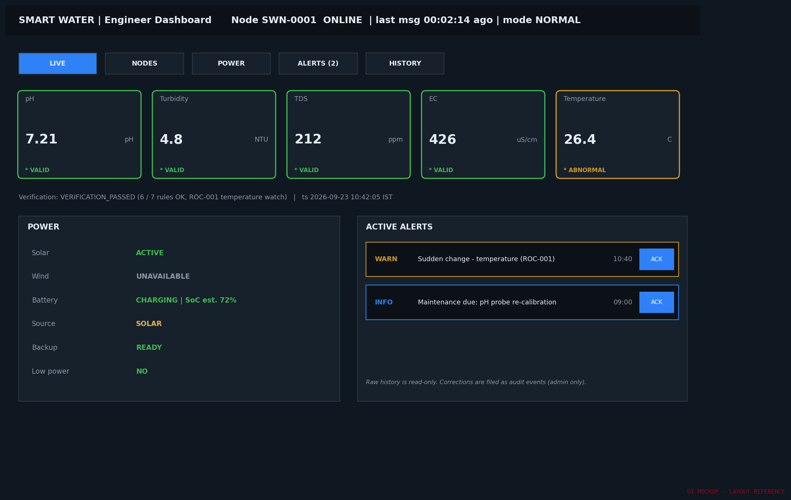</p>

<sub>Figure 18.1: Dashboard layout reference (Python-generated mock-up; values illustrative).</sub>

### 18.3 Tabs and content

| Tab | Shows | Actions allowed |
|---|---|---|
| **LIVE** | pH · Turbidity · TDS · EC · Temperature · timestamp · node ID · verification status (with plain-language reason) | None (read-only) |
| **NODES** | Online/offline · last communication · sensor health per sensor · firmware version · power state · deployment state | None |
| **POWER** | Solar · Wind · Battery · current power source · charging · backup · low-power flag | None |
| **ALERTS** | Active and recent alerts with severity, time and plain explanation | **Acknowledge** (with optional note) |
| **HISTORY** | Raw readings table · verification status · events · power history · node history · CSV export | Filter, export (read-only) |

### 18.4 Alert catalogue (dashboard)

| Alert type | Plain-language text | Source | Default severity | Suggested engineer action |
|---|---|---|---|---|
| `SENSOR_DISCONNECTED` | "The {sensor} sensor is not responding." | MIS-001 × N consecutive | ALARM | Check connector and cable; run the debugger sensor check |
| `ABNORMAL_READING` | "{param} is outside the configured attention band." | ABN-001 | WARNING | Follow the site procedure; consider a manual sample or screening |
| `SUDDEN_CHANGE` | "{param} changed faster than expected." | ROC-001 | WARNING | Check the probe is immersed and has no air bubble; compare with a manual reading |
| `NODE_OFFLINE` | "No data from node for {duration}." | Heartbeat timeout | ALARM | Check power and link; use the debugger |
| `COMMUNICATION_FAILURE` | "Messages were lost between node and gateway." | COM-001 / link counters | WARNING | Check the cable; look for noise sources |
| `POWER_FAILURE` | "No renewable input and battery supplying all loads." | Power monitor | WARNING | Inspect panel, turbine and controllers |
| `BATTERY_LOW` | "Battery low: system entering low-power mode." | SoC < LOW_ENTER | WARNING | Check charging; plan a visit |
| `BATTERY_CRITICAL` | "Battery critical: non-essential loads switched off." | SoC < CRITICAL | CRITICAL | Urgent site visit |
| `VERIFICATION_FAILURE` | "Recent readings failed data checks ({count} in {window})." | Verification failure rate | WARNING | Open History to see which rules fired |
| `MAINTENANCE_REQUIRED` | "{task} is due." | Maintenance schedule | INFO | Perform the task and log it |

### 18.5 Alert lifecycle

<p align="center">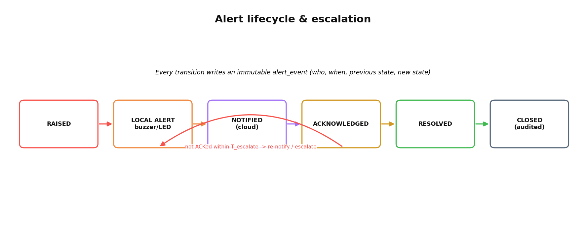</p>

<sub>Figure 18.2: Alert lifecycle and escalation. Every transition is an immutable event.</sub>

### 18.6 Technology

| Concern | Choice | Reason |
|---|---|---|
| Framework | React 18 + TypeScript + Vite | Mature, typed, fast build |
| Styling | Plain CSS modules with a small design-token file | No heavy UI kit; predictable rendering on low-end tablets |
| Data | Firebase JS SDK (Firestore `onSnapshot`) | Live updates, offline cache |
| Charts (History only) | One lightweight line chart per parameter | Charts only where they help: history, not live |
| Testing | Vitest + React Testing Library; Playwright for e2e | |
| Hosting | Firebase Hosting (optional) | |

### 18.7 Folder structure

```text
smart-water-dashboard/
├── README.md
├── LICENSE
├── .env.example
├── package.json
├── vite.config.ts
├── public/
│   └── favicon.svg
├── src/
│   ├── main.tsx
│   ├── App.tsx
│   ├── components/        # StatusBadge, ParamTile, StaleBanner, AckButton, DataTable
│   ├── pages/             # LivePage, NodesPage, PowerPage, AlertsPage, HistoryPage, LoginPage
│   ├── services/          # firebase.ts, readings.ts, alerts.ts, power.ts, auth.ts
│   ├── dashboard/         # live layout, tile grid
│   ├── alerts/            # alert list, plain-language map
│   ├── history/           # filters, CSV export
│   ├── power/             # power panel
│   └── styles/tokens.css
└── tests/
    ├── unit/
    └── e2e/
```

### 18.8 Key component: parameter tile

```tsx
// smart-water-dashboard/src/components/ParamTile.tsx
import { StatusBadge } from "./StatusBadge";
import type { VerificationStatus } from "../services/types";

interface Props {
  label: string;             // "pH"
  value: number | null;      // raw value, never modified
  unit: string;              // "NTU"
  status: VerificationStatus;
  reason?: string;           // plain-language reason
  ts: string;                // ISO timestamp of the reading
  annotated?: boolean;       // true if an audit annotation exists
}

export function ParamTile({ label, value, unit, status, reason, ts, annotated }: Props) {
  const display = value === null ? "—" : value.toLocaleString(undefined, { maximumFractionDigits: 2 });
  return (
    <section className={`tile tile--${status.toLowerCase()}`} aria-label={`${label} reading`}>
      <header className="tile__label">{label}</header>
      <div className="tile__value">
        {display} <span className="tile__unit">{unit}</span>
      </div>
      <StatusBadge status={status} />
      {reason && <p className="tile__reason">{reason}</p>}
      <footer className="tile__ts">
        {new Date(ts).toLocaleString()} {annotated && <span className="tile__annot">annotated</span>}
      </footer>
    </section>
  );
}
```

### 18.9 Plain-language mapping

```ts
// smart-water-dashboard/src/alerts/plainLanguage.ts
export const RULE_TEXT: Record<string, string> = {
  "FMT-001": "Message could not be read",
  "FMT-002": "Message incomplete",
  "FMT-005": "Sensor sent a non-numeric value",
  "DUP-001": "Duplicate message ignored",
  "NID-001": "Unknown device",
  "NID-002": "Unregistered sensor",
  "TS-001":  "Time stamp unreadable",
  "TS-002":  "Device clock ahead of gateway",
  "TS-003":  "Very old message",
  "TS-004":  "Time went backwards",
  "COM-001": "Some messages were lost",
  "MIS-001": "Sensor not responding",
  "RNG-001": "Value outside what the sensor can measure: likely sensor fault",
  "ROC-001": "Changed faster than expected",
  "HLT-001": "Sensor value not changing: possibly stuck",
  "CON-001": "TDS and EC sensors disagree",
  "ABN-001": "Outside configured attention band",
};
```

---

## 19. Industrial Debugger

### 19.1 Purpose

The dashboard answers *"what is the water doing, and do I need to act?"*
The debugger answers *"what exactly is wrong with this installation, and how do I prove it's fixed?"*

It is a **separate application** (web UI plus CLI) for service engineers. It talks to the edge's local API over the LAN or the gateway's service Wi-Fi access point, so it **works on site with no internet**.

### 19.2 Layout

<p align="center">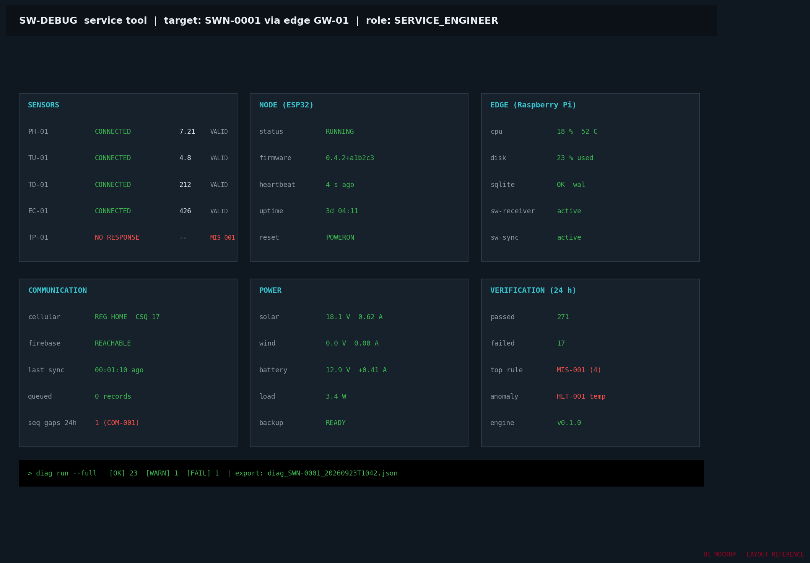</p>

<sub>Figure 19.1: Debugger layout reference (Python-generated mock-up). Monospace, high-density, service-tool aesthetic.</sub>

### 19.3 Panels

| Panel | Fields | Source |
|---|---|---|
| **Sensor diagnostics** | Connected/disconnected · last reading · reading validity · response status · raw mV · calibration version/date · noise (σ over last N) | Latest frames + `raw_electrical` |
| **Node diagnostics** | ESP32 status · firmware version · last heartbeat · communication status · uptime · reset reason · free heap · boot_id · ring-buffer depth | Heartbeat frames |
| **Raspberry Pi** | CPU %, CPU temperature · storage used/free · local database status (integrity check, WAL size) · processing service status (systemd) | `sw-health` |
| **Communication** | Cellular status (registration, CSQ) · Firebase status · last successful sync · queued records · CRC error rate · seq gaps | `sw-sync`, receiver counters |
| **Power** | Solar V/I/W · wind V/I/W · battery V/I/state · load W · backup state · active source · last source switch | Power samples |
| **Data verification** | Passed/failed counts (1 h / 24 h) · rule triggered (histogram) · sensor anomalies · engine version · config hash | `verification_results` |
| **Maintenance** | Calibration due dates · last maintenance · open tasks · chain verification status | `maintenance`, chain check |

### 19.4 CLI

```text
$ swdebug --gateway 192.168.4.1 --token $SW_DEBUG_API_TOKEN

swdebug> status
  node SWN-0001  RUNNING  fw 0.4.2+a1b2c3  mode NORMAL  hb 4s  link LINK_OK
  edge GW-01     cpu 18%  52C  disk 23%  db OK  receiver active  sync active
  cloud          REACHABLE  last sync 70s  queued 0

swdebug> sensors
  ID     STATE        LAST     mV      VALID   CAL           NOISE(σ)
  PH-01  CONNECTED    7.21     1412    VALID   2026-09-01#3  0.004
  TU-01  CONNECTED    4.80     3021    VALID   2026-09-01#1  0.12
  TD-01  CONNECTED    212      611     VALID   2026-09-01#2  1.1
  EC-01  CONNECTED    426      702     VALID   2026-09-01#2  2.3
  TP-01  NO RESPONSE  --       --      MIS-001 n/a           --

swdebug> rules --since 24h
  MIS-001  4   ████
  ROC-001  3   ███
  HLT-001  3   ███
  CON-001  1   █
  RNG-001  1   █
  COM-001  1   █

swdebug> verify-chain SWN-0001
  checked 12,447 records ... OK (head 9c1e…44af)

swdebug> diag run --full
  [OK]   sensor.ph.response        [OK]   edge.disk.free
  [OK]   sensor.tu.response        [OK]   edge.db.integrity
  ...
  [FAIL] sensor.tp.response        -> check 1-Wire cable / pull-up (TSG-S03)
  [WARN] comm.seq_gaps_24h = 1     -> see TSG-C02
  summary: OK 23  WARN 1  FAIL 1
  report: diag_SWN-0001_20260923T1042.json
```

### 19.5 Diagnostic check catalogue

| Check ID | Checks | PASS criterion (configurable) | Troubleshooting ref |
|---|---|---|---|
| `sensor.<x>.response` | Value non-null in the last N frames | ≥ 1 non-null in last 3 | TSG-S01…S05 |
| `sensor.<x>.noise` | σ of the last N readings | < `noise_max.<x>` | TSG-S06 |
| `sensor.<x>.cal_age` | Days since calibration | < `cal_interval_days.<x>` | §43 |
| `node.heartbeat` | Age of the last heartbeat | < `heartbeat_timeout_s` | TSG-N01 |
| `node.fw_match` | Firmware equals the expected release | equal | TSG-N03 |
| `node.reset_reason` | Last reset not brownout/watchdog | not in {BROWNOUT, WDT} | TSG-P04 |
| `edge.disk.free` | Free space | > 20% | TSG-E02 |
| `edge.db.integrity` | `PRAGMA integrity_check` | `ok` | TSG-E03 |
| `edge.services` | systemd units active | all active | TSG-E01 |
| `edge.cpu_temp` | CPU temperature | < `cpu_temp_warn_c` | TSG-E04 |
| `comm.link` | CRC error rate | < 1% | TSG-C01 |
| `comm.seq_gaps_24h` | COM-001 count | 0 | TSG-C02 |
| `comm.cloud` | Last sync age | < `stale_after_s` | TSG-C03 |
| `comm.modem` | Registered, CSQ | registered & CSQ ≥ `csq_min` | TSG-C04 |
| `power.battery` | SoC estimate | > LOW_ENTER | TSG-P01 |
| `power.solar` | Daylight output | > 0 during the configured daylight window | TSG-P02 |
| `power.wind` | Output when the anemometer (optional) reports wind | consistent | TSG-P03 |
| `data.verify_rate` | Failed/total over 24 h | < `verify_fail_max` | TSG-D01 |
| `data.chain` | Hash chain intact | OK | TSG-D02 |

### 19.6 Local API (edge, read-mostly)

| Method | Path | Role | Description |
|---|---|---|---|
| GET | `/api/v1/status` | service | Summary of node, edge and cloud |
| GET | `/api/v1/sensors` | service | Per-sensor diagnostics |
| GET | `/api/v1/readings?node=&since=&limit=` | service | Raw readings (read-only) |
| GET | `/api/v1/results?node=&since=` | service | Verification results |
| GET | `/api/v1/power?since=` | service | Power samples |
| GET | `/api/v1/outbox` | service | Queue summary |
| POST | `/api/v1/diag/run` | service | Run the diagnostic suite (no data mutation) |
| POST | `/api/v1/chain/verify` | service | Verify the hash chain |
| POST | `/api/v1/calibration/session` | service | Start a calibration session (audited) |
| POST | `/api/v1/maintenance` | engineer+ | Log a maintenance action (audited) |

There are no endpoints to update or delete readings, results or audit entries.

---

# PART D: ENERGY

## 20. Weather-Resilient Energy Management

### 20.1 Principle

> **Weather describes likely conditions; sensors measure actual energy.** The power controller acts only on measured voltage, current and battery state. Weather labels in this section explain *why* measured values might change. They are never inputs to the control law.

### 20.2 Scenario matrix

<p align="center">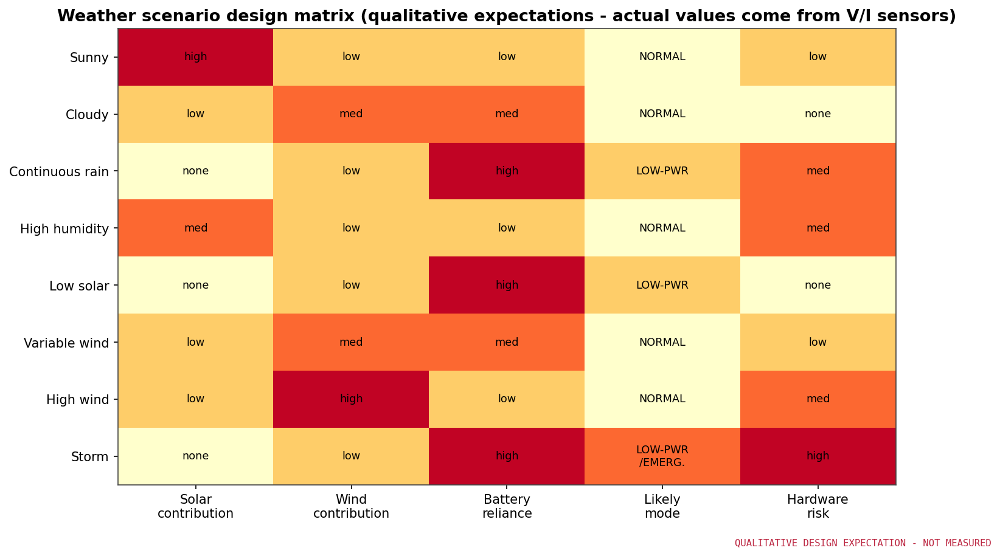</p>

<sub>Figure 20.1: Qualitative design expectations per weather scenario. These are not measurements.</sub>

| Weather condition | Expected solar | Expected wind | Controller response (based on **measurements**) |
|---|---|---|---|
| **Sunny** + low wind | High (daytime) | Low | Solar supplies load and charges battery; battery covers night |
| **Cloudy** + sufficient wind | Reduced | Moderate–high | Wind contributes; solar partial |
| **Continuous rain** + intermittent wind | Low | Variable | Available renewable + battery; watch SoC trend |
| **High humidity** | Unaffected directly | — | Enclosure condensation risk; no power action (monitor internal RH if fitted) |
| **Low solar availability** (e.g. monsoon week) | Low for days | Variable | Battery reliance grows → LOW-POWER as needed |
| **Variable wind** | — | Fluctuating | Wind controller smooths; battery buffers |
| **High wind** | — | High until cut-out | Controller may brake or divert; generation can drop to zero |
| **Storm-related** | Very low | Gusty / braked | Battery + LOW-POWER; lightning protection matters most; check the site after the storm |

### 20.3 Control law (measurement-driven)

```text
every power_interval_s:
    P_solar  = V_solar  × I_solar          (measured)
    P_wind   = V_wind   × I_wind           (measured)
    P_load   = V_load   × I_load           (measured)
    P_batt   = V_batt   × I_batt           (measured, sign: + charging, − discharging)
    SoC_est  = estimator(V_batt, I_batt, T, history)

    source   = classify(P_solar, P_wind, P_load)      # SOLAR | WIND | SOLAR+WIND | RENEWABLE+BATTERY | BATTERY
    state    = CHARGING if P_batt > +ε else DISCHARGING if P_batt < −ε else IDLE

    if SoC_est < CRITICAL: shed(P2, P3, P4) ; mode ← LOW_POWER ; event(BATTERY_CRITICAL)
    elif SoC_est < LOW_ENTER for T_low: shed(P4) ; mode ← LOW_POWER ; event(BATTERY_LOW)
    elif SoC_est > LOW_EXIT and P_solar+P_wind > P_load for T_ok: restore() ; mode ← NORMAL
    emit power_sample, and events on any transition
```

### 20.4 Source classification

```python
# smart-water-power/src/power/classify.py
from enum import Enum

class Source(str, Enum):
    SOLAR = "SOLAR"
    WIND = "WIND"
    SOLAR_WIND = "SOLAR+WIND"
    RENEWABLE_BATTERY = "RENEWABLE+BATTERY"
    BATTERY = "BATTERY"

def classify(p_solar: float, p_wind: float, p_load: float, eps: float = 0.2) -> Source:
    """eps (W) = measurement noise floor; TBD / CONFIGURABLE from INA calibration."""
    solar_on, wind_on = p_solar > eps, p_wind > eps
    gen = (p_solar if solar_on else 0.0) + (p_wind if wind_on else 0.0)
    if gen <= eps:
        return Source.BATTERY
    if gen < p_load:
        return Source.RENEWABLE_BATTERY
    if solar_on and wind_on:
        return Source.SOLAR_WIND
    return Source.SOLAR if solar_on else Source.WIND
```

### 20.5 Battery state estimation (honest version)

| Method | Accuracy | Complexity | Notes |
|---|---|---|---|
| Voltage look-up table | Low–medium | Low | Depends on load and temperature; LiFePO₄'s flat curve makes it especially poor |
| Coulomb counting | Medium–high short-term | Medium | Drifts; needs periodic re-sync at full charge |
| BMS-reported SoC | Depends on BMS | Low (integration) | Preferred where a BMS with a data interface exists |
| Combined (coulomb + voltage re-sync at rest) | Medium–high | Medium | Recommended target for Phase 13 |

> The dashboard labels battery state as **"SoC estimate"**, never as a precise percentage guarantee.

---

## 21. Power Monitoring

### 21.1 Recorded measurements

| Measurement | Unit | Sensor | Sample interval |
|---|---|---|---|
| Solar voltage | V | Power monitor #1 | `power_interval_s` (default 60 s NORMAL; at wake in LOW-POWER) |
| Solar current | A | Power monitor #1 | same |
| Solar power | W | computed | same |
| Wind voltage | V | Power monitor #2 (after rectifier) | same |
| Wind current | A | Power monitor #2 | same |
| Wind power | W | computed | same |
| Battery voltage | V | Power monitor #3 | same |
| Battery current (±) | A | Power monitor #3 | same |
| Battery state/status | enum + SoC estimate | estimator | same |
| Load power | W | Power monitor #4 | same |
| Charging/discharging state | enum | derived | same |
| Current power source | enum | classifier | same |
| Timestamp | ISO-8601 | RTC | same |

### 21.2 Power events

| Event | Condition (all thresholds configurable) | Severity | Clears when |
|---|---|---|---|
| `SOLAR_UNAVAILABLE` | P_solar < ε for > `T_solar_absent` **inside** the configured daylight window | INFO | P_solar > ε for `T_restore` |
| `WIND_UNAVAILABLE` | P_wind < ε for > `T_wind_absent` | INFO | P_wind > ε for `T_restore` |
| `BATTERY_LOW` | SoC_est < LOW_ENTER | WARNING | SoC_est > LOW_EXIT |
| `BATTERY_CRITICAL` | SoC_est < CRITICAL | CRITICAL | SoC_est > LOW_ENTER |
| `CHARGING_FAILURE` | P_solar+P_wind > P_load + margin **and** I_batt ≤ 0 for > `T_chg_fail` | ALARM | I_batt > 0 |
| `POWER_SOURCE_SWITCH` | `source` classification changes (debounced by `T_switch_debounce`) | INFO | — |
| `RENEWABLE_RESTORED` | Generation > load after a BATTERY period | INFO | — |
| `OVERSPEED_PROTECTION` | Wind controller status input reports brake/dump (if available) | INFO | Status clears |

### 21.3 Power sample payload

```json
{
  "sample_id": "SWN-0001-P-00017-00012094",
  "node_id": "SWN-0001",
  "ts": "2026-09-23T05:12:00Z",
  "solar":   { "v": 18.1, "i": 0.62, "p": 11.2, "status": "ACTIVE" },
  "wind":    { "v": 0.0,  "i": 0.00, "p": 0.0,  "status": "UNAVAILABLE" },
  "battery": { "v": 12.9, "i": 0.41, "soc_est": 72, "status": "CHARGING" },
  "load_p": 3.4,
  "source": "SOLAR",
  "charge_state": "CHARGING"
}
```

### 21.4 Power configuration (example)

```yaml
# smart-water-power/config/power.example.yaml
battery:
  chemistry: TBD
  nominal_v: TBD
  capacity_ah: TBD            # not specified by this project
  soc_method: combined
  thresholds_pct:
    low_enter: TBD            # e.g. chosen after battery datasheet review
    low_exit:  TBD            # must be > low_enter
    critical:  TBD            # must be < low_enter
measurement:
  interval_s: 60
  noise_floor_w: TBD          # ε
daylight_window_local: ["06:00", "18:30"]   # site-dependent
events:
  solar_absent_s: 3600
  wind_absent_s: 21600
  charge_fail_s: 1800
  restore_s: 600
  switch_debounce_s: 120
load_priority:                # lower number = more important
  P1: [esp32_sensors, local_alert]
  P2: [raspberry_pi]
  P3: [cellular_modem]
  P4: [purification_aux]
shed_profile:
  low_power: { P4: off, P3: burst, P2: duty_cycle }
  critical:  { P4: off, P3: burst, P2: off_with_graceful_shutdown }
```

---

## 22. Power Failover & Load Priority

### 22.1 Failover behaviour

```text
Renewable ≥ load              → renewable supplies load, surplus charges battery
Renewable < load              → BATTERY supports the deficit         (event: POWER_SOURCE_SWITCH)
Renewable returns             → resume renewable-supported operation (event: RENEWABLE_RESTORED)
SoC < LOW_ENTER               → LOW-POWER mode, shed P4, P3 → burst, P2 → duty-cycle
SoC < CRITICAL                → shed P2 (graceful Pi shutdown), P3 burst-only; P1 protected
Hardware LVD threshold        → everything off (battery protection, independent of firmware)
```

### 22.2 Load-priority matrix

<p align="center">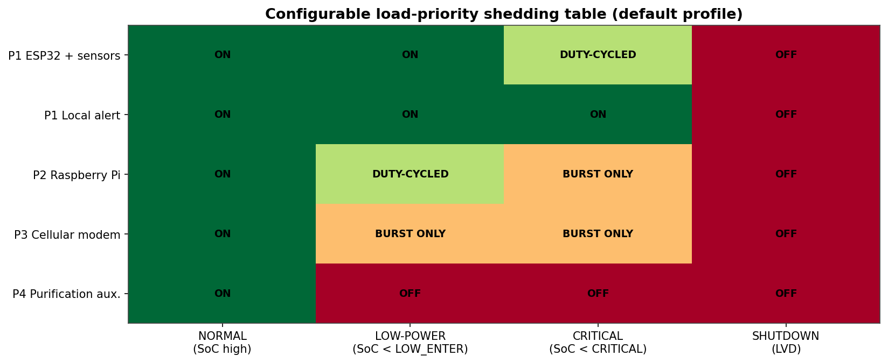</p>

<sub>Figure 22.1: Default shedding profile (configurable).</sub>

### 22.3 Graceful Raspberry Pi shutdown

Cutting power to a Pi while it writes to its database can corrupt the SD card. Shedding P2 therefore uses a handshake:

```text
ESP32                                   Raspberry Pi
  │ SHUTDOWN_REQUEST (UART, reason)        │
  │───────────────────────────────────────►│ flush WAL, stop services, sync FS
  │                                        │ `systemctl poweroff`
  │◄─────────────── SHUTDOWN_ACK ──────────│
  │ wait for GPIO "PI_HALTED" or t_max     │
  │ open load switch P2                    │
  │ log POWER event (P2_SHED)              │
```

- `t_max` = `TBD / CONFIGURABLE` (measure the actual shutdown time and add margin).
- While the Pi is off, the ESP32 **ring-buffers** frames and replays them after the Pi is restored.
- The Pi is restored only when SoC > LOW_EXIT, which avoids on/off cycling.

### 22.4 Load manager (ESP32, C++)

```cpp
// smart-water-esp32/power/LoadManager.cpp
#include "LoadManager.h"

void LoadManager::apply(PowerLevel level) {
  switch (level) {
    case PowerLevel::NORMAL:
      setLoad(Load::P4_AUX,   cfg_.auxEnabledInNormal);
      setLoad(Load::P3_MODEM, LoadState::ON_DEMAND);
      requestPi(true);
      break;
    case PowerLevel::LOW:
      setLoad(Load::P4_AUX,   LoadState::OFF);
      setLoad(Load::P3_MODEM, LoadState::BURST);
      cfg_.piPolicyLow == PiPolicy::OFF ? requestPi(false) : dutyCyclePi();
      break;
    case PowerLevel::CRITICAL:
      setLoad(Load::P4_AUX,   LoadState::OFF);
      setLoad(Load::P3_MODEM, LoadState::BURST);
      requestPi(false);                 // graceful shutdown handshake
      break;
  }
  // P1 (ESP32 + sensors + local alert) is never shed by firmware.
  events_.log(EventCategory::POWER, "LOAD_PROFILE_APPLIED", toString(level));
}
```

---

# PART E: REPOSITORIES AND THE 17-PHASE BUILD

## 23. Repository Structure (8 repositories)

<p align="center">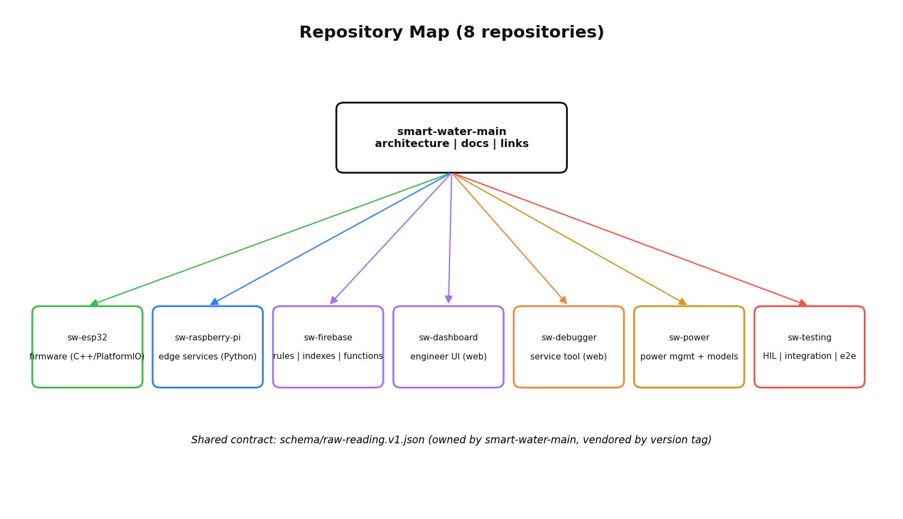</p>

<sub>Figure 23.1: Repository map. The shared message schema is owned by <code>smart-water-main</code> and pinned by version tag in each consumer.</sub>

### 23.1 Why separate repositories?

| Reason | Explanation |
|---|---|
| Independent release cycles | Firmware releases are rare and risky; dashboard releases are frequent and low-risk |
| Different toolchains | PlatformIO (C++), Python/pytest, Node/TypeScript, Firebase CLI |
| Access control | Firebase rules and power-control code can have stricter reviewers |
| Clear ownership | Each repo maps to one subsystem and one CODEOWNERS group |
| No duplicated code | Shared *contracts* (JSON Schema, rule IDs) are versioned in `smart-water-main/schema/`; *code* isn't shared by copy-paste |

### 23.2 Files every repository must have

| File / folder | Purpose |
|---|---|
| `README.md` | What, why, how to build, how to test, how to configure |
| `LICENSE` | License text (see §55) |
| `docs/` | Subsystem documentation |
| `src/` (or equivalent) | Source code |
| `config/*.example.*` | Configuration examples, **no secrets** |
| `.env.example` | Environment variable template (where applicable) |
| `tests/` | Automated tests |
| `.gitignore` | Excludes secrets, build output, databases, logs |
| `.pre-commit-config.yaml` | Secret scanning + hygiene |
| `.github/workflows/ci.yml` | Build + test on every PR |
| `.github/ISSUE_TEMPLATE/` | Bug report, field incident, feature request |
| `.github/pull_request_template.md` | Checklist incl. "no secrets", "tests added", "docs updated" |
| `CHANGELOG.md` | Keep-a-Changelog format |
| `CODEOWNERS` | Review ownership |

### 23.3 `smart-water-main`

```text
smart-water-main/
│
├── README.md                    ← this document (generated from readme_src/)
├── LICENSE
├── CHANGELOG.md
├── repository-links.md
├── requirements-docs.txt
│
├── architecture/
│   ├── system-architecture.md
│   ├── data-flow.md
│   ├── power-flow.md
│   └── communication-flow.md
│
├── documentation/
│   ├── deployment.md
│   ├── calibration.md
│   ├── troubleshooting.md
│   └── maintenance.md
│
├── diagrams/                    ← ALL generated by scripts/generate_diagrams.py
│   ├── 00_hero_concept.png      (AI concept illustration, labelled as such)
│   ├── 01_system_architecture.png … 26_scaling_write_volume.png
│
├── schema/
│   ├── raw-reading.v1.json      ← shared wire contract
│   ├── power-sample.v1.json
│   └── verification-result.v1.json
│
├── reference/                   ← reference verification engine + simulator + tests
│   ├── edge/verification_engine.py
│   ├── edge/simulator.py
│   └── tests/test_verification_engine.py
│
├── readme_src/                  ← README section sources
└── scripts/
    ├── generate_diagrams.py
    └── build_readme.py
```

### 23.4 `smart-water-esp32`

```text
smart-water-esp32/
│
├── README.md
├── LICENSE
├── platformio.ini
├── src/
│   └── main.cpp
├── include/
│   ├── Version.h
│   └── Types.h
├── config/
│   ├── pins.h
│   ├── hardware.example.yaml
│   └── modes.example.yaml
├── sensors/
│   ├── SensorBase.h
│   ├── AnalogProbe.{h,cpp}
│   ├── PhSensor.{h,cpp}
│   ├── TurbiditySensor.{h,cpp}
│   ├── TdsSensor.{h,cpp}
│   ├── EcSensor.{h,cpp}
│   ├── TemperatureSensor.{h,cpp}
│   └── Calibration.{h,cpp}
├── communication/
│   ├── Frame.{h,cpp}            (STX/LEN/CRC framing)
│   ├── PiLink.{h,cpp}
│   ├── RingBuffer.{h,cpp}
│   └── ModemLink.{h,cpp}        (optional)
├── power/
│   ├── PowerMonitor.{h,cpp}
│   └── LoadManager.{h,cpp}
├── modes/
│   └── ModeManager.{h,cpp}
├── diagnostics/
│   ├── Health.{h,cpp}
│   └── LocalAlert.{h,cpp}
└── tests/
    ├── test_frame/
    ├── test_ringbuffer/
    ├── test_calibration/
    └── test_modes/
```

### 23.5 `smart-water-raspberry-pi`

```text
smart-water-raspberry-pi/
│
├── README.md
├── LICENSE
├── pyproject.toml
├── src/swedge/
│   ├── receiver/        serial_receiver.py, framing.py
│   ├── validator/       engine.py, rules/, config.py
│   ├── algorithms/      compensation.py, stats.py
│   ├── storage/         db.py, raw_store.py, result_store.py, chain.py, archive.py
│   ├── sync/            outbox.py, engine.py, firestore_client.py
│   ├── diagnostics/     health.py, events.py, api.py
│   └── power/           aggregate.py
├── config/              edge.example.yaml, verification.example.yaml
├── database/            schema.sql, migrations/
├── deploy/systemd/      sw-*.service
├── logs/                (git-ignored, .gitkeep only)
└── tests/
```

### 23.6 `smart-water-dashboard`

```text
smart-water-dashboard/
├── README.md
├── src/
│   ├── components/
│   ├── pages/
│   ├── services/
│   ├── dashboard/
│   ├── alerts/
│   ├── history/
│   └── power/
├── public/
└── tests/
```

### 23.7 `smart-water-debugger`

```text
smart-water-debugger/
├── README.md
├── web/                 React service UI (panels from §19.3)
│   └── src/{panels,services,components}
├── cli/                 swdebug (Python, click)
│   └── swdebug/{__main__.py, client.py, checks.py, report.py}
├── checks/catalogue.yaml
└── tests/
```

### 23.8 `smart-water-firebase`

```text
smart-water-firebase/
├── README.md
├── firebase.json
├── firestore.rules
├── firestore.indexes.json
├── functions/
│   ├── src/{index.ts, audit.ts, provisioning.ts, config.ts, claims.ts}
│   └── package.json
├── scripts/set-role.ts
└── tests/rules.test.ts       (Firebase Emulator + @firebase/rules-unit-testing)
```

### 23.9 `smart-water-power`

```text
smart-water-power/
├── README.md
├── firmware/            (library consumed by smart-water-esp32 via PlatformIO lib_deps, tag-pinned)
│   └── src/{PowerMonitor, SocEstimator, SourceClassifier, LoadManager}
├── src/power/           Python models: classify.py, soc.py, budget.py, simulate.py
├── config/power.example.yaml
├── docs/{solar.md, wind.md, battery.md, protection.md}
└── tests/
```

> **No duplication:** the power logic lives in `smart-water-power/firmware` and is consumed by `smart-water-esp32` as a PlatformIO library pinned to a tag (`lib_deps = https://github.com/YOUR-ORG/smart-water-power.git#v0.3.0`).

### 23.10 `smart-water-testing`

```text
smart-water-testing/
├── README.md
├── integration/         pi + firebase emulator
├── hil/                 hardware-in-the-loop scripts (serial fixtures)
├── e2e/                 Playwright (dashboard + debugger)
├── security/            rules tests, API auth tests, fuzzing of frame parser
├── fixtures/            recorded frames, simulated streams
├── reports/             generated test reports (INPUT/PROCESS/EXPECTED/ACTUAL/PASS-FAIL)
└── tools/report.py
```

---

## 24. Development Method: 17 Phases

<p align="center">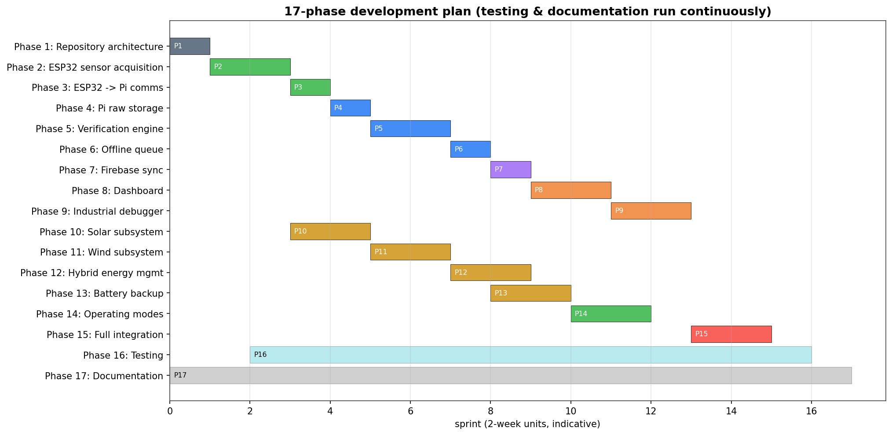</p>

<sub>Figure 24.1: Indicative 17-phase plan. Testing and documentation run through every phase.</sub>

### 24.1 Rules of the method

1. **One phase at a time.** A phase is complete only when its test procedure passes and its README update is merged.
2. **Every phase delivers the 14 items:** Objective · Architecture · Folder structure · Required files · Complete code · Configuration · Installation commands · Run commands · Expected output · Test procedure · Troubleshooting · Git commands · Commit message · README update.
3. **Code stays small per phase.** Each phase adds only what it needs.
4. **Tests are not optional.** A phase with no passing tests isn't done.

### 24.2 Phase overview

| Phase | Name | Primary repo | Exit criterion |
|:-:|---|---|---|
| 1 | Repository architecture | all | 8 repos scaffolded, CI green, secret scanning active |
| 2 | ESP32 sensor acquisition | esp32 | Five sensors read, `null` on disconnect, calibration interface |
| 3 | ESP32 → Pi communication | esp32, raspberry-pi | Framed, CRC-checked, ACKed frames; replay buffer |
| 4 | Pi raw-data storage | raspberry-pi | Append-only store, hash chain, triggers tested |
| 5 | Verification engine | raspberry-pi | All catalogue rules implemented + unit tested |
| 6 | Offline queue | raspberry-pi | Outbox with unique constraint; survives restart |
| 7 | Firebase synchronisation | raspberry-pi, firebase | Idempotent sync; rules tests pass |
| 8 | Dashboard | dashboard | Five tabs; ack only; e2e tests |
| 9 | Industrial debugger | debugger | Panels + CLI + diag report |
| 10 | Solar subsystem | power | Solar V/I measured; SOLAR events |
| 11 | Wind subsystem | power | Wind V/I measured; over-speed protection verified |
| 12 | Hybrid energy management | power | Source classification + 4 availability scenarios tested |
| 13 | Battery backup | power | SoC estimate, thresholds, graceful Pi shutdown |
| 14 | Operating modes | esp32 | Three modes, hysteresis, emergency local-first |
| 15 | Full integration | testing | End-to-end soak test (7 days) |
| 16 | Testing | testing | Full test plan executed, report published |
| 17 | Documentation | main | All docs updated; limitations reviewed |

---

## Phase 1: Repository Architecture

**1. Objective.** Create the eight repositories with consistent structure, licensing, CI, secret scanning and templates, so later phases have a clean, safe foundation.

**2. Architecture.**

```text
GitHub organisation YOUR-ORG
 ├─ smart-water-main          (docs, schema, diagrams)
 ├─ smart-water-esp32         (PlatformIO)
 ├─ smart-water-raspberry-pi  (Python)
 ├─ smart-water-dashboard     (Vite/React)
 ├─ smart-water-debugger      (React + Python CLI)
 ├─ smart-water-firebase      (Firebase CLI)
 ├─ smart-water-power         (C++ lib + Python models)
 └─ smart-water-testing       (pytest + Playwright)
Branch protection on main: PR required, 1 review, CI green, signed commits recommended.
```

**3. Folder structure.** See §23.3–§23.10.

**4. Required files.** `README.md`, `LICENSE`, `.gitignore`, `.env.example` (where applicable), `.pre-commit-config.yaml`, `.github/workflows/ci.yml`, `.github/ISSUE_TEMPLATE/{bug_report.yml, field_incident.yml, feature_request.yml}`, `.github/pull_request_template.md`, `CHANGELOG.md`, `CODEOWNERS`.

**5. Complete code: scaffolding script.**

```bash
#!/usr/bin/env bash
# smart-water-main/scripts/scaffold_repos.sh
set -euo pipefail
ORG="${1:?usage: scaffold_repos.sh <github-org>}"
REPOS=(smart-water-main smart-water-esp32 smart-water-raspberry-pi smart-water-dashboard
       smart-water-debugger smart-water-firebase smart-water-power smart-water-testing)

for r in "${REPOS[@]}"; do
  mkdir -p "$r"/{docs,config,tests,.github/ISSUE_TEMPLATE,.github/workflows}
  cd "$r"
  git init -q -b main
  cat > README.md <<EOF
# $r
Part of the **Smart Water Monitoring & Purification System**.
See the main repository: https://github.com/$ORG/smart-water-main

> Status: PROTOTYPE — not certified for industrial or drinking-water use.
EOF
  cp ../templates/LICENSE LICENSE
  cp ../templates/.gitignore .gitignore
  cp ../templates/.pre-commit-config.yaml .pre-commit-config.yaml
  cp ../templates/pull_request_template.md .github/pull_request_template.md
  cp ../templates/ISSUE_TEMPLATE/*.yml .github/ISSUE_TEMPLATE/
  printf "# Changelog\n\n## [Unreleased]\n" > CHANGELOG.md
  printf "* @%s/maintainers\n" "$ORG" > CODEOWNERS
  git add -A && git commit -qm "chore: scaffold $r repository"
  cd ..
done
echo "Scaffolded ${#REPOS[@]} repositories."
```

**Issue template: field incident**

```yaml
# .github/ISSUE_TEMPLATE/field_incident.yml
name: Field incident
description: Report a problem observed at a deployed or pilot site
labels: [field-incident]
body:
  - type: input
    id: node
    attributes: { label: Node ID, placeholder: SWN-0001 }
    validations: { required: true }
  - type: input
    id: when
    attributes: { label: When (UTC or local with timezone) }
    validations: { required: true }
  - type: dropdown
    id: category
    attributes:
      label: Category
      options: [Sensor, Communication, Power, Edge (Pi), Dashboard, Debugger, Enclosure/Physical, Other]
    validations: { required: true }
  - type: textarea
    id: observed
    attributes: { label: What was observed? }
    validations: { required: true }
  - type: textarea
    id: diag
    attributes: { label: Attach debugger diagnostic report (JSON) — REMOVE any tokens/keys }
  - type: checkboxes
    id: nosecrets
    attributes:
      label: Confirmation
      options:
        - label: I confirm this issue contains no passwords, API keys, service-account files or personal data.
          required: true
```

**Pull-request template**

```markdown
## What
## Why
## How tested (paste INPUT → EXPECTED → ACTUAL → PASS/FAIL)
## Checklist
- [ ] No secrets, keys, certificates or credentials added
- [ ] Tests added/updated and passing
- [ ] README / docs updated
- [ ] Config changes have `.example` counterparts
- [ ] No unsupported claims (IP rating, certification, contaminant detection)
```

**CI (Python repos)**

```yaml
# .github/workflows/ci.yml
name: ci
on: [push, pull_request]
jobs:
  test:
    runs-on: ubuntu-latest
    steps:
      - uses: actions/checkout@v4
      - uses: actions/setup-python@v5
        with: { python-version: "3.11" }
      - run: pip install -e ".[dev]" || pip install -r requirements-docs.txt
      - run: python -m pytest -q
  secrets:
    runs-on: ubuntu-latest
    steps:
      - uses: actions/checkout@v4
        with: { fetch-depth: 0 }
      - uses: gitleaks/gitleaks-action@v2
        env: { GITHUB_TOKEN: "${{ secrets.GITHUB_TOKEN }}" }
```

**6. Configuration.** Branch protection (GitHub → Settings → Branches): require PR, 1 approval, status checks `test` and `secrets`, no force-push to `main`. Enable Dependabot and secret scanning.

**7. Installation commands.**

```bash
pip install pre-commit
bash scripts/scaffold_repos.sh YOUR-ORG
for r in smart-water-*; do (cd "$r" && pre-commit install); done
# Create remotes (GitHub CLI)
for r in smart-water-*; do (cd "$r" && gh repo create "YOUR-ORG/$r" --private --source=. --push); done
```

**8. Run commands.**

```bash
for r in smart-water-*; do (cd "$r" && pre-commit run --all-files); done
```

**9. Expected output.**

```text
Scaffolded 8 repositories.
gitleaks.................................................................Passed
check for added large files..............................................Passed
detect private key.......................................................Passed
```

**10. Test procedure.**

| # | INPUT | PROCESS | EXPECTED | ACTUAL | PASS/FAIL |
|:-:|---|---|---|---|:-:|
| P1-T1 | Run scaffold script | Inspect each repo | 8 repos, each with README, LICENSE, .gitignore, templates | _record_ | _ |
| P1-T2 | Commit a file containing a fake private key header | `git commit` | pre-commit `detect-private-key` blocks commit | _record_ | _ |
| P1-T3 | Push branch with a dummy key string | CI | `secrets` job fails | _record_ | _ |
| P1-T4 | Commit `.env` | `git status` | `.env` ignored, not staged | _record_ | _ |

**11. Troubleshooting.**

| Symptom | Cause | Fix |
|---|---|---|
| `gh: command not found` | GitHub CLI missing | Install `gh` or create repos in the web UI |
| pre-commit hook not running | `pre-commit install` not run | Run it inside each repo |
| gitleaks false positive | Test fixture looks like a key | Add a narrowly scoped allow-list entry in `.gitleaks.toml` with a comment |

**12. Git commands.**

```bash
git checkout -b chore/phase-1-scaffold
git add -A
git commit -m "chore: scaffold repository structure, CI and secret scanning"
git push -u origin chore/phase-1-scaffold
gh pr create --fill
```

**13. Commit message.** `chore: scaffold repository structure, CI and secret scanning`

**14. README update.** Add the repository table (see [Subsystem Repositories](#-subsystem-repositories)) and a status badge section; mark Phase 1 ✅ in §24.2.

---

## Phase 2: ESP32 Sensor Acquisition

**1. Objective.** Read pH, turbidity, TDS, EC and temperature reliably; produce **raw** engineering values plus raw electrical values; represent a disconnected sensor as `null`; provide a calibration interface with versioned coefficients stored in NVS.

**2. Architecture.**

```text
          ┌───────────── SensorManager ─────────────┐
          │  for each sensor (excitation group order)│
          │   enable excitation → settle → sample N  │
          │   → median → detect disconnect → convert │
          └──────┬──────────┬──────────┬──────────┬──┘
           PhSensor   TurbiditySensor TdsSensor  EcSensor   TemperatureSensor
              │           │             │          │               │
         AnalogProbe  AnalogProbe  AnalogProbe AnalogProbe      OneWire
              └───── Calibration (NVS: coefficients + version) ─────┘
```

**3. Folder structure.** `sensors/`, `config/pins.h`, `include/Types.h`, `tests/test_calibration/`.

**4. Required files.** `include/Types.h`, `sensors/SensorBase.h`, `sensors/AnalogProbe.{h,cpp}`, `sensors/PhSensor.{h,cpp}`, `sensors/EcSensor.{h,cpp}`, `sensors/TemperatureSensor.{h,cpp}`, `sensors/Calibration.{h,cpp}`, `src/main.cpp`, `platformio.ini`.

**5. Complete code.**

```ini
; platformio.ini
[platformio]
default_envs = esp32dev
src_dir = src
include_dir = include

[env]
framework = arduino
monitor_speed = 115200
build_flags =
  -I config -I sensors -I communication -I power -I modes -I diagnostics
  -D SW_FW_VERSION=\"0.2.0\"
build_src_filter = +<*> +<../sensors/*.cpp> +<../communication/*.cpp> +<../power/*.cpp> +<../modes/*.cpp> +<../diagnostics/*.cpp>
lib_deps =
  paulstoffregen/OneWire@^2.3.8
  milesburton/DallasTemperature@^3.11.0
  bblanchon/ArduinoJson@^7.0.4

[env:esp32dev]
platform = espressif32
board = esp32dev

[env:native]
platform = native
build_flags = -std=c++17 -I sensors -I include -I communication -I modes -D UNIT_TEST
test_build_src = no
```

```cpp
// include/Types.h
#pragma once
#include <stdint.h>
#include <math.h>

enum class Param : uint8_t { PH = 0, TURBIDITY, TDS, EC, TEMPERATURE, COUNT };

struct Reading {
  float value = NAN;          // engineering units; NAN => serialised as null
  float electrical_mv = NAN;  // pre-calibration signal, NAN if not applicable
  bool  present = false;      // false => sensor missing/disconnected
  uint16_t calVersion = 0;    // 0 => UNCALIBRATED
};

inline const char* paramKey(Param p) {
  switch (p) {
    case Param::PH: return "ph";
    case Param::TURBIDITY: return "turbidity_ntu";
    case Param::TDS: return "tds_ppm";
    case Param::EC: return "ec_us_cm";
    case Param::TEMPERATURE: return "temperature_c";
    default: return "unknown";
  }
}
```

```cpp
// sensors/SensorBase.h
#pragma once
#include "Types.h"

class SensorBase {
 public:
  virtual ~SensorBase() = default;
  virtual bool begin() = 0;
  virtual Reading read(float temperatureC) = 0;  // temperature for compensation (NAN if unknown)
  virtual const char* id() const = 0;
  virtual Param param() const = 0;
};
```

```cpp
// sensors/AnalogProbe.h
#pragma once
#include <stdint.h>
#include <stddef.h>

struct AnalogProbeCfg {
  uint8_t pin;
  int8_t  excitationPin;      // -1 if always powered
  uint16_t settleMs;          // TBD / CONFIGURABLE
  uint8_t samples;            // odd number recommended (median)
  float   disconnectLowMv;    // below => treat as disconnected (TBD per board)
  float   disconnectHighMv;   // above => treat as disconnected (TBD per board)
};

class AnalogProbe {
 public:
  explicit AnalogProbe(const AnalogProbeCfg& c) : cfg_(c) {}
  void begin();
  // Returns median millivolts, or NAN if disconnected / railed.
  float readMillivolts();
  static float median(float* v, size_t n);
 private:
  AnalogProbeCfg cfg_;
};
```

```cpp
// sensors/AnalogProbe.cpp
#include "AnalogProbe.h"
#include <math.h>
#ifndef UNIT_TEST
#include <Arduino.h>
#endif

float AnalogProbe::median(float* v, size_t n) {
  // insertion sort: n is small (≤ 31)
  for (size_t i = 1; i < n; ++i) {
    float key = v[i]; size_t j = i;
    while (j > 0 && v[j - 1] > key) { v[j] = v[j - 1]; --j; }
    v[j] = key;
  }
  return (n % 2) ? v[n / 2] : 0.5f * (v[n / 2 - 1] + v[n / 2]);
}

#ifndef UNIT_TEST
void AnalogProbe::begin() {
  analogSetPinAttenuation(cfg_.pin, ADC_11db);
  if (cfg_.excitationPin >= 0) { pinMode(cfg_.excitationPin, OUTPUT); digitalWrite(cfg_.excitationPin, LOW); }
}

float AnalogProbe::readMillivolts() {
  if (cfg_.excitationPin >= 0) digitalWrite(cfg_.excitationPin, HIGH);
  delay(cfg_.settleMs);
  float buf[31];
  const uint8_t n = cfg_.samples > 31 ? 31 : cfg_.samples;
  for (uint8_t i = 0; i < n; ++i) { buf[i] = (float)analogReadMilliVolts(cfg_.pin); delay(5); }
  if (cfg_.excitationPin >= 0) digitalWrite(cfg_.excitationPin, LOW);
  const float mv = median(buf, n);
  if (mv < cfg_.disconnectLowMv || mv > cfg_.disconnectHighMv) return NAN;
  return mv;
}
#endif
```

```cpp
// sensors/Calibration.h
#pragma once
#include <stdint.h>
#include "Types.h"

// Linear or two-point calibration: value = slope * mv + offset
// pH typically uses 2- or 3-point buffer calibration; EC uses standard solutions.
struct CalRecord {
  float slope = 1.0f;
  float offset = 0.0f;
  uint16_t version = 0;       // incremented on every successful calibration
  uint32_t epoch = 0;         // unix time of calibration
  bool valid() const { return version > 0 && isfinite(slope) && slope != 0.0f; }
};

class Calibration {
 public:
  // Two-point solve from (mv1 -> ref1), (mv2 -> ref2). Returns false if degenerate.
  static bool solveTwoPoint(float mv1, float ref1, float mv2, float ref2, CalRecord& out);
  static float apply(const CalRecord& c, float mv) { return c.slope * mv + c.offset; }
#ifndef UNIT_TEST
  static bool load(Param p, CalRecord& out);            // NVS
  static bool store(Param p, const CalRecord& in);      // NVS (increments version)
#endif
};
```

```cpp
// sensors/Calibration.cpp
#include "Calibration.h"
#include <math.h>
#ifndef UNIT_TEST
#include <Preferences.h>
#endif

bool Calibration::solveTwoPoint(float mv1, float ref1, float mv2, float ref2, CalRecord& out) {
  if (!isfinite(mv1) || !isfinite(mv2) || fabsf(mv2 - mv1) < 1.0f) return false;  // < 1 mV apart: degenerate
  out.slope = (ref2 - ref1) / (mv2 - mv1);
  out.offset = ref1 - out.slope * mv1;
  return isfinite(out.slope) && isfinite(out.offset);
}

#ifndef UNIT_TEST
bool Calibration::load(Param p, CalRecord& out) {
  Preferences prefs;
  if (!prefs.begin("cal", true)) return false;
  const String k = String(paramKey(p));
  out.slope = prefs.getFloat((k + ".s").c_str(), 1.0f);
  out.offset = prefs.getFloat((k + ".o").c_str(), 0.0f);
  out.version = prefs.getUShort((k + ".v").c_str(), 0);
  out.epoch = prefs.getULong((k + ".t").c_str(), 0);
  prefs.end();
  return out.valid();
}

bool Calibration::store(Param p, const CalRecord& in) {
  Preferences prefs;
  if (!prefs.begin("cal", false)) return false;
  const String k = String(paramKey(p));
  const uint16_t v = prefs.getUShort((k + ".v").c_str(), 0) + 1;
  prefs.putFloat((k + ".s").c_str(), in.slope);
  prefs.putFloat((k + ".o").c_str(), in.offset);
  prefs.putULong((k + ".t").c_str(), in.epoch);
  prefs.putUShort((k + ".v").c_str(), v);
  prefs.end();
  return true;
}
#endif
```

```cpp
// sensors/EcSensor.h / .cpp (condensed)
#pragma once
#include "SensorBase.h"
#include "AnalogProbe.h"
#include "Calibration.h"

class EcSensor : public SensorBase {
 public:
  EcSensor(const char* id, const AnalogProbeCfg& cfg, float tempCoeffPerC)
      : id_(id), probe_(cfg), alpha_(tempCoeffPerC) {}
  bool begin() override { probe_.begin(); Calibration::load(Param::EC, cal_); return true; }
  const char* id() const override { return id_; }
  Param param() const override { return Param::EC; }

  Reading read(float tC) override {
    Reading r;
    r.electrical_mv = probe_.readMillivolts();
    if (isnan(r.electrical_mv)) return r;            // present=false, value=NAN -> null
    float ec = Calibration::apply(cal_, r.electrical_mv);
    // Linear temperature compensation to 25 °C. alpha is TBD / CONFIGURABLE (often ~0.02/°C).
    if (!isnan(tC)) ec = ec / (1.0f + alpha_ * (tC - 25.0f));
    r.value = ec; r.present = true; r.calVersion = cal_.version;
    return r;
  }
 private:
  const char* id_;
  AnalogProbe probe_;
  CalRecord cal_;
  float alpha_;
};
```

```cpp
// sensors/TemperatureSensor.h
#pragma once
#include "SensorBase.h"
#include <OneWire.h>
#include <DallasTemperature.h>

class TemperatureSensor : public SensorBase {
 public:
  TemperatureSensor(const char* id, uint8_t pin) : id_(id), bus_(pin), dt_(&bus_) {}
  bool begin() override { dt_.begin(); return dt_.getDeviceCount() > 0; }
  const char* id() const override { return id_; }
  Param param() const override { return Param::TEMPERATURE; }
  Reading read(float) override {
    Reading r;
    dt_.requestTemperatures();
    const float t = dt_.getTempCByIndex(0);
    if (t == DEVICE_DISCONNECTED_C || t < -55.0f || t > 125.0f) return r;   // null
    r.value = t; r.present = true; r.calVersion = 1;
    return r;
  }
 private:
  const char* id_;
  OneWire bus_;
  DallasTemperature dt_;
};
```

```cpp
// src/main.cpp  (Phase 2 scope: acquisition + serial print)
#include <Arduino.h>
#include "pins.h"
#include "PhSensor.h"
#include "TurbiditySensor.h"
#include "TdsSensor.h"
#include "EcSensor.h"
#include "TemperatureSensor.h"

static TemperatureSensor temp("TP-01", PIN_TEMP_1WIRE);
static PhSensor  ph ("PH-01", {PIN_PH,  -1,               TBD_SETTLE_MS, 15, 50.0f, 3250.0f});
static TurbiditySensor tu("TU-01", {PIN_TURB, -1,         TBD_SETTLE_MS, 15, 50.0f, 3250.0f});
static TdsSensor tds("TD-01", {PIN_TDS, PIN_EXC_GROUP_B,  TBD_SETTLE_MS, 15, 1.0f, 3250.0f}, 0.02f);
static EcSensor  ec ("EC-01", {PIN_EC,  PIN_EXC_GROUP_C,  TBD_SETTLE_MS, 15, 1.0f, 3250.0f}, 0.02f);

static void printReading(const char* key, const Reading& r) {
  Serial.printf("  %-14s ", key);
  if (!r.present) Serial.println("null  (sensor not responding)");
  else Serial.printf("%.3f   [%.0f mV, cal v%u]\n", r.value, r.electrical_mv, r.calVersion);
}

void setup() {
  Serial.begin(115200);
  delay(200);
  Serial.printf("smart-water-esp32 %s — Phase 2 acquisition\n", SW_FW_VERSION);
  temp.begin(); ph.begin(); tu.begin(); tds.begin(); ec.begin();
}

void loop() {
  const Reading t = temp.read(NAN);
  const float tC = t.present ? t.value : NAN;
  Serial.println("---- sample ----");
  printReading("temperature_c", t);
  printReading("ph",            ph.read(tC));
  printReading("turbidity_ntu", tu.read(tC));
  printReading("tds_ppm",       tds.read(tC));    // excitation groups: TDS then EC, never together
  printReading("ec_us_cm",      ec.read(tC));
  delay(5000);
}
```

> `TBD_SETTLE_MS` and the disconnect thresholds are defined in `config/pins.h` as placeholders. They **must** be measured on the chosen boards: on the bench, record the mV level with each probe unplugged.

**6. Configuration.** `config/pins.h` (pin map from §8.2), `config/hardware.example.yaml` (§8.5). Temperature coefficient `alpha` is `TBD / CONFIGURABLE`.

**7. Installation commands.**

```bash
pipx install platformio         # or: pip install platformio
git clone https://github.com/YOUR-ORG/smart-water-esp32.git && cd smart-water-esp32
pio pkg install
```

**8. Run commands.**

```bash
pio run -e esp32dev -t upload
pio device monitor -b 115200
pio test -e native                # host-side unit tests (calibration, median)
```

**9. Expected output.**

```text
smart-water-esp32 0.2.0 — Phase 2 acquisition
---- sample ----
  temperature_c  26.375   [nan mV, cal v1]
  ph             7.214    [1412 mV, cal v3]
  turbidity_ntu  4.810    [3021 mV, cal v1]
  tds_ppm        212.400  [611 mV, cal v2]
  ec_us_cm       426.100  [702 mV, cal v2]
```

With the pH probe unplugged:

```text
  ph             null  (sensor not responding)
```

**10. Test procedure.**

```cpp
// tests/test_calibration/test_main.cpp  (pio test -e native)
#include <unity.h>
#include "Calibration.h"
#include "AnalogProbe.h"

void test_two_point_solves_line() {
  CalRecord c;
  TEST_ASSERT_TRUE(Calibration::solveTwoPoint(1000.0f, 4.0f, 2000.0f, 7.0f, c));
  TEST_ASSERT_FLOAT_WITHIN(1e-5, 0.003f, c.slope);
  TEST_ASSERT_FLOAT_WITHIN(1e-4, 1.0f, c.offset);
  TEST_ASSERT_FLOAT_WITHIN(1e-4, 5.5f, Calibration::apply(c, 1500.0f));
}
void test_two_point_rejects_degenerate() {
  CalRecord c;
  TEST_ASSERT_FALSE(Calibration::solveTwoPoint(1000.0f, 4.0f, 1000.5f, 7.0f, c));
}
void test_median_odd() {
  float v[] = {5, 1, 9, 3, 7};
  TEST_ASSERT_EQUAL_FLOAT(5.0f, AnalogProbe::median(v, 5));
}
void test_median_rejects_spike() {
  float v[] = {100, 101, 4095, 99, 100};
  TEST_ASSERT_EQUAL_FLOAT(100.0f, AnalogProbe::median(v, 5));
}
int main() {
  UNITY_BEGIN();
  RUN_TEST(test_two_point_solves_line);
  RUN_TEST(test_two_point_rejects_degenerate);
  RUN_TEST(test_median_odd);
  RUN_TEST(test_median_rejects_spike);
  return UNITY_END();
}
```

| # | INPUT | PROCESS | EXPECTED | ACTUAL | PASS/FAIL |
|:-:|---|---|---|---|:-:|
| P2-T1 | All five sensors connected in reference water | Read 10 samples | All five present, values plausible, stable | _record_ | _ |
| P2-T2 | Unplug pH probe | Read | `ph: null`, others unaffected | _record_ | _ |
| P2-T3 | Unplug temperature probe | Read | `temperature_c: null`; EC/TDS uncompensated flag | _record_ | _ |
| P2-T4 | pH 4.00 & 7.00 buffers | Two-point calibration | cal version increments; readback within tolerance (TBD) | _record_ | _ |
| P2-T5 | TDS and EC probes in same vessel | Toggle one probe's excitation | Other reading changes < tolerance (SN-06) | _record_ | _ |
| P2-T6 | Native unit tests | `pio test -e native` | 4/4 pass | _record_ | _ |

**11. Troubleshooting.**

| Symptom | Likely cause | Fix |
|---|---|---|
| All analog readings ≈ 0 or ≈ 3300 mV | Wrong pin / attenuation / missing sensor supply | Check `pins.h`; verify sensor board VCC |
| pH drifts continuously | Dry or aged electrode; missing reference junction contact | Soak in storage solution; replace probe |
| EC reads differently when TDS probe is powered | Probe interference through the water | Excitation groups / isolation (§8.4) |
| Readings jump when the Wi-Fi radio is on | ADC2 pin used, or supply noise | Use ADC1 pins only; add filtering |
| DS18B20 returns −127 °C | Missing pull-up / broken cable | Check pull-up resistor and wiring |

**12. Git commands.**

```bash
git checkout -b feat/phase-2-acquisition
git add sensors/ include/ config/pins.h src/main.cpp platformio.ini tests/test_calibration/
git commit -m "feat(sensors): add acquisition for pH, turbidity, TDS, EC, temperature with null-on-disconnect and NVS calibration"
git push -u origin feat/phase-2-acquisition
```

**13. Commit message.** `feat(sensors): add acquisition for pH, turbidity, TDS, EC, temperature with null-on-disconnect and NVS calibration`

**14. README update.** In `smart-water-esp32/README.md`, add "Sensor acquisition", "Calibration interface" and "Disconnect behaviour (`null`)" sections, plus the pin table. Mark Phase 2 ✅ here.

---

## Phase 3: ESP32 → Raspberry Pi Communication

**1. Objective.** Deliver raw frames reliably from the ESP32 to the Pi over UART with framing, CRC, ACK/NACK, retries and a replay ring buffer, without ever losing or duplicating a reading at this hop.

**2. Architecture.**

```text
ESP32                                           Raspberry Pi
 build JSON ─► Frame::encode ─► UART TX ───────► framing.decode ─► CRC ok? ─► JSON parse
     ▲                                              │                         │
     │                                              └─ bad CRC: NACK ◄────────┤
 RingBuffer (unACKed)  ◄──────── ACK <record_id> ◄──────────────── stored OK ─┘
     │ replay oldest-first on reconnect
```

**3. Folder structure.** ESP32: `communication/`. Pi: `src/swedge/receiver/`.

**4. Required files.** `communication/Frame.{h,cpp}`, `communication/PiLink.{h,cpp}`, `communication/RingBuffer.{h,cpp}`; `swedge/receiver/framing.py`, `swedge/receiver/serial_receiver.py`; tests on both sides.

**5. Complete code.**

```cpp
// communication/Frame.h
#pragma once
#include <stdint.h>
#include <stddef.h>

namespace frame {
constexpr uint8_t STX = 0x02, ETX = 0x03, VER = 0x01;
constexpr size_t  MAX_PAYLOAD = 1024;
constexpr size_t  OVERHEAD = 1 + 1 + 2 + 2 + 1;   // STX VER LEN(2) CRC(2) ETX

uint16_t crc16_ccitt(const uint8_t* data, size_t len, uint16_t crc = 0xFFFF);
// Returns total frame length, or 0 if payload too large / buffer too small.
size_t encode(const uint8_t* payload, size_t len, uint8_t* out, size_t outCap);
}  // namespace frame
```

```cpp
// communication/Frame.cpp
#include "Frame.h"

namespace frame {
uint16_t crc16_ccitt(const uint8_t* d, size_t n, uint16_t crc) {
  for (size_t i = 0; i < n; ++i) {
    crc ^= (uint16_t)d[i] << 8;
    for (int b = 0; b < 8; ++b) crc = (crc & 0x8000) ? (crc << 1) ^ 0x1021 : (crc << 1);
  }
  return crc;
}

size_t encode(const uint8_t* p, size_t len, uint8_t* out, size_t cap) {
  if (len > MAX_PAYLOAD || cap < len + OVERHEAD) return 0;
  size_t i = 0;
  out[i++] = STX;
  out[i++] = VER;
  out[i++] = (uint8_t)(len >> 8);
  out[i++] = (uint8_t)(len & 0xFF);
  for (size_t k = 0; k < len; ++k) out[i++] = p[k];
  const uint16_t crc = crc16_ccitt(out + 1, 3 + len);   // over VER|LEN|payload
  out[i++] = (uint8_t)(crc >> 8);
  out[i++] = (uint8_t)(crc & 0xFF);
  out[i++] = ETX;
  return i;
}
}  // namespace frame
```

```cpp
// communication/RingBuffer.h — fixed-capacity FIFO of serialized frames (RAM or RTC/flash-backed)
#pragma once
#include <stdint.h>
#include <string.h>

template <size_t N, size_t SLOT>
class RingBuffer {
 public:
  bool push(const char* s) {                 // overwrites oldest when full (counted as dropped)
    if (count_ == N) { tail_ = (tail_ + 1) % N; --count_; ++dropped_; }
    strncpy(slots_[head_], s, SLOT - 1); slots_[head_][SLOT - 1] = '\0';
    head_ = (head_ + 1) % N; ++count_;
    return true;
  }
  const char* peek() const { return count_ ? slots_[tail_] : nullptr; }
  void pop() { if (count_) { tail_ = (tail_ + 1) % N; --count_; } }
  size_t size() const { return count_; }
  uint32_t dropped() const { return dropped_; }
 private:
  char slots_[N][SLOT] = {};
  size_t head_ = 0, tail_ = 0, count_ = 0;
  uint32_t dropped_ = 0;
};
```

```cpp
// communication/PiLink.cpp (core send loop, condensed)
#include "PiLink.h"
#include "Frame.h"

PiLink::Result PiLink::sendOne(const char* json, const char* recordId) {
  uint8_t buf[frame::MAX_PAYLOAD + frame::OVERHEAD];
  const size_t n = frame::encode((const uint8_t*)json, strlen(json), buf, sizeof(buf));
  if (!n) return Result::TOO_LARGE;
  for (uint8_t attempt = 0; attempt <= cfg_.maxRetries; ++attempt) {
    uart_.write(buf, n);
    String line;
    if (readLine(line, cfg_.ackTimeoutMs)) {
      if (line == String("ACK ") + recordId) { stats_.acked++; return Result::OK; }
      if (line.startsWith("NACK")) stats_.nacked++;
    } else {
      stats_.timeouts++;
    }
    delay(cfg_.retryBackoffMs * (attempt + 1));
  }
  return Result::NO_ACK;
}

void PiLink::pump() {
  // Replay buffered frames oldest-first; stop at first failure to preserve order.
  while (const char* json = buffer_.peek()) {
    char rid[40];
    if (!extractRecordId(json, rid, sizeof(rid))) { buffer_.pop(); stats_.corrupt++; continue; }
    if (sendOne(json, rid) != Result::OK) break;
    buffer_.pop();
  }
}
```

```python
# swedge/receiver/framing.py
"""Stream decoder for STX|VER|LEN|payload|CRC16|ETX frames."""
from __future__ import annotations

STX, ETX, VER = 0x02, 0x03, 0x01
MAX_PAYLOAD = 1024


def crc16_ccitt(data: bytes, crc: int = 0xFFFF) -> int:
    for byte in data:
        crc ^= byte << 8
        for _ in range(8):
            crc = ((crc << 1) ^ 0x1021) if crc & 0x8000 else (crc << 1)
            crc &= 0xFFFF
    return crc


def encode(payload: bytes) -> bytes:
    if len(payload) > MAX_PAYLOAD:
        raise ValueError("payload too large")
    body = bytes([VER]) + len(payload).to_bytes(2, "big") + payload
    return bytes([STX]) + body + crc16_ccitt(body).to_bytes(2, "big") + bytes([ETX])


class FrameDecoder:
    """Feed arbitrary byte chunks; yields ('ok', payload) or ('error', reason)."""

    def __init__(self, max_payload: int = MAX_PAYLOAD):
        self.buf = bytearray()
        self.max_payload = max_payload

    def feed(self, chunk: bytes):
        self.buf.extend(chunk)
        while True:
            start = self.buf.find(bytes([STX]))
            if start < 0:
                self.buf.clear()
                return
            if start > 0:
                del self.buf[:start]
            if len(self.buf) < 4:
                return
            ver, length = self.buf[1], int.from_bytes(self.buf[2:4], "big")
            if ver != VER or length > self.max_payload:
                del self.buf[0]
                yield ("error", "bad header")
                continue
            total = 1 + 1 + 2 + length + 2 + 1
            if len(self.buf) < total:
                return
            frame = bytes(self.buf[:total])
            del self.buf[:total]
            if frame[-1] != ETX:
                yield ("error", "missing ETX")
                continue
            body, crc = frame[1:-3], int.from_bytes(frame[-3:-1], "big")
            if crc16_ccitt(body) != crc:
                yield ("error", "bad CRC")
                continue
            yield ("ok", body[3:])
```

```python
# swedge/receiver/serial_receiver.py
"""Reads frames from UART, stores raw first, verifies, ACKs. Phase 3 stores to a JSONL spool;
Phase 4 replaces the spool with the append-only SQLite store."""
from __future__ import annotations

import json
import logging
import os
from datetime import datetime, timezone

import serial  # pyserial

from .framing import FrameDecoder

log = logging.getLogger("swedge.receiver")


def utcnow_iso() -> str:
    return datetime.now(timezone.utc).isoformat(timespec="milliseconds")


class Receiver:
    def __init__(self, port: str, baud: int, sink, timeout: float = 0.2):
        self.ser = serial.Serial(port, baud, timeout=timeout)
        self.dec = FrameDecoder()
        self.sink = sink            # callable(msg: dict, received_ts: str) -> "stored" | "duplicate"
        self.stats = {"ok": 0, "crc_err": 0, "json_err": 0, "dup": 0}

    def _reply(self, line: str):
        self.ser.write((line + "\n").encode())

    def step(self):
        chunk = self.ser.read(256)
        if not chunk:
            return
        for kind, data in self.dec.feed(chunk):
            if kind == "error":
                self.stats["crc_err"] += 1
                self._reply(f"NACK {data}")
                continue
            rx = utcnow_iso()
            try:
                msg = json.loads(data.decode("utf-8"))
                rid = msg["record_id"]
            except (ValueError, KeyError, UnicodeDecodeError) as e:
                self.stats["json_err"] += 1
                log.warning("unparseable payload: %s", e)
                self._reply("NACK json")
                continue
            outcome = self.sink(msg, rx)
            self.stats["dup" if outcome == "duplicate" else "ok"] += 1
            self._reply(f"ACK {rid}")      # duplicates are ACKed so the node stops retrying


def main():
    logging.basicConfig(level=os.environ.get("SW_LOG_LEVEL", "INFO"))
    seen: set[str] = set()
    spool = open(os.environ.get("SW_SPOOL", "spool.jsonl"), "a", buffering=1)

    def sink(msg, rx):
        if msg["record_id"] in seen:
            return "duplicate"
        seen.add(msg["record_id"])
        spool.write(json.dumps({"received_ts": rx, "msg": msg}) + "\n")
        log.info("stored %s", msg["record_id"])
        return "stored"

    r = Receiver(os.environ.get("SW_SERIAL", "/dev/serial0"), int(os.environ.get("SW_BAUD", "115200")), sink)
    while True:
        r.step()


if __name__ == "__main__":
    main()
```

**6. Configuration.** Pi: enable UART (`raspi-config` → Interface → Serial: login shell **No**, hardware **Yes**). ESP32 `link.pi.*` in `hardware.yaml`. **Share a common ground** between the ESP32 and the Pi. Both use 3.3 V logic. For cable runs longer than a short in-enclosure link, use RS-485 transceivers.

**7. Installation commands.**

```bash
# Raspberry Pi
sudo apt update && sudo apt install -y python3-venv
git clone https://github.com/YOUR-ORG/smart-water-raspberry-pi.git && cd smart-water-raspberry-pi
python3 -m venv .venv && . .venv/bin/activate
pip install -e ".[dev]"            # pyserial, pyyaml, pytest
sudo usermod -aG dialout $USER     # serial access; re-login required
```

**8. Run commands.**

```bash
SW_SERIAL=/dev/serial0 SW_BAUD=115200 python -m swedge.receiver.serial_receiver
```

**9. Expected output.**

```text
INFO:swedge.receiver:stored SWN-0001-00017-00004521
INFO:swedge.receiver:stored SWN-0001-00017-00004522
```

**10. Test procedure.**

```python
# tests/test_framing.py
from swedge.receiver.framing import FrameDecoder, encode, crc16_ccitt

def test_crc_known_vector():
    assert crc16_ccitt(b"123456789") == 0x29B1      # CRC-16/CCITT-FALSE check value

def test_roundtrip_single():
    d = FrameDecoder()
    assert list(d.feed(encode(b'{"a":1}'))) == [("ok", b'{"a":1}')]

def test_split_across_chunks():
    f = encode(b'{"record_id":"X"}'); d = FrameDecoder()
    out = list(d.feed(f[:5])) + list(d.feed(f[5:]))
    assert out == [("ok", b'{"record_id":"X"}')]

def test_garbage_before_frame_is_skipped():
    d = FrameDecoder()
    assert list(d.feed(b"\xff\x00noise" + encode(b"{}"))) == [("ok", b"{}")]

def test_corrupted_crc_detected():
    f = bytearray(encode(b'{"a":1}')); f[6] ^= 0x01
    assert list(FrameDecoder().feed(bytes(f))) == [("error", "bad CRC")]

def test_two_frames_back_to_back():
    d = FrameDecoder()
    assert [p for _, p in d.feed(encode(b"1") + encode(b"2"))] == [b"1", b"2"]
```

| # | INPUT | PROCESS | EXPECTED | ACTUAL | PASS/FAIL |
|:-:|---|---|---|---|:-:|
| P3-T1 | 100 frames at normal rate | Receiver running | 100 stored, 100 ACKs, 0 errors | _record_ | _ |
| P3-T2 | Pi receiver stopped for 10 frames | Restart receiver | ESP32 replays 10 frames oldest-first; 0 lost | _record_ | _ |
| P3-T3 | Same frame sent twice (lost ACK) | Receiver | 1 stored, 2 ACKs, `dup=1` | _record_ | _ |
| P3-T4 | Byte corrupted in transit (test jig) | Receiver | `NACK bad CRC`, ESP32 retries, stored once | _record_ | _ |
| P3-T5 | `pytest tests/test_framing.py` | — | 6/6 pass | _record_ | _ |

**11. Troubleshooting.**

| Symptom | Cause | Fix |
|---|---|---|
| No bytes received | UART not enabled / console on serial0 | `raspi-config`; disable serial console |
| Garbled data | Baud mismatch / no common ground | Match baud; connect GND |
| Constant `bad CRC` | Noise, long wires | Shorten, twist, shield; RS-485 for long runs |
| `Permission denied /dev/serial0` | User not in `dialout` | `usermod -aG dialout`, re-login |
| Frames stuck in ESP32 buffer | ACK text mismatch | Check line ending `\n` and exact `ACK <record_id>` |

**12. Git commands.**

```bash
# ESP32 repo
git checkout -b feat/phase-3-link && git add communication/ tests/test_frame/ && \
git commit -m "feat(link): add CRC16-framed UART link with ACK/NACK, retries and replay ring buffer"
# Pi repo
git checkout -b feat/phase-3-receiver && git add src/swedge/receiver tests/test_framing.py && \
git commit -m "feat(receiver): add frame decoder and serial receiver with idempotent ACK"
```

**13. Commit message.** `feat(link): add CRC16-framed UART link with ACK/NACK, retries and replay ring buffer`

**14. README update.** Document the frame format (§7.2) in both repos; add wiring notes (common ground, 3.3 V logic). Mark Phase 3 ✅.

---

## Phase 4: Raspberry Pi Raw-Data Storage

**1. Objective.** Replace the Phase 3 spool with an **append-only** SQLite store that records every raw message verbatim with SHA-256 and a per-node hash chain, and rejects UPDATE/DELETE at the database layer.

**2. Architecture.**

```text
Receiver ─► RawStore.insert(msg, received_ts)
               ├─ canonical JSON → raw_sha256
               ├─ prev_chain_hash (last row for node) → chain_hash
               ├─ INSERT raw_readings (single transaction)
               └─ returns "stored" | "duplicate"
SQLite (WAL) with triggers:  UPDATE/DELETE on raw_readings → ABORT
```

**3. Folder structure.** `src/swedge/storage/`, `database/schema.sql`, `database/migrations/`.

**4. Required files.** `storage/db.py`, `storage/raw_store.py`, `storage/chain.py` (see §13.4), `database/schema.sql` (see §10.4), `tests/test_raw_store.py`.

**5. Complete code.**

```python
# swedge/storage/db.py
from __future__ import annotations

import sqlite3
from pathlib import Path

SCHEMA = Path(__file__).resolve().parents[3] / "database" / "schema.sql"


def connect(path: str) -> sqlite3.Connection:
    con = sqlite3.connect(path, isolation_level=None, timeout=10)   # autocommit; explicit BEGIN
    con.row_factory = sqlite3.Row
    con.execute("PRAGMA journal_mode=WAL")
    con.execute("PRAGMA synchronous=FULL")        # durability over speed (power loss is expected)
    con.execute("PRAGMA foreign_keys=ON")
    con.executescript(SCHEMA.read_text())
    return con
```

```python
# swedge/storage/raw_store.py
from __future__ import annotations

import json
import sqlite3

from .chain import GENESIS, chain_hash, raw_hash


class RawStore:
    def __init__(self, con: sqlite3.Connection):
        self.con = con

    def _prev_chain(self, node_id: str) -> str:
        row = self.con.execute(
            "SELECT chain_hash FROM raw_readings WHERE node_id=? ORDER BY rowid DESC LIMIT 1",
            (node_id,),
        ).fetchone()
        return row["chain_hash"] if row else GENESIS

    def insert(self, msg: dict, received_ts: str) -> str:
        rid = msg["record_id"]
        raw = msg.get("raw", {}) or {}
        rsha = raw_hash(msg)
        try:
            self.con.execute("BEGIN IMMEDIATE")
            prev = self._prev_chain(msg["node_id"])
            self.con.execute(
                """INSERT INTO raw_readings (record_id, node_id, boot_id, seq, sensor_ids_json,
                   device_ts, received_ts, mode, ph, turbidity_ntu, tds_ppm, ec_us_cm, temperature_c,
                   raw_electrical_json, cal_version_json, power_json, comm_json, fw_version,
                   payload_json, raw_sha256, prev_chain_hash, chain_hash)
                   VALUES (?,?,?,?,?,?,?,?,?,?,?,?,?,?,?,?,?,?,?,?,?,?)""",
                (
                    rid, msg["node_id"], int(msg.get("boot_id", 0)), int(msg["seq"]),
                    json.dumps(msg.get("sensor_ids", {}), sort_keys=True),
                    msg["timestamp"], received_ts, msg["mode"],
                    _num(raw.get("ph")), _num(raw.get("turbidity_ntu")), _num(raw.get("tds_ppm")),
                    _num(raw.get("ec_us_cm")), _num(raw.get("temperature_c")),
                    json.dumps(msg.get("raw_electrical")), json.dumps(msg.get("cal_version")),
                    json.dumps(msg.get("power", {})), json.dumps(msg.get("comm", {})), msg.get("fw"),
                    json.dumps(msg, sort_keys=True, separators=(",", ":")),
                    rsha, prev, chain_hash(prev, rsha),
                ),
            )
            self.con.execute("COMMIT")
            return "stored"
        except sqlite3.IntegrityError:
            self.con.execute("ROLLBACK")
            return "duplicate"
        except Exception:
            self.con.execute("ROLLBACK")
            raise

    def rows_for_node(self, node_id: str):
        return self.con.execute(
            "SELECT * FROM raw_readings WHERE node_id=? ORDER BY boot_id, seq", (node_id,)
        ).fetchall()


def _num(v):
    """Store numbers as REAL; anything else (None, strings, bools) as NULL column.
    The verbatim original is always preserved in payload_json."""
    return float(v) if isinstance(v, (int, float)) and not isinstance(v, bool) else None
```

> The node must be registered in `nodes` first (foreign key). The provisioning script `swedge-admin register-node` inserts it. Unregistered frames are logged as events, not stored as raw readings (NID-001).

**6. Configuration.** `edge.db_path` in `edge.example.yaml`. Use an SSD or high-endurance card. The DB directory is owned by `swedge:swedge`, mode `0750`.

**7. Installation commands.**

```bash
sudo useradd --system --home /var/lib/smart-water --shell /usr/sbin/nologin swedge
sudo install -d -o swedge -g swedge -m 0750 /var/lib/smart-water /var/log/smart-water
pip install -e ".[dev]"
```

**8. Run commands.**

```bash
swedge-admin init-db --db /var/lib/smart-water/edge.db
swedge-admin register-node --node SWN-0001 --location LOC-A1 --sensors PH-01,TU-01,TD-01,EC-01,TP-01
sudo -u swedge .venv/bin/python -m swedge.receiver
```

**9. Expected output.**

```text
$ sqlite3 /var/lib/smart-water/edge.db "SELECT record_id, ph, substr(chain_hash,1,12) FROM raw_readings ORDER BY rowid DESC LIMIT 3;"
SWN-0001-00017-00004523|7.209|a41c9b2e0f13
SWN-0001-00017-00004522|7.215|0e7d1f55c8a2
SWN-0001-00017-00004521|7.214|9c1e3a7744af

$ sqlite3 /var/lib/smart-water/edge.db "UPDATE raw_readings SET ph=7.0;"
Runtime error: raw_readings is append-only (19)
```

**10. Test procedure.**

```python
# tests/test_raw_store.py
import sqlite3
import pytest
from swedge.storage.db import connect
from swedge.storage.raw_store import RawStore
from swedge.storage.chain import verify_chain


@pytest.fixture
def store(tmp_path):
    con = connect(str(tmp_path / "t.db"))
    con.execute("INSERT INTO nodes VALUES ('SWN-0001','LOC','DEPLOYED_VERIFIED','{}','0.4.2','2026-09-01T00:00:00Z')")
    return RawStore(con)


def msg(seq, ph=7.1):
    return {"schema_version": 1, "record_id": f"SWN-0001-00001-{seq:08d}", "node_id": "SWN-0001",
            "boot_id": 1, "seq": seq, "sensor_ids": {}, "timestamp": f"2026-09-01T00:{seq:02d}:00Z",
            "mode": "NORMAL", "raw": {"ph": ph, "turbidity_ntu": None, "tds_ppm": 210,
            "ec_us_cm": 420, "temperature_c": 25}, "power": {}, "comm": {}}


def test_insert_and_duplicate(store):
    assert store.insert(msg(1), "t") == "stored"
    assert store.insert(msg(1), "t") == "duplicate"


def test_update_blocked(store):
    store.insert(msg(1), "t")
    with pytest.raises(sqlite3.DatabaseError, match="append-only"):
        store.con.execute("UPDATE raw_readings SET ph=0")


def test_delete_blocked(store):
    store.insert(msg(1), "t")
    with pytest.raises(sqlite3.DatabaseError, match="append-only"):
        store.con.execute("DELETE FROM raw_readings")


def test_null_preserved(store):
    store.insert(msg(1), "t")
    row = store.con.execute("SELECT turbidity_ntu FROM raw_readings").fetchone()
    assert row[0] is None


def test_chain_valid(store):
    for i in range(1, 20):
        store.insert(msg(i, 7 + i / 100), "t")
    assert verify_chain(store.rows_for_node("SWN-0001")) == (True, None)


def test_chain_detects_offline_tamper(store, tmp_path):
    for i in range(1, 6):
        store.insert(msg(i), "t")
    store.con.execute("DROP TRIGGER trg_raw_no_update")          # simulate root-level tampering
    store.con.execute("UPDATE raw_readings SET payload_json=replace(payload_json,'7.1','6.1') WHERE seq=3")
    ok, bad = verify_chain(store.rows_for_node("SWN-0001"))
    assert not ok and bad.endswith("00000003")
```

| # | INPUT | PROCESS | EXPECTED | ACTUAL | PASS/FAIL |
|:-:|---|---|---|---|:-:|
| P4-T1 | 1000 frames | Insert | 1000 rows; chain valid | _record_ | _ |
| P4-T2 | UPDATE via sqlite3 CLI | — | Aborted: append-only | _record_ | _ |
| P4-T3 | DELETE via sqlite3 CLI | — | Aborted: append-only | _record_ | _ |
| P4-T4 | Pull power during insert loop (10×) | Reboot, `PRAGMA integrity_check` | `ok`; no partial rows; chain valid | _record_ | _ |
| P4-T5 | Tamper payload with triggers dropped | `verify_chain` | Detects first bad record | _record_ | _ |
| P4-T6 | `pytest tests/test_raw_store.py` | — | 6/6 pass | _record_ | _ |

**11. Troubleshooting.**

| Symptom | Cause | Fix |
|---|---|---|
| `database is locked` | Two writers without WAL / long transaction | WAL mode; single writer process; `timeout=10` |
| `FOREIGN KEY constraint failed` | Node not registered | `swedge-admin register-node` |
| DB corruption after power cut | Low-quality SD, `synchronous=OFF` | SSD; `synchronous=FULL`; UPS/LVD margin |
| Disk filling | No archiving | Enable archive job (Phase 6 health) |

**12. Git commands.**

```bash
git checkout -b feat/phase-4-raw-store
git add database/schema.sql src/swedge/storage tests/test_raw_store.py
git commit -m "feat(storage): append-only SQLite raw store with SHA-256 hash chain and DB-level immutability"
```

**13. Commit message.** `feat(storage): append-only SQLite raw store with SHA-256 hash chain and DB-level immutability`

**14. README update.** Add a "Data integrity" section to `smart-water-raspberry-pi/README.md` linking to §10 and §13 here. Mark Phase 4 ✅.

---

## Phase 5: Verification Engine

**1. Objective.** Implement every rule in the [Rule Catalogue](#124-verification-rule-catalogue), write append-only verification results, and raise events, **without modifying raw data**.

**2. Architecture.** See §12.1–12.2. Pipeline position:

```text
RawStore.insert ─► (stored) ─► VerificationEngine.verify ─► ResultStore.insert ─► EventRaiser ─► Outbox (Phase 6)
```

**3. Folder structure.** `src/swedge/validator/{engine.py, config.py, rules/}`, `src/swedge/storage/result_store.py`, `tests/test_engine.py`.

**4. Required files.** The engine is the reference implementation in this repository ([`reference/edge/verification_engine.py`](reference/edge/verification_engine.py)), promoted into `swedge/validator/engine.py`, plus:

**5. Complete code.**

```python
# swedge/validator/config.py
"""Load and VALIDATE verification configuration. Refuses unsafe/undocumented settings."""
from __future__ import annotations

import hashlib
import json
from pathlib import Path

import yaml

PARAMS = ("ph", "turbidity_ntu", "tds_ppm", "ec_us_cm", "temperature_c")


class ConfigError(ValueError):
    pass


def load(path: str) -> tuple[dict, str]:
    cfg = yaml.safe_load(Path(path).read_text())
    for p in PARAMS:
        lo, hi = cfg["ranges"][p]
        if not (isinstance(lo, (int, float)) and isinstance(hi, (int, float))):
            raise ConfigError(f"ranges.{p} still TBD — set from the installed sensor's datasheet")
        if lo >= hi:
            raise ConfigError(f"ranges.{p}: low must be < high")
        if cfg["max_rate_per_min"][p] <= 0:
            raise ConfigError(f"max_rate_per_min.{p} must be > 0")
    bands = {}
    for p, b in (cfg.get("attention_bands") or {}).items():
        if b and b.get("enabled"):
            if not b.get("source"):
                raise ConfigError(f"attention_bands.{p} enabled without a documented source")
            bands[p] = [b.get("low"), b.get("high")]
        else:
            bands[p] = None
    cfg["attention_bands"] = bands
    if cfg.get("tds_ec_factor") in (None, "TBD"):
        raise ConfigError("tds_ec_factor is TBD — determine for your site")
    digest = hashlib.sha256(json.dumps(cfg, sort_keys=True).encode()).hexdigest()[:16]
    return cfg, digest
```

```python
# swedge/storage/result_store.py
from __future__ import annotations

import json
import sqlite3


class ResultStore:
    def __init__(self, con: sqlite3.Connection, config_hash: str):
        self.con, self.config_hash = con, config_hash

    def insert(self, result) -> str:
        d = result.to_dict()
        rid = f"{d['record_id']}#v{d['engine_version']}"
        try:
            self.con.execute(
                """INSERT INTO verification_results (result_id, record_id, node_id, status, verification,
                   rules_json, raw_snapshot_json, raw_sha256, engine_version, config_hash, verified_ts)
                   VALUES (?,?,?,?,?,?,?,?,?,?,?)""",
                (rid, d["record_id"], d["node_id"], d["status"], d["verification"],
                 json.dumps(d["rules_triggered"]), json.dumps(d["raw_snapshot"]), d["raw_sha256"],
                 d["engine_version"], self.config_hash, d["verified_at"]),
            )
            return rid
        except sqlite3.IntegrityError:
            return rid        # already verified by this engine version (idempotent)
```

```python
# swedge/pipeline.py — glue used by the receiver sink
from __future__ import annotations

from datetime import datetime

from swedge.validator.engine import VerificationEngine, Status


class Pipeline:
    def __init__(self, raw_store, result_store, events, outbox, engine: VerificationEngine):
        self.raw, self.results, self.events, self.outbox, self.engine = raw_store, result_store, events, outbox, engine

    def handle(self, msg: dict, received_ts: str) -> str:
        outcome = self.raw.insert(msg, received_ts)           # 1) RAW FIRST
        if outcome == "duplicate":
            return outcome
        result = self.engine.verify(msg, datetime.fromisoformat(received_ts))   # 2) VERIFY
        result_id = self.results.insert(result)               # 3) STORE RESULT
        for hit in result.rules_triggered:                    # 4) EVENTS
            self.events.from_rule_hit(msg["node_id"], msg["record_id"], hit)
        self.outbox.enqueue("readings", msg["record_id"], {**msg, "received_ts": received_ts,
                            "verification": result.to_dict()})          # 5) QUEUE (Phase 6)
        return outcome
```

**6. Configuration.** `/etc/smart-water/verification.yaml` (§12.6). The engine **will not start** while ranges or `tds_ec_factor` are still `TBD`. That's intentional.

**7. Installation commands.** `pip install -e ".[dev]"` (adds `pyyaml`).

**8. Run commands.**

```bash
# Reference engine in this repository:
python -m pytest -q reference/tests
# Edge repository:
python -m pytest -q tests/test_engine.py
sudo systemctl restart sw-receiver
```

**9. Expected output.**

```text
..................                                                       [100%]
18 passed in 0.13s
```

**10. Test procedure.** The 18 tests in [`reference/tests/test_verification_engine.py`](reference/tests/test_verification_engine.py) cover every rule family:

| Test | Rule(s) | INPUT | EXPECTED | Status |
|---|---|---|---|:-:|
| `test_valid_reading_passes` | — | nominal reading | VALID / PASSED | ✅ PASS |
| `test_not_a_dict_is_invalid` | FMT-001 | `"garbage"` | INVALID | ✅ PASS |
| `test_missing_field_is_invalid` | FMT-002 | no `timestamp` | INVALID | ✅ PASS |
| `test_out_of_range_is_suspected_sensor_error` | RNG-001 | pH 15.2 | SUSPECTED_SENSOR_ERROR | ✅ PASS |
| `test_missing_sensor_value` | MIS-001 | turbidity `null` | MIS-001 hit | ✅ PASS |
| `test_non_numeric_value` | FMT-005 | pH `"7.1"` (string) | INVALID | ✅ PASS |
| `test_sudden_change_flagged` | ROC-001 | pH 7.1 → 10.5 in 5 min | ABNORMAL | ✅ PASS |
| `test_future_timestamp_rejected` | TS-002 | +60 min | INVALID | ✅ PASS |
| `test_naive_timestamp_rejected` | TS-001 | no timezone | INVALID | ✅ PASS |
| `test_duplicate_record_rejected` | DUP-001 | same record twice | INVALID | ✅ PASS |
| `test_unregistered_node` | NID-001 | unknown node | INVALID | ✅ PASS |
| `test_sequence_gap_is_comm_error` | COM-001 | seq 1 → 5 | COMMUNICATION_ERROR | ✅ PASS |
| `test_stuck_sensor` | HLT-001 | temperature identical ×6 | HLT-001 hit | ✅ PASS |
| `test_tds_ec_consistency` | CON-001 | TDS 400, EC 420 (k=0.5) | CON-001 hit | ✅ PASS |
| `test_attention_band_only_when_configured` | ABN-001 | pH 5.0 with/without band | hit only when configured | ✅ PASS |
| `test_raw_value_not_modified` | invariant | pH 15.2 | input dict unchanged | ✅ PASS |
| `test_hash_is_stable` | integrity | same msg twice | same SHA-256 | ✅ PASS |
| `test_simulated_stream_triggers_expected_rules` | 6 families | 24 h simulated stream | all injected faults detected | ✅ PASS |

> ✅ = executed in this repository's reference implementation (`18 passed`). The same suite must pass again after the code is promoted into `smart-water-raspberry-pi`.

**11. Troubleshooting.**

| Symptom | Cause | Fix |
|---|---|---|
| `ConfigError: ranges.x still TBD` | Config not completed | Enter datasheet ranges |
| Many ROC-001 hits after deployment | `max_rate_per_min` too tight for the site | Tune from the baseline week; record the change as an audited config change |
| HLT-001 on temperature in a stable tank | Legitimate repeats at sensor resolution | Increase the window for temperature only |
| CON-001 constantly | Wrong `tds_ec_factor` or a fouled probe | Determine k from paired lab samples; clean probes |
| Everything INVALID after reboot | RTC lost time → TS-003/TS-004 | Replace RTC battery; check time sync (TSG-N04) |

**12. Git commands.**

```bash
git checkout -b feat/phase-5-verification
git add src/swedge/validator src/swedge/storage/result_store.py src/swedge/pipeline.py tests/
git commit -m "feat(validator): implement documented verification rule catalogue with append-only results"
```

**13. Commit message.** `feat(validator): implement documented verification rule catalogue with append-only results`

**14. README update.** Copy the Rule Catalogue (§12.4) into `smart-water-raspberry-pi/docs/verification-rules.md`. CI checks that every `rule_id` in code appears in that file:

```bash
# CI step: rule catalogue consistency
grep -ohE '"[A-Z]{2,3}-[0-9]{3}"' src/swedge/validator/*.py | tr -d '"' | sort -u > /tmp/code_rules
grep -ohE '\*\*[A-Z]{2,3}-[0-9]{3}\*\*' docs/verification-rules.md | tr -d '*' | sort -u > /tmp/doc_rules
diff /tmp/code_rules /tmp/doc_rules && echo "rule catalogue consistent"
```

---

## Phase 6: Offline Queue

**1. Objective.** Guarantee that every stored record (raw + result), event, power sample and audit entry is queued for cloud delivery, survives reboots, and can never be enqueued twice.

**2. Architecture.**

```text
Pipeline ─► Outbox.enqueue(collection, doc_id, payload)
              INSERT OR IGNORE INTO sync_outbox  (UNIQUE collection+doc_id)
              state = PENDING, next_attempt_ts = now
SyncEngine (Phase 7) ─► reads PENDING due rows ─► ACKED / deferred with backoff
Health ─► queue depth, oldest pending age → debugger + events
```

**3. Folder structure.** `src/swedge/sync/outbox.py`, `tests/test_outbox.py`.

**4. Required files.** `outbox.py`, the `sync_outbox` table (see §10.4), and a health check for queue depth.

**5. Complete code.**

```python
# swedge/sync/outbox.py
from __future__ import annotations

import json
import sqlite3
from datetime import datetime, timezone


def _now() -> str:
    return datetime.now(timezone.utc).isoformat()


class Outbox:
    def __init__(self, con: sqlite3.Connection):
        self.con = con

    def enqueue(self, collection: str, doc_id: str, payload: dict) -> bool:
        """Returns True if newly queued, False if already present (idempotent)."""
        cur = self.con.execute(
            "INSERT OR IGNORE INTO sync_outbox (collection, doc_id, payload_json, state, attempts, "
            "next_attempt_ts, created_ts) VALUES (?,?,?,'PENDING',0,?,?)",
            (collection, doc_id, json.dumps(payload, sort_keys=True, default=str), _now(), _now()),
        )
        return cur.rowcount == 1

    def depth(self) -> int:
        return self.con.execute("SELECT COUNT(*) FROM sync_outbox WHERE state='PENDING'").fetchone()[0]

    def oldest_pending_age_s(self) -> float | None:
        row = self.con.execute(
            "SELECT MIN(created_ts) FROM sync_outbox WHERE state='PENDING'").fetchone()
        if not row or row[0] is None:
            return None
        return (datetime.now(timezone.utc) - datetime.fromisoformat(row[0])).total_seconds()

    def purge_acked(self, older_than_days: int = 7) -> int:
        """Operational cleanup of DELIVERY STATE only (evidence tables are untouched)."""
        cur = self.con.execute(
            "DELETE FROM sync_outbox WHERE state='ACKED' AND created_ts < datetime('now', ?)",
            (f"-{older_than_days} days",),
        )
        return cur.rowcount
```

**6. Configuration.** `sync.batch_size`, `sync.stale_after_s`, and the queue-depth alert threshold `health.outbox_warn_depth` (`TBD / CONFIGURABLE`, based on storage).

**7. Installation commands.** None beyond Phase 4.

**8. Run commands.**

```bash
python -m pytest -q tests/test_outbox.py
swedge-admin outbox --summary
```

**9. Expected output.**

```text
outbox: PENDING=0  SENT=0  ACKED=12447  DEAD=0  oldest_pending=—
```

**10. Test procedure.**

```python
# tests/test_outbox.py
from swedge.storage.db import connect
from swedge.sync.outbox import Outbox

def test_enqueue_idempotent(tmp_path):
    ob = Outbox(connect(str(tmp_path / "o.db")))
    assert ob.enqueue("readings", "R1", {"a": 1}) is True
    assert ob.enqueue("readings", "R1", {"a": 1}) is False
    assert ob.depth() == 1

def test_survives_reconnect(tmp_path):
    p = str(tmp_path / "o.db")
    Outbox(connect(p)).enqueue("readings", "R1", {})
    assert Outbox(connect(p)).depth() == 1          # simulated reboot

def test_same_doc_different_collection_allowed(tmp_path):
    ob = Outbox(connect(str(tmp_path / "o.db")))
    assert ob.enqueue("readings", "X", {}) and ob.enqueue("power", "X", {})
```

| # | INPUT | PROCESS | EXPECTED | ACTUAL | PASS/FAIL |
|:-:|---|---|---|---|:-:|
| P6-T1 | Network unplugged, 24 h of frames | Observe outbox | depth = frames received; no loss | _record_ | _ |
| P6-T2 | Reboot Pi mid-outage | Check depth after boot | Unchanged | _record_ | _ |
| P6-T3 | Same record enqueued twice | — | depth +1 only | _record_ | _ |
| P6-T4 | pytest | — | 3/3 pass | _record_ | _ |

**11. Troubleshooting.**

| Symptom | Cause | Fix |
|---|---|---|
| Queue grows while online | Sync service stopped or auth error | `systemctl status sw-sync`; debugger comm panel |
| Queue never shrinks after reconnect | `next_attempt_ts` far in the future (long backoff) | `swedge-admin outbox --retry-now` (audited) |
| Disk usage high | Many ACKED rows retained | `purge_acked` job (delivery state only) |

**12. Git commands.**

```bash
git checkout -b feat/phase-6-outbox
git add src/swedge/sync/outbox.py tests/test_outbox.py
git commit -m "feat(sync): add durable idempotent outbox queue for offline-first operation"
```

**13. Commit message.** `feat(sync): add durable idempotent outbox queue for offline-first operation`

**14. README update.** Add an "Offline-first" section linking to §15. Mark Phase 6 ✅.

---

## Phase 7: Firebase Synchronisation

**1. Objective.** Deliver queued data to Firestore with **exactly-once storage semantics** (at-least-once delivery + idempotent document IDs), backoff, auth-error handling, and Security Rules that make raw data immutable in the cloud.

**2. Architecture.** See §15.2 (sequence) and §16 (collections, rules).

**3. Folder structure.** Edge: `src/swedge/sync/{engine.py, firestore_client.py}`. Firebase repo: `firestore.rules`, `firestore.indexes.json`, `functions/src/*`, `tests/rules.test.ts`.

**4. Required files.** `engine.py` (§15.5), `firestore_client.py`, `firestore.rules` (§16.3), `audit.ts` (§16.4), `rules.test.ts`.

**5. Complete code.**

```python
# swedge/sync/firestore_client.py
from __future__ import annotations

import logging

from google.api_core import exceptions as gexc
import firebase_admin
from firebase_admin import credentials, firestore

from .engine import CloudAuthError, CloudUnavailable

log = logging.getLogger("swedge.firestore")


class FirestoreClient:
    """Create-if-absent semantics: ALREADY_EXISTS is success (idempotent)."""

    def __init__(self, project_id: str):
        # Credentials come from GOOGLE_APPLICATION_CREDENTIALS (file outside the repo).
        if not firebase_admin._apps:
            firebase_admin.initialize_app(credentials.ApplicationDefault(), {"projectId": project_id})
        self.db = firestore.client()

    def upsert_many(self, docs):
        try:
            for collection, doc_id, payload in docs:
                ref = self.db.collection(collection).document(doc_id)
                try:
                    ref.create(payload)                     # fails if exists → no overwrite
                except gexc.AlreadyExists:
                    log.debug("exists: %s/%s", collection, doc_id)
        except (gexc.Unauthenticated, gexc.PermissionDenied) as e:
            raise CloudAuthError(str(e)) from e
        except (gexc.ServiceUnavailable, gexc.DeadlineExceeded, gexc.InternalServerError,
                gexc.TooManyRequests, ConnectionError, OSError) as e:
            raise CloudUnavailable(str(e)) from e
```

> **Why `create()` instead of `set()`?** `set()` would overwrite an existing document. If a buggy node reused a record ID, `set()` would silently replace cloud history. `create()` refuses, and the conflict shows up in the debugger as a `SYNC_CONFLICT` event if the payload hash differs.

> **Performance note.** Per-document `create()` calls are simple and safe. For higher throughput, use `BulkWriter` with the same create semantics and per-document error handling.

```typescript
// smart-water-firebase/tests/rules.test.ts
import { initializeTestEnvironment, assertFails, assertSucceeds, RulesTestEnvironment } from "@firebase/rules-unit-testing";
import { readFileSync } from "fs";
import { doc, getDoc, setDoc, updateDoc, deleteDoc, serverTimestamp } from "firebase/firestore";

let env: RulesTestEnvironment;

beforeAll(async () => {
  env = await initializeTestEnvironment({
    projectId: "demo-smart-water",
    firestore: { rules: readFileSync("firestore.rules", "utf8") },
  });
  await env.withSecurityRulesDisabled(async (ctx) => {
    await setDoc(doc(ctx.firestore(), "readings/R1"), { node_id: "SWN-0001", raw: { ph: 7.1 } });
    await setDoc(doc(ctx.firestore(), "alerts/A1"), { status: "RAISED", node_id: "SWN-0001" });
    await setDoc(doc(ctx.firestore(), "audit/X1"), { action: "TEST" });
  });
});
afterAll(() => env.cleanup());

const as = (role: string) => env.authenticatedContext(`u_${role}`, { role }).firestore();

test("engineer can read readings", async () => {
  await assertSucceeds(getDoc(doc(as("engineer"), "readings/R1")));
});
test("unauthenticated cannot read", async () => {
  await assertFails(getDoc(doc(env.unauthenticatedContext().firestore(), "readings/R1")));
});
test("nobody can modify a reading — not even admin", async () => {
  for (const r of ["engineer", "service", "supervisor", "admin"]) {
    await assertFails(updateDoc(doc(as(r), "readings/R1"), { "raw.ph": 6.5 }));
    await assertFails(deleteDoc(doc(as(r), "readings/R1")));
  }
});
test("client cannot create readings", async () => {
  await assertFails(setDoc(doc(as("admin"), "readings/R2"), { raw: { ph: 7 } }));
});
test("engineer can acknowledge alert with own uid only", async () => {
  const db = as("engineer");
  await assertFails(updateDoc(doc(db, "alerts/A1"), { status: "ACKNOWLEDGED", ack: { by: "someone_else", ts: serverTimestamp() } }));
  await assertSucceeds(updateDoc(doc(db, "alerts/A1"), { status: "ACKNOWLEDGED", ack: { by: "u_engineer", ts: serverTimestamp() } }));
});
test("engineer cannot change alert severity", async () => {
  await assertFails(updateDoc(doc(as("engineer"), "alerts/A1"), { severity: "INFO" }));
});
test("audit is not writable by any client", async () => {
  await assertFails(updateDoc(doc(as("admin"), "audit/X1"), { action: "FORGED" }));
  await assertFails(setDoc(doc(as("admin"), "audit/X2"), { action: "FORGED" }));
});
test("engineer cannot read audit", async () => {
  await assertFails(getDoc(doc(as("engineer"), "audit/X1")));
});
```

```typescript
// smart-water-firebase/scripts/set-role.ts  — run by an administrator locally, never in the browser
import { initializeApp, applicationDefault } from "firebase-admin/app";
import { getAuth } from "firebase-admin/auth";

const [uid, role] = process.argv.slice(2);
const allowed = ["engineer", "service", "supervisor", "admin"];
if (!uid || !allowed.includes(role)) {
  console.error(`usage: set-role <uid> <${allowed.join("|")}>`);
  process.exit(1);
}
initializeApp({ credential: applicationDefault() });
await getAuth().setCustomUserClaims(uid, { role });
console.log(`role ${role} set for ${uid} — user must sign out/in to refresh token`);
```

**6. Configuration.**

```bash
# /etc/smart-water/edge.env  (mode 0600, NOT in Git)
GOOGLE_APPLICATION_CREDENTIALS=/etc/smart-water/sa.json
FIREBASE_PROJECT_ID=your-project-id
```

Service-account role: grant the **minimum** needed (Firestore writes for the project). Don't use an Owner/Editor key on a field device.

**7. Installation commands.**

```bash
# Edge
pip install firebase-admin
sudo install -m 0600 -o swedge -g swedge sa.json /etc/smart-water/sa.json
# Firebase repo
npm i -g firebase-tools
cd smart-water-firebase && npm ci && (cd functions && npm ci)
firebase login
```

**8. Run commands.**

```bash
# Rules tests against the local emulator (no real project needed)
firebase emulators:exec --only firestore "npx jest tests/rules.test.ts"
# Deploy (after review)
firebase deploy --only firestore:rules,firestore:indexes,functions
# Edge
sudo systemctl enable --now sw-sync
journalctl -u sw-sync -f
```

**9. Expected output.**

```text
PASS tests/rules.test.ts
  ✓ engineer can read readings
  ✓ unauthenticated cannot read
  ✓ nobody can modify a reading — not even admin
  ✓ client cannot create readings
  ✓ engineer can acknowledge alert with own uid only
  ✓ engineer cannot change alert severity
  ✓ audit is not writable by any client
  ✓ engineer cannot read audit
Tests: 8 passed, 8 total

sw-sync[812]: INFO swedge.sync synced 100 docs
sw-sync[812]: WARNING swedge.sync cloud unavailable (100 queued): 503 Service Unavailable
sw-sync[812]: INFO swedge.sync synced 100 docs
```

**10. Test procedure.**

```python
# tests/test_sync_engine.py
import json
from swedge.storage.db import connect
from swedge.sync.outbox import Outbox
from swedge.sync.engine import SyncEngine, CloudUnavailable

CFG = {"batch_size": 50, "base_delay_s": 0, "max_delay_s": 0, "jitter_s": 0}

class FakeCloud:
    def __init__(self): self.store, self.up = {}, True
    def upsert_many(self, docs):
        if not self.up: raise CloudUnavailable("down")
        for c, i, p in docs: self.store.setdefault((c, i), p)     # create-if-absent

def test_offline_then_recover_no_duplicates(tmp_path):
    con = connect(str(tmp_path / "s.db")); ob = Outbox(con); cloud = FakeCloud()
    for i in range(120): ob.enqueue("readings", f"R{i}", {"i": i})
    cloud.up = False
    eng = SyncEngine(con, cloud, CFG)
    assert eng.run_once() == 0 and ob.depth() == 120
    cloud.up = True
    while eng.run_once(): pass
    assert ob.depth() == 0 and len(cloud.store) == 120

def test_retry_after_partial_success_is_idempotent(tmp_path):
    con = connect(str(tmp_path / "s.db")); ob = Outbox(con); cloud = FakeCloud()
    ob.enqueue("readings", "R1", {"v": 1})
    cloud.store[("readings", "R1")] = {"v": 1}        # already delivered, ACK was lost
    SyncEngine(con, cloud, CFG).run_once()
    assert len(cloud.store) == 1 and ob.depth() == 0
```

| # | INPUT | PROCESS | EXPECTED | ACTUAL | PASS/FAIL |
|:-:|---|---|---|---|:-:|
| P7-T1 | Online, 1000 records | Sync | 1000 docs, outbox ACKED | _record_ | _ |
| P7-T2 | Offline 13 h, then online | Sync | All docs delivered; count matches local | _record_ | _ |
| P7-T3 | Kill sync mid-batch, restart | Sync | No duplicates; count matches | _record_ | _ |
| P7-T4 | Revoke service-account key | Sync | `CLOUD_AUTH_ERROR` event; queue grows; no data loss | _record_ | _ |
| P7-T5 | Rules emulator suite | jest | 8/8 pass | _record_ | _ |
| P7-T6 | pytest sync tests | — | 2/2 pass | _record_ | _ |

**11. Troubleshooting.**

| Symptom | Cause | Fix |
|---|---|---|
| `DefaultCredentialsError` | Env var/path wrong or file permissions | Check `EnvironmentFile`, path, `0600` owner `swedge` |
| `PERMISSION_DENIED` from the Admin SDK | Service account lacks a Firestore role | Grant the minimum Firestore write role |
| Clock-related TLS errors | Pi clock wrong at boot | Enable NTP / RTC HAT; `timedatectl` |
| Quota / cost higher than expected | Emergency mode for long periods | Review `emergency.max_duration_s`; batch; see §50 |

**12. Git commands.**

```bash
# edge
git checkout -b feat/phase-7-sync && git add src/swedge/sync tests/test_sync_engine.py && \
git commit -m "feat(sync): idempotent Firestore sync with backoff and auth-error handling"
# firebase
git checkout -b feat/phase-7-rules && git add firestore.rules firestore.indexes.json functions tests && \
git commit -m "feat(rules): immutable readings/audit, ack-only alerts, role claims, emulator tests"
```

**13. Commit message.** `feat(sync): idempotent Firestore sync with backoff and auth-error handling`

**14. README update.** In `smart-water-firebase/README.md`, add a Collections table (§16.1), a rules summary, emulator test instructions, and "How to assign roles". Mark Phase 7 ✅.

---

## Phase 8: Dashboard

**1. Objective.** Build a simple five-tab engineer dashboard (LIVE, NODES, POWER, ALERTS, HISTORY) that shows raw values with verification status and freshness, and allows **only** alert acknowledgement.

**2. Architecture.**

```text
Browser ─► Firebase Auth (email/password; MFA for admin) ─► ID token with role claim
        ─► Firestore onSnapshot(readings where node_id == X order by device_ts desc limit 1)
        ─► Firestore onSnapshot(alerts where status in [RAISED, NOTIFIED])
        ─► updateDoc(alert, {status: ACKNOWLEDGED, ack:{by: uid, ts: serverTimestamp()}})   ← only write
```

**3. Folder structure.** §18.7.

**4. Required files.** `src/services/firebase.ts`, `src/services/readings.ts`, `src/services/alerts.ts`, `src/pages/*.tsx`, `src/components/{ParamTile,StatusBadge,StaleBanner,AckButton}.tsx`, `.env.example`, tests.

**5. Complete code.**

```ts
// src/services/firebase.ts
import { initializeApp } from "firebase/app";
import { getAuth } from "firebase/auth";
import { initializeFirestore, persistentLocalCache } from "firebase/firestore";

const cfg = {
  apiKey: import.meta.env.VITE_FIREBASE_API_KEY,
  authDomain: import.meta.env.VITE_FIREBASE_AUTH_DOMAIN,
  projectId: import.meta.env.VITE_FIREBASE_PROJECT_ID,
  appId: import.meta.env.VITE_FIREBASE_APP_ID,
};
for (const [k, v] of Object.entries(cfg)) if (!v) throw new Error(`Missing env VITE_FIREBASE_${k}`);

export const app = initializeApp(cfg);
export const auth = getAuth(app);
export const db = initializeFirestore(app, { localCache: persistentLocalCache() });   // tolerate flaky site internet
```

```ts
// src/services/readings.ts
import { collection, onSnapshot, orderBy, query, where, limit } from "firebase/firestore";
import { db } from "./firebase";
import type { Reading } from "./types";

export function subscribeLatest(nodeId: string, cb: (r: Reading | null) => void) {
  const q = query(collection(db, "readings"), where("node_id", "==", nodeId),
                  orderBy("device_ts", "desc"), limit(1));
  return onSnapshot(q, (s) => cb(s.empty ? null : (s.docs[0].data() as Reading)));
}
```

```ts
// src/services/alerts.ts
import { doc, updateDoc, serverTimestamp } from "firebase/firestore";
import { auth, db } from "./firebase";

export async function acknowledge(alertId: string, note: string) {
  const uid = auth.currentUser?.uid;
  if (!uid) throw new Error("Not signed in");
  const clean = note.trim().slice(0, 500);            // input validation
  await updateDoc(doc(db, "alerts", alertId), {
    status: "ACKNOWLEDGED",
    ack: { by: uid, ts: serverTimestamp(), note: clean },
  });
}
```

> **Rules alignment.** The Security Rule in §16.3 checks `request.resource.data.ack.ts == request.time` and `ack.by == request.auth.uid`. `serverTimestamp()` satisfies the first check, and the client can't forge either value.

```tsx
// src/pages/LivePage.tsx
import { useEffect, useState } from "react";
import { subscribeLatest } from "../services/readings";
import { ParamTile } from "../components/ParamTile";
import { StaleBanner } from "../components/StaleBanner";
import { RULE_TEXT } from "../alerts/plainLanguage";
import type { Reading } from "../services/types";

const PARAMS = [
  { key: "ph", label: "pH", unit: "pH" },
  { key: "turbidity_ntu", label: "Turbidity", unit: "NTU" },
  { key: "tds_ppm", label: "TDS", unit: "ppm" },
  { key: "ec_us_cm", label: "EC", unit: "µS/cm" },
  { key: "temperature_c", label: "Temperature", unit: "°C" },
] as const;

export function LivePage({ nodeId }: { nodeId: string }) {
  const [r, setR] = useState<Reading | null>(null);
  useEffect(() => subscribeLatest(nodeId, setR), [nodeId]);
  if (!r) return <p>No readings yet for {nodeId}.</p>;

  const hitsFor = (p: string) => r.verification.rules_triggered.filter((h) => h.parameter === p);
  return (
    <main>
      <StaleBanner ts={r.received_ts} staleAfterS={1800} />
      <div className="tile-grid">
        {PARAMS.map(({ key, label, unit }) => {
          const hits = hitsFor(key);
          return (
            <ParamTile key={key} label={label} unit={unit} ts={r.device_ts}
              value={r.raw[key] ?? null}
              status={hits.length ? hits[0].status : "VALID"}
              reason={hits.map((h) => `${RULE_TEXT[h.rule_id] ?? h.rule_id} (${h.rule_id})`).join("; ")} />
          );
        })}
      </div>
      <p className="meta">Node {r.node_id} · mode {r.mode} · {r.verification.verification}</p>
    </main>
  );
}
```

**6. Configuration.**

```bash
# .env.example (committed); copy to .env.local (ignored)
VITE_FIREBASE_API_KEY=
VITE_FIREBASE_AUTH_DOMAIN=
VITE_FIREBASE_PROJECT_ID=
VITE_FIREBASE_APP_ID=
VITE_STALE_AFTER_S=1800
```

**7. Installation commands.**

```bash
git clone https://github.com/YOUR-ORG/smart-water-dashboard.git && cd smart-water-dashboard
npm ci
cp .env.example .env.local   # fill in values
```

**8. Run commands.**

```bash
npm run dev -- --host 0.0.0.0      # local development
npm test                           # vitest unit tests
npx playwright test                # e2e against emulators
npm run build && firebase deploy --only hosting   # optional
```

**9. Expected output.**

```text
  VITE v5.x  ready in 412 ms
  ➜  Local:   http://localhost:5173/
 ✓ tests/unit/ParamTile.test.tsx (4)
 ✓ tests/unit/plainLanguage.test.ts (2)
 Test Files  2 passed (2)
```

**10. Test procedure.**

```tsx
// tests/unit/ParamTile.test.tsx
import { render, screen } from "@testing-library/react";
import { ParamTile } from "../../src/components/ParamTile";

test("null value renders em dash, not zero", () => {
  render(<ParamTile label="pH" value={null} unit="pH" status="SUSPECTED_SENSOR_ERROR" ts="2026-09-23T05:00:00Z" />);
  expect(screen.getByText("—")).toBeInTheDocument();
  expect(screen.queryByText("0")).toBeNull();
});
test("status has text label (not colour only)", () => {
  render(<ParamTile label="pH" value={7.2} unit="pH" status="ABNORMAL" ts="2026-09-23T05:00:00Z" />);
  expect(screen.getByText(/abnormal/i)).toBeInTheDocument();
});
test("no edit control exists", () => {
  render(<ParamTile label="pH" value={7.2} unit="pH" status="VALID" ts="2026-09-23T05:00:00Z" />);
  expect(screen.queryByRole("button", { name: /edit|delete/i })).toBeNull();
});
test("annotated badge shown when annotation exists", () => {
  render(<ParamTile label="pH" value={7.2} unit="pH" status="VALID" ts="2026-09-23T05:00:00Z" annotated />);
  expect(screen.getByText("annotated")).toBeInTheDocument();
});
```

| # | INPUT | PROCESS | EXPECTED | ACTUAL | PASS/FAIL |
|:-:|---|---|---|---|:-:|
| P8-T1 | New reading written to emulator | Observe LIVE | Tiles update < 5 s; timestamp shown | _record_ | _ |
| P8-T2 | Reading with MIS-001 on turbidity | LIVE | Turbidity "—", "Sensor not responding (MIS-001)" | _record_ | _ |
| P8-T3 | No readings for > stale threshold | LIVE | Stale banner visible | _record_ | _ |
| P8-T4 | Engineer clicks ACK | ALERTS | Alert → ACKNOWLEDGED; audit entry created by function | _record_ | _ |
| P8-T5 | Engineer tries to edit reading via devtools | Firestore | PERMISSION_DENIED | _record_ | _ |
| P8-T6 | Usability: engineer with no programming background | Task: "Is the node healthy? Which sensor has a problem?" | Correct answers < 60 s without help | _record_ | _ |

**11. Troubleshooting.**

| Symptom | Cause | Fix |
|---|---|---|
| Blank page, "Missing env" | `.env.local` not filled | Copy from `.env.example` |
| `FAILED_PRECONDITION: requires an index` | Composite index missing | Deploy `firestore.indexes.json` |
| ACK fails with permission denied | Role claim missing or stale token | `set-role`, then sign out and back in |
| Data looks old | Edge sync delayed | Check the stale banner; open debugger comm panel |

**12. Git commands.**

```bash
git checkout -b feat/phase-8-dashboard
git add src tests public .env.example package.json vite.config.ts
git commit -m "feat(dashboard): five-tab engineer dashboard with verification status, stale banner and ack-only alerts"
```

**13. Commit message.** `feat(dashboard): five-tab engineer dashboard with verification status, stale banner and ack-only alerts`

**14. README update.** Add screenshots (or the mock-up in §18.2), a role table and setup steps to `smart-water-dashboard/README.md`. Mark Phase 8 ✅.

---

## Phase 9: Industrial Debugger

**1. Objective.** Provide a separate service tool (web UI + CLI) that exposes deep diagnostics from the edge over the LAN, runs a diagnostic suite, verifies the hash chain, and exports a JSON report, **with no data-mutation capability**.

**2. Architecture.**

```text
Service laptop/tablet ──LAN / service Wi-Fi AP──► sw-api (FastAPI, token auth, read-mostly)
      │                                               │
      ├─ web panels (§19.3)                           ├─ SQLite (read-only connection: mode=ro)
      └─ swdebug CLI (§19.4)                          ├─ systemd status, /proc, disk
                                                      └─ diag checks (checks/catalogue.yaml)
```

**3. Folder structure.** §23.7; edge side `src/swedge/diagnostics/api.py`.

**4. Required files.** `diagnostics/api.py`, `diagnostics/health.py`, `debugger/cli/swdebug/*.py`, `checks/catalogue.yaml`, tests.

**5. Complete code.**

```python
# swedge/diagnostics/api.py
from __future__ import annotations

import hmac
import os
import shutil
import sqlite3
import subprocess
from datetime import datetime, timezone

from fastapi import Depends, FastAPI, Header, HTTPException, Query

from swedge.storage.chain import verify_chain

DB = os.environ.get("SW_DB", "/var/lib/smart-water/edge.db")
TOKEN = os.environ.get("SW_DEBUG_API_TOKEN", "")
SERVICES = ["sw-receiver", "sw-sync", "sw-health"]

app = FastAPI(title="smart-water edge diagnostics", version="0.1.0")


def auth(authorization: str = Header(default="")):
    if not TOKEN:
        raise HTTPException(503, "API token not configured")
    supplied = authorization.removeprefix("Bearer ").strip()
    if not hmac.compare_digest(supplied, TOKEN):
        raise HTTPException(401, "unauthorised")


def ro() -> sqlite3.Connection:
    con = sqlite3.connect(f"file:{DB}?mode=ro", uri=True)       # READ-ONLY connection
    con.row_factory = sqlite3.Row
    return con


@app.get("/api/v1/status", dependencies=[Depends(auth)])
def status():
    con = ro()
    last = con.execute("SELECT node_id, device_ts, received_ts, mode, fw_version FROM raw_readings "
                       "ORDER BY rowid DESC LIMIT 1").fetchone()
    pending = con.execute("SELECT COUNT(*) FROM sync_outbox WHERE state='PENDING'").fetchone()[0]
    du = shutil.disk_usage(os.path.dirname(DB))
    return {
        "now": datetime.now(timezone.utc).isoformat(),
        "last_reading": dict(last) if last else None,
        "outbox_pending": pending,
        "disk_used_pct": round(100 * du.used / du.total, 1),
        "services": {s: _svc(s) for s in SERVICES},
        "cpu_temp_c": _cpu_temp(),
    }


@app.get("/api/v1/sensors", dependencies=[Depends(auth)])
def sensors(node: str, window: int = Query(12, ge=3, le=500)):
    rows = ro().execute("SELECT payload_json FROM raw_readings WHERE node_id=? ORDER BY rowid DESC LIMIT ?",
                        (node, window)).fetchall()
    import json, statistics
    msgs = [json.loads(r[0]) for r in rows]
    out = {}
    for p in ("ph", "turbidity_ntu", "tds_ppm", "ec_us_cm", "temperature_c"):
        vals = [m["raw"].get(p) for m in msgs]
        nums = [v for v in vals if isinstance(v, (int, float))]
        out[p] = {
            "sensor_id": (msgs[0].get("sensor_ids") or {}).get(p) if msgs else None,
            "state": "CONNECTED" if vals and vals[0] is not None else "NO_RESPONSE",
            "last": vals[0] if vals else None,
            "present_ratio": round(len(nums) / len(vals), 2) if vals else 0,
            "noise_sigma": round(statistics.pstdev(nums), 4) if len(nums) > 1 else None,
        }
    return out


@app.post("/api/v1/chain/verify", dependencies=[Depends(auth)])
def chain(node: str):
    rows = ro().execute("SELECT * FROM raw_readings WHERE node_id=? ORDER BY boot_id, seq", (node,)).fetchall()
    ok, bad = verify_chain([dict(r) for r in rows])
    return {"node": node, "checked": len(rows), "ok": ok, "first_bad_record": bad}


def _svc(name: str) -> str:
    try:
        return subprocess.run(["systemctl", "is-active", name], capture_output=True, text=True, timeout=3).stdout.strip()
    except Exception:
        return "unknown"


def _cpu_temp():
    try:
        return int(open("/sys/class/thermal/thermal_zone0/temp").read()) / 1000
    except OSError:
        return None
```

```python
# smart-water-debugger/cli/swdebug/__main__.py
import json
import os
import sys
from datetime import datetime

import click
import requests


class Client:
    def __init__(self, base, token):
        self.base, self.h = base.rstrip("/"), {"Authorization": f"Bearer {token}"}

    def get(self, path, **params):
        r = requests.get(f"{self.base}{path}", headers=self.h, params=params, timeout=10)
        r.raise_for_status()
        return r.json()

    def post(self, path, **params):
        r = requests.post(f"{self.base}{path}", headers=self.h, params=params, timeout=120)
        r.raise_for_status()
        return r.json()


@click.group()
@click.option("--gateway", default=lambda: os.environ.get("SW_GATEWAY", "http://192.168.4.1:8088"))
@click.option("--token", default=lambda: os.environ.get("SW_DEBUG_API_TOKEN", ""))
@click.pass_context
def cli(ctx, gateway, token):
    if not token:
        click.echo("SW_DEBUG_API_TOKEN not set", err=True)
        sys.exit(2)
    ctx.obj = Client(gateway if gateway.startswith("http") else f"http://{gateway}:8088", token)


@cli.command()
@click.pass_obj
def status(c):
    s = c.get("/api/v1/status")
    lr = s["last_reading"] or {}
    click.echo(f"  node {lr.get('node_id','?')}  mode {lr.get('mode','?')}  fw {lr.get('fw_version','?')}  last {lr.get('received_ts','—')}")
    click.echo(f"  edge disk {s['disk_used_pct']}%  cpu {s['cpu_temp_c']}C  services {s['services']}")
    click.echo(f"  cloud queued {s['outbox_pending']}")


@cli.command()
@click.argument("node")
@click.pass_obj
def sensors(c, node):
    click.echo(f"  {'PARAM':15}{'ID':8}{'STATE':13}{'LAST':>10}{'PRESENT':>9}{'σ':>9}")
    for p, d in c.get("/api/v1/sensors", node=node).items():
        click.echo(f"  {p:15}{str(d['sensor_id']):8}{d['state']:13}{str(d['last']):>10}{d['present_ratio']:>9}{str(d['noise_sigma']):>9}")


@cli.command("verify-chain")
@click.argument("node")
@click.pass_obj
def verify_chain(c, node):
    r = c.post("/api/v1/chain/verify", node=node)
    click.echo(f"  checked {r['checked']:,} records ... " + ("OK" if r["ok"] else f"BROKEN at {r['first_bad_record']}"))


@cli.command()
@click.argument("node")
@click.pass_obj
def report(c, node):
    data = {"generated": datetime.utcnow().isoformat() + "Z", "status": c.get("/api/v1/status"),
            "sensors": c.get("/api/v1/sensors", node=node)}
    fn = f"diag_{node}_{datetime.utcnow():%Y%m%dT%H%M}.json"
    with open(fn, "w") as f:
        json.dump(data, f, indent=2)
    click.echo(f"  report: {fn}")


if __name__ == "__main__":
    cli()
```

**6. Configuration.** `SW_DEBUG_API_TOKEN` (generate with `openssl rand -hex 32`) goes in `/etc/smart-water/edge.env` on the Pi and in the service engineer's environment. The API binds to the LAN/service AP only. **Don't expose it to the internet.**

**7. Installation commands.**

```bash
# edge
pip install fastapi uvicorn
sudo systemctl enable --now sw-api
# service laptop
pipx install ./smart-water-debugger/cli
```

**8. Run commands.**

```bash
uvicorn swedge.diagnostics.api:app --host 0.0.0.0 --port 8088      # (via sw-api.service in production)
export SW_DEBUG_API_TOKEN=...; swdebug --gateway 192.168.4.1 status
swdebug --gateway 192.168.4.1 sensors SWN-0001
swdebug --gateway 192.168.4.1 verify-chain SWN-0001
swdebug --gateway 192.168.4.1 report SWN-0001
```

**9. Expected output.** See §19.4.

**10. Test procedure.**

| # | INPUT | PROCESS | EXPECTED | ACTUAL | PASS/FAIL |
|:-:|---|---|---|---|:-:|
| P9-T1 | Request without token | GET /status | 401 | _record_ | _ |
| P9-T2 | Wrong token | GET /status | 401 (constant-time compare) | _record_ | _ |
| P9-T3 | Unplug temperature probe | `swdebug sensors` | TP state NO_RESPONSE | _record_ | _ |
| P9-T4 | Attempt write via API connection | Code review + test: API opens DB `mode=ro` | Write raises `attempt to write a readonly database` | _record_ | _ |
| P9-T5 | Stop sw-sync | `swdebug status` | services shows `inactive` | _record_ | _ |
| P9-T6 | Tampered DB (test copy) | `verify-chain` | BROKEN at first modified record | _record_ | _ |
| P9-T7 | No internet on site | Connect laptop to service AP | Debugger fully functional | _record_ | _ |

**11. Troubleshooting.**

| Symptom | Cause | Fix |
|---|---|---|
| 503 "token not configured" | Env var missing | Add to `edge.env`, restart `sw-api` |
| Connection refused | Service down / firewall | `systemctl status sw-api`; `ufw allow from 192.168.4.0/24 to any port 8088` |
| `sensors` slow | Large window | Reduce `window` |

**12. Git commands.**

```bash
git checkout -b feat/phase-9-debugger
git add cli web checks tests
git commit -m "feat(debugger): LAN diagnostic API (read-only DB), swdebug CLI, chain verification and reports"
```

**13. Commit message.** `feat(debugger): LAN diagnostic API (read-only DB), swdebug CLI, chain verification and reports`

**14. README update.** Add the panel descriptions (§19.3), the check catalogue (§19.5) and the security note ("LAN only") to `smart-water-debugger/README.md`. Mark Phase 9 ✅.

---

## Phase 10: Solar Power Subsystem

**1. Objective.** Integrate the PV panel and solar charge controller with the battery; measure solar voltage, current and power; detect `SOLAR_UNAVAILABLE` and restore events; and publish power samples.

**2. Architecture.**

```text
PV panel ─► [fuse] ─► Solar charge controller (PWM/MPPT) ─► Battery
                 │
            [Power monitor #1: V/I on PV side OR controller output — choose & document]
                 │ I²C
               ESP32 PowerMonitor ─► power sample (every power_interval_s) ─► Pi ─► power_samples
```

> **Measurement point decision.** Measuring on the **controller output** (the battery side) shows the energy actually delivered to the system. Measuring on the **PV side** shows what the panel produces. The prototype records the controller output. Document whichever point you choose in `hardware.yaml` so the data is interpreted correctly.

**3. Folder structure.** `smart-water-power/firmware/src/PowerMonitor.*`, `smart-water-power/src/power/`, `docs/solar.md`.

**4. Required files.** `PowerMonitor.{h,cpp}`, `SolarEvents.{h,cpp}`, `docs/solar.md`, tests.

**5. Complete code.**

```cpp
// firmware/src/PowerMonitor.h
#pragma once
#include <stdint.h>
#include <math.h>

struct Channel { float v = NAN, i = NAN; float p() const { return (isnan(v) || isnan(i)) ? NAN : v * i; } };

struct PowerSnapshot {
  Channel solar, wind, battery, load;
  uint32_t epoch = 0;
};

class IPowerSensor {                     // abstraction: INA219 / INA226 / INA3221 / BMS
 public:
  virtual ~IPowerSensor() = default;
  virtual bool begin() = 0;
  virtual Channel read() = 0;            // NAN on I²C failure — never 0
};

class PowerMonitor {
 public:
  PowerMonitor(IPowerSensor* s, IPowerSensor* w, IPowerSensor* b, IPowerSensor* l) : s_(s), w_(w), b_(b), l_(l) {}
  bool begin() { return s_->begin() & w_->begin() & b_->begin() & l_->begin(); }
  PowerSnapshot sample(uint32_t epoch) {
    PowerSnapshot p; p.solar = s_->read(); p.wind = w_->read(); p.battery = b_->read(); p.load = l_->read();
    p.epoch = epoch; return p;
  }
 private:
  IPowerSensor *s_, *w_, *b_, *l_;
};
```

```cpp
// firmware/src/AvailabilityDetector.h — generic debounced availability (used for solar AND wind)
#pragma once
#include <stdint.h>
#include <math.h>

class AvailabilityDetector {
 public:
  enum class Event : uint8_t { NONE, BECAME_UNAVAILABLE, RESTORED };
  AvailabilityDetector(float epsW, uint32_t absentS, uint32_t restoreS)
      : eps_(epsW), absentS_(absentS), restoreS_(restoreS) {}

  // 'expected' = whether generation is expected now (e.g. inside daylight window for solar; always true for wind)
  Event update(float powerW, bool expected, uint32_t now) {
    const bool on = !isnan(powerW) && powerW > eps_;
    if (on) { lowSince_ = 0; if (!highSince_) highSince_ = now; }
    else    { highSince_ = 0; if (expected && !lowSince_) lowSince_ = now; if (!expected) lowSince_ = 0; }

    if (available_ && lowSince_ && now - lowSince_ >= absentS_) { available_ = false; return Event::BECAME_UNAVAILABLE; }
    if (!available_ && highSince_ && now - highSince_ >= restoreS_) { available_ = true; return Event::RESTORED; }
    return Event::NONE;
  }
  bool available() const { return available_; }
 private:
  float eps_; uint32_t absentS_, restoreS_;
  uint32_t lowSince_ = 0, highSince_ = 0;
  bool available_ = true;
};
```

```python
# smart-water-power/src/power/availability.py  (host-side model mirroring the firmware, used in tests/simulation)
from dataclasses import dataclass


@dataclass
class AvailabilityDetector:
    eps_w: float
    absent_s: int
    restore_s: int
    available: bool = True
    _low_since: int | None = None
    _high_since: int | None = None

    def update(self, power_w: float | None, expected: bool, now: int) -> str | None:
        on = power_w is not None and power_w > self.eps_w
        if on:
            self._low_since = None
            self._high_since = self._high_since if self._high_since is not None else now
        else:
            self._high_since = None
            if expected and self._low_since is None:
                self._low_since = now
            if not expected:
                self._low_since = None
        if self.available and self._low_since is not None and now - self._low_since >= self.absent_s:
            self.available = False
            return "UNAVAILABLE"
        if not self.available and self._high_since is not None and now - self._high_since >= self.restore_s:
            self.available = True
            return "RESTORED"
        return None
```

**6. Configuration.** `power.example.yaml` (§21.4): `daylight_window_local`, `events.solar_absent_s`, `events.restore_s`, `measurement.noise_floor_w`. Panel and controller ratings: `TBD / CONFIGURABLE`.

**7. Installation commands.** `pio pkg install` (firmware lib); `pip install -e smart-water-power[dev]`.

**8. Run commands.**

```bash
cd smart-water-power && python -m pytest -q tests/test_availability.py
pio test -e native -d firmware
```

**9. Expected output.**

```text
tests/test_availability.py ....                                          [100%]
4 passed
```

**10. Test procedure.**

```python
# tests/test_availability.py
from power.availability import AvailabilityDetector

def test_night_does_not_raise_solar_unavailable():
    d = AvailabilityDetector(0.2, 3600, 600)
    assert all(d.update(0.0, expected=False, now=t) is None for t in range(0, 20000, 60))

def test_daylight_absence_raises_after_absent_s():
    d = AvailabilityDetector(0.2, 3600, 600)
    events = [d.update(0.0, True, t) for t in range(0, 4000, 60)]
    assert "UNAVAILABLE" in events and events.index("UNAVAILABLE") * 60 >= 3600

def test_restore_requires_sustained_generation():
    d = AvailabilityDetector(0.2, 60, 600); d.update(0, True, 0); d.update(0, True, 61)
    assert d.update(5.0, True, 100) is None
    assert d.update(5.0, True, 701) == "RESTORED"

def test_nan_is_not_generation():
    d = AvailabilityDetector(0.2, 60, 60)
    d.update(None, True, 0)
    assert d.update(None, True, 61) == "UNAVAILABLE"
```

| # | INPUT | PROCESS | EXPECTED | ACTUAL | PASS/FAIL |
|:-:|---|---|---|---|:-:|
| P10-T1 | Clear midday | Read solar channel | V, I, P > 0; source includes SOLAR | _record_ | _ |
| P10-T2 | Cover panel (opaque sheet) for > absent_s in daylight | Observe events | `SOLAR_UNAVAILABLE` | _record_ | _ |
| P10-T3 | Uncover | Observe | `RENEWABLE_RESTORED` after restore_s | _record_ | _ |
| P10-T4 | Night | Observe | No `SOLAR_UNAVAILABLE` events | _record_ | _ |
| P10-T5 | Disconnect INA I²C | Read | NaN → `null`, `POWER_MONITOR_FAULT` event; never 0 | _record_ | _ |
| P10-T6 | Measured vs reference multimeter | Compare | Within tolerance (TBD) | _record_ | _ |

**11. Troubleshooting.**

| Symptom | Cause | Fix |
|---|---|---|
| Solar power reads negative | Shunt orientation reversed | Swap shunt leads or invert sign in config |
| Controller doesn't charge | Battery-type setting wrong / panel Voc too low | Check controller manual; measure Voc |
| Solar output low on a clear day | Panel dirty / shaded / wrong tilt | Clean; remove shade; adjust tilt |

**12. Git commands.**

```bash
git checkout -b feat/phase-10-solar
git add firmware/src/PowerMonitor.* firmware/src/AvailabilityDetector.h src/power/availability.py tests docs/solar.md
git commit -m "feat(power): solar channel measurement and debounced availability events"
```

**13. Commit message.** `feat(power): solar channel measurement and debounced availability events`

**14. README update.** Add a solar wiring diagram, measurement-point decision and event table to `smart-water-power/docs/solar.md`. Mark Phase 10 ✅.

---

## Phase 11: Wind Power Subsystem

**1. Objective.** Integrate the small wind turbine through a rectifier and wind charge controller with **over-speed protection** (dump load/brake); measure wind V/I/P; raise `WIND_UNAVAILABLE`, `OVERSPEED_PROTECTION` and restore events.

**2. Architecture.**

```text
Turbine (3-phase AC or DC) ─► Rectifier ─► Wind charge controller ─┬─► Battery
                                            │                      └─► Dump load (resistor) when battery full / over-speed
                                            └─ status output (optional) ─► ESP32 GPIO (OVERSPEED/BRAKE)
                                        [Power monitor #2 on controller output]
Manual brake switch (shorting) for maintenance — mounted at the pole base.
```

> ⚠️ **Safety:** a free-spinning turbine that's disconnected from a load can over-speed and produce dangerous voltages. Always use the manufacturer-specified controller and dump load, and brake the turbine before any maintenance.

**3. Folder structure.** Reuses `AvailabilityDetector`; adds `WindStatus.{h,cpp}`, `docs/wind.md`.

**4. Required files.** `WindStatus.{h,cpp}`, `docs/wind.md`, tests.

**5. Complete code.**

```cpp
// firmware/src/WindStatus.h
#pragma once
#include "AvailabilityDetector.h"

enum class WindState : uint8_t { GENERATING, IDLE, UNAVAILABLE, PROTECTION_ACTIVE, UNKNOWN };

class WindStatus {
 public:
  WindStatus(float epsW, uint32_t absentS, uint32_t restoreS, int8_t protectionPin, bool activeLow)
      : det_(epsW, absentS, restoreS), pin_(protectionPin), activeLow_(activeLow) {}

  // protectionInput: raw GPIO level (or -1 if not wired)
  WindState update(float powerW, int protectionInput, uint32_t now, AvailabilityDetector::Event& ev) {
    ev = det_.update(powerW, /*expected=*/true, now);
    if (pin_ >= 0 && protectionInput >= 0) {
      const bool prot = activeLow_ ? (protectionInput == 0) : (protectionInput == 1);
      if (prot) return WindState::PROTECTION_ACTIVE;
    }
    if (isnan(powerW)) return WindState::UNKNOWN;
    if (!det_.available()) return WindState::UNAVAILABLE;
    return powerW > 0.2f ? WindState::GENERATING : WindState::IDLE;
  }
 private:
  AvailabilityDetector det_;
  int8_t pin_;
  bool activeLow_;
};
```

**6. Configuration.**

```yaml
wind:
  controller_status_pin: TBD       # -1 if controller has no status output
  status_active_low: true
  absent_s: 21600                  # wind is intermittent — long debounce avoids alert noise
  restore_s: 600
  rated_power_w: TBD
  cut_in_note: "from turbine datasheet — informational only; control uses measured power"
```

**7. Installation commands.** As Phase 10.

**8. Run commands.** `python -m pytest -q tests/test_wind.py`; `pio test -e native -d firmware`.

**9. Expected output.** `3 passed`.

**10. Test procedure.**

```python
# tests/test_wind.py
from power.availability import AvailabilityDetector

def test_short_lulls_do_not_raise_unavailable():
    d = AvailabilityDetector(0.2, 21600, 600)
    ev = [d.update(0.0 if (t // 600) % 2 else 3.0, True, t) for t in range(0, 86400, 60)]
    assert "UNAVAILABLE" not in ev

def test_long_calm_raises_unavailable():
    d = AvailabilityDetector(0.2, 21600, 600)
    ev = [d.update(0.0, True, t) for t in range(0, 30000, 60)]
    assert "UNAVAILABLE" in ev

def test_restore():
    d = AvailabilityDetector(0.2, 60, 600); d.update(0, True, 0); d.update(0, True, 61)
    assert [d.update(4.0, True, t) for t in (100, 800)][-1] == "RESTORED"
```

| # | INPUT | PROCESS | EXPECTED | ACTUAL | PASS/FAIL |
|:-:|---|---|---|---|:-:|
| P11-T1 | Turbine spinning (natural wind or bench motor rig) | Read wind channel | V/I/P > 0; `GENERATING` | _record_ | _ |
| P11-T2 | Calm > absent_s | Events | `WIND_UNAVAILABLE` | _record_ | _ |
| P11-T3 | Battery full + generation | Controller | Dump load engages; battery not over-charged (measured V ≤ controller set-point) | _record_ | _ |
| P11-T4 | Simulate over-speed status input | Status | `PROTECTION_ACTIVE`, `OVERSPEED_PROTECTION` event | _record_ | _ |
| P11-T5 | Manual brake switch | Observe | Turbine stops; P = 0; no false alarm beyond INFO | _record_ | _ |

**11. Troubleshooting.**

| Symptom | Cause | Fix |
|---|---|---|
| Wind power spiky/noisy | Normal turbulence | Use averages for display; raw samples still stored |
| Turbine spins but no charge | Rectifier fault / controller in dump mode | Measure AC and DC sides; check battery voltage |
| Dump resistor very hot | Expected when battery full and windy | Make sure it's mounted outside the electronics enclosure with clearance |
| Audible noise / vibration | Blade imbalance, loose mounting | Inspect; balance; tighten |

**12. Git commands.**

```bash
git checkout -b feat/phase-11-wind
git add firmware/src/WindStatus.* tests/test_wind.py docs/wind.md
git commit -m "feat(power): wind channel with protection status and long-debounce availability"
```

**13. Commit message.** `feat(power): wind channel with protection status and long-debounce availability`

**14. README update.** `smart-water-power/docs/wind.md`: safety warning, controller/dump-load requirement, event table. Mark Phase 11 ✅.

---

## Phase 12: Hybrid Energy Management

**1. Objective.** Combine solar, wind and battery measurements into a single power status: classify the active source, determine charge state, and handle all four availability scenarios deterministically.

**2. Architecture.**

```text
PowerSnapshot ─► SourceClassifier ─► source ∈ {SOLAR, WIND, SOLAR+WIND, RENEWABLE+BATTERY, BATTERY}
              ─► ChargeState      ─► {CHARGING, DISCHARGING, IDLE, FAULT, UNKNOWN}
              ─► Switch debouncer ─► POWER_SOURCE_SWITCH / RENEWABLE_RESTORED events
              ─► PowerStatus{source, charge_state, soc_est, renewable_w, load_w} ─► ModeManager (Phase 14)
```

**3. Folder structure.** `firmware/src/SourceClassifier.*`, `src/power/classify.py` (§20.4), `src/power/hybrid.py`.

**4. Required files.** Classifier, charge-state logic, switch debouncer, tests.

**5. Complete code.**

```python
# smart-water-power/src/power/hybrid.py
from __future__ import annotations

from dataclasses import dataclass, field

from .classify import Source, classify


def charge_state(battery_i: float | None, eps_a: float = 0.05) -> str:
    if battery_i is None:
        return "UNKNOWN"
    if battery_i > eps_a:
        return "CHARGING"
    if battery_i < -eps_a:
        return "DISCHARGING"
    return "IDLE"


@dataclass
class HybridManager:
    eps_w: float = 0.2
    debounce_s: int = 120
    current: Source | None = None
    _candidate: Source | None = None
    _candidate_since: int = 0
    events: list = field(default_factory=list)

    def update(self, now: int, solar_w, wind_w, load_w, battery_i):
        s = 0.0 if solar_w is None else solar_w
        w = 0.0 if wind_w is None else wind_w
        l = 0.0 if load_w is None else load_w
        src = classify(s, w, l, self.eps_w)
        if self.current is None:
            self.current = src
        elif src != self.current:
            if src != self._candidate:
                self._candidate, self._candidate_since = src, now
            elif now - self._candidate_since >= self.debounce_s:
                prev, self.current = self.current, src
                self.events.append((now, "POWER_SOURCE_SWITCH", prev.value, src.value))
                if prev == Source.BATTERY and src != Source.BATTERY:
                    self.events.append((now, "RENEWABLE_RESTORED", prev.value, src.value))
                self._candidate = None
        else:
            self._candidate = None
        return {"source": self.current.value, "charge_state": charge_state(battery_i),
                "renewable_w": s + w, "load_w": l}
```

**6. Configuration.** `measurement.noise_floor_w`, `events.switch_debounce_s` (§21.4).

**7. Installation commands.** As Phase 10.

**8. Run commands.** `python -m pytest -q tests/test_hybrid.py`

**9. Expected output.** `6 passed`

**10. Test procedure: the four availability scenarios.**

```python
# tests/test_hybrid.py
import pytest
from power.classify import classify, Source
from power.hybrid import HybridManager, charge_state

LOAD = 3.0

@pytest.mark.parametrize("solar,wind,expected", [
    (10.0, 0.0,  Source.SOLAR),               # 1 solar available, wind unavailable
    (0.0,  8.0,  Source.WIND),                # 2 solar unavailable, wind available
    (6.0,  4.0,  Source.SOLAR_WIND),          # 3 both available
    (0.0,  0.0,  Source.BATTERY),             # 4 neither available
])
def test_four_scenarios(solar, wind, expected):
    assert classify(solar, wind, LOAD) == expected

def test_insufficient_renewable_uses_battery_too():
    assert classify(1.0, 0.5, LOAD) == Source.RENEWABLE_BATTERY

def test_switch_is_debounced_and_restoration_logged():
    m = HybridManager(debounce_s=120)
    m.update(0, 0, 0, LOAD, -0.3)                        # BATTERY
    m.update(60, 10, 0, LOAD, 0.5)                       # candidate SOLAR
    assert m.current == Source.BATTERY
    m.update(200, 10, 0, LOAD, 0.5)                      # debounce elapsed
    assert m.current == Source.SOLAR
    assert [e[1] for e in m.events] == ["POWER_SOURCE_SWITCH", "RENEWABLE_RESTORED"]
```

| # | INPUT | PROCESS | EXPECTED | ACTUAL | PASS/FAIL |
|:-:|---|---|---|---|:-:|
| P12-T1 | Solar ✔, wind ✘ (bench PSU emulating PV; turbine braked) | Observe | source SOLAR | _record_ | _ |
| P12-T2 | Solar ✘, wind ✔ | Observe | source WIND | _record_ | _ |
| P12-T3 | Both ✔ | Observe | SOLAR+WIND; CHARGING | _record_ | _ |
| P12-T4 | Neither | Observe | BATTERY; DISCHARGING | _record_ | _ |
| P12-T5 | Solar flickers (cloud edge) every 30 s | Observe | No switch events within debounce | _record_ | _ |
| P12-T6 | pytest | — | 6/6 pass | _record_ | _ |

**11. Troubleshooting.**

| Symptom | Cause | Fix |
|---|---|---|
| Rapid source switching | Debounce too short / noise floor too low | Increase `switch_debounce_s`, calibrate `eps` |
| Source BATTERY while panel is in sun | Controller in float (battery full): low current | Expected. Charge state is IDLE, not a fault |
| CHARGING shown at night | Battery current sensor offset | Zero-offset calibration of the INA |

**12. Git commands.**

```bash
git checkout -b feat/phase-12-hybrid
git add src/power/classify.py src/power/hybrid.py firmware/src/SourceClassifier.* tests/test_hybrid.py
git commit -m "feat(power): hybrid source classification, charge state and debounced switching events"
```

**13. Commit message.** `feat(power): hybrid source classification, charge state and debounced switching events`

**14. README update.** Add the four-scenario table (§6.3) and figures 6.2/6.3 to `smart-water-power/README.md`. Mark Phase 12 ✅.

---

## Phase 13: Battery Backup

**1. Objective.** Estimate battery state, apply the configurable LOW_ENTER / LOW_EXIT / CRITICAL thresholds with hysteresis, raise battery events, perform load shedding (including the graceful Pi shutdown handshake), and **measure** the real energy budget.

**2. Architecture.**

```text
battery V/I/T ─► SocEstimator (voltage LUT + coulomb counting, re-sync at rest) ─► soc_est
soc_est ─► BatteryPolicy (hysteresis) ─► PowerLevel {NORMAL, LOW, CRITICAL}
PowerLevel ─► LoadManager (§22.4) ─► load switches P2/P3/P4, Pi shutdown handshake (§22.3)
Hardware LVD (independent) ─► protects battery if firmware fails
```

**3. Folder structure.** `firmware/src/SocEstimator.*`, `firmware/src/BatteryPolicy.*`, `src/power/soc.py`, `src/power/budget.py`, `docs/battery.md`.

**4. Required files.** Estimator, policy, budget tool, tests, and a measured energy-budget sheet.

**5. Complete code.**

```python
# smart-water-power/src/power/soc.py
from __future__ import annotations

from bisect import bisect_left
from dataclasses import dataclass


@dataclass
class SocEstimator:
    """Combined estimator. The LUT (rest voltage -> SoC%) MUST come from the battery datasheet
    for the chosen chemistry; capacity_ah is TBD / CONFIGURABLE."""
    capacity_ah: float
    lut_v: list[float]            # ascending rest voltages
    lut_soc: list[float]          # matching SoC %
    soc: float = 50.0
    rest_a: float = 0.05          # |I| below this counts as 'at rest'
    rest_needed_s: int = 1800
    _rest_s: int = 0

    def _from_voltage(self, v: float) -> float:
        if v <= self.lut_v[0]:
            return self.lut_soc[0]
        if v >= self.lut_v[-1]:
            return self.lut_soc[-1]
        i = bisect_left(self.lut_v, v)
        v0, v1, s0, s1 = self.lut_v[i - 1], self.lut_v[i], self.lut_soc[i - 1], self.lut_soc[i]
        return s0 + (s1 - s0) * (v - v0) / (v1 - v0)

    def update(self, v: float | None, i: float | None, dt_s: float) -> float:
        if i is not None:
            self.soc += 100.0 * (i * dt_s / 3600.0) / self.capacity_ah       # coulomb counting (+ = charge)
            self._rest_s = self._rest_s + dt_s if abs(i) < self.rest_a else 0
        if v is not None and self._rest_s >= self.rest_needed_s:
            self.soc = 0.7 * self.soc + 0.3 * self._from_voltage(v)          # gentle re-sync at rest
        self.soc = max(0.0, min(100.0, self.soc))
        return self.soc


@dataclass
class BatteryPolicy:
    low_enter: float
    low_exit: float
    critical: float
    level: str = "NORMAL"

    def __post_init__(self):
        if not (self.critical < self.low_enter < self.low_exit):
            raise ValueError("require critical < low_enter < low_exit (hysteresis)")

    def update(self, soc: float) -> tuple[str, str | None]:
        prev = self.level
        if soc < self.critical:
            self.level = "CRITICAL"
        elif soc < self.low_enter:
            self.level = "LOW" if prev != "CRITICAL" or soc >= self.low_enter else prev
        elif soc > self.low_exit:
            self.level = "NORMAL"
        elif prev == "CRITICAL" and soc >= self.low_enter:
            self.level = "LOW"
        event = None
        if self.level != prev:
            event = {"CRITICAL": "BATTERY_CRITICAL", "LOW": "BATTERY_LOW", "NORMAL": "BATTERY_RECOVERED"}[self.level]
        return self.level, event
```

```python
# smart-water-power/src/power/budget.py — turns MEASURED values into autonomy estimates
from __future__ import annotations


def autonomy_days(nominal_v: float, capacity_ah: float, dod: float, eta_discharge: float, avg_load_w: float) -> float:
    if avg_load_w <= 0:
        raise ValueError("avg_load_w must be > 0 (measured)")
    usable_wh = nominal_v * capacity_ah * dod * eta_discharge
    return usable_wh / (avg_load_w * 24.0)


def required_daily_harvest_wh(avg_load_w: float, eta_charge: float, eta_controller: float) -> float:
    return avg_load_w * 24.0 / (eta_charge * eta_controller)


if __name__ == "__main__":
    import argparse
    ap = argparse.ArgumentParser(description="Energy budget from MEASURED inputs")
    for k in ("nominal_v", "capacity_ah", "dod", "eta_discharge", "avg_load_w", "eta_charge", "eta_controller"):
        ap.add_argument(f"--{k}", type=float, required=True)
    a = ap.parse_args()
    print(f"autonomy (no input): {autonomy_days(a.nominal_v, a.capacity_ah, a.dod, a.eta_discharge, a.avg_load_w):.2f} days")
    print(f"required daily harvest: {required_daily_harvest_wh(a.avg_load_w, a.eta_charge, a.eta_controller):.1f} Wh/day")
```

**6. Configuration.** `battery.*` in `power.example.yaml`. **The LUT, capacity and thresholds must come from the selected battery's datasheet and from measurement. None are provided here.**

**7. Installation commands.** As Phase 10.

**8. Run commands.**

```bash
python -m pytest -q tests/test_battery.py
# after measuring (example invocation — values are placeholders you must replace):
python -m power.budget --nominal_v <V> --capacity_ah <Ah> --dod <0-1> --eta_discharge <0-1> \
       --avg_load_w <measured W> --eta_charge <0-1> --eta_controller <0-1>
```

**9. Expected output.**

```text
tests/test_battery.py .....                                              [100%]
5 passed
autonomy (no input): X.XX days
required daily harvest: YYY.Y Wh/day
```

**10. Test procedure.**

```python
# tests/test_battery.py
import pytest
from power.soc import BatteryPolicy, SocEstimator

def test_policy_requires_hysteresis_order():
    with pytest.raises(ValueError):
        BatteryPolicy(low_enter=30, low_exit=25, critical=15)

def test_low_then_critical_then_recover_with_hysteresis():
    p = BatteryPolicy(low_enter=30, low_exit=45, critical=15)
    assert p.update(29)[1] == "BATTERY_LOW"
    assert p.update(14)[1] == "BATTERY_CRITICAL"
    assert p.update(20)[0] == "CRITICAL"          # still below low_enter
    assert p.update(31)[0] == "LOW"               # above low_enter but below low_exit
    assert p.update(40)[0] == "LOW"               # hysteresis band
    assert p.update(46)[1] == "BATTERY_RECOVERED"

def test_coulomb_counting_direction():
    e = SocEstimator(capacity_ah=10, lut_v=[11.8, 13.4], lut_soc=[0, 100], soc=50)
    e.update(None, +1.0, 3600)    # +1 A for 1 h into 10 Ah → +10 %
    assert abs(e.soc - 60) < 1e-6

def test_soc_clamped():
    e = SocEstimator(capacity_ah=1, lut_v=[11.8, 13.4], lut_soc=[0, 100], soc=99)
    e.update(None, +5.0, 3600)
    assert e.soc == 100

def test_rest_resync_moves_toward_voltage_estimate():
    e = SocEstimator(capacity_ah=10, lut_v=[11.8, 13.4], lut_soc=[0, 100], soc=90, rest_needed_s=60)
    e.update(12.6, 0.0, 120)       # at rest; LUT says 50 %
    assert e.soc < 90
```

| # | INPUT | PROCESS | EXPECTED | ACTUAL | PASS/FAIL |
|:-:|---|---|---|---|:-:|
| P13-T1 | All renewables disconnected, full battery | Run until LOW | `BATTERY_LOW` at configured threshold; P4 off, P3 burst | _record_ | _ |
| P13-T2 | Continue discharge | Run until CRITICAL | Pi shutdown handshake completes; P2 off; ESP32 keeps sampling | _record_ | _ |
| P13-T3 | Reconnect renewable | Charge | P2 restored only after SoC > LOW_EXIT | _record_ | _ |
| P13-T4 | Firmware halted (debug) during deep discharge | Hardware LVD | Loads cut at LVD threshold; battery protected | _record_ | _ |
| P13-T5 | Measure average load per mode for 24 h | Energy logger | Fill §6.5 table with measured values | _record_ | _ |
| P13-T6 | Pi file-system after 20 forced CRITICAL cycles | `fsck`, `PRAGMA integrity_check` | No corruption | _record_ | _ |

**11. Troubleshooting.**

| Symptom | Cause | Fix |
|---|---|---|
| SoC estimate drifts over days | Coulomb-counting offset | Zero-offset calibration; ensure rest periods for re-sync |
| Pi reboots under load | Buck converter undersized / voltage drop | Use an adequately rated supply; thicker cables |
| Frequent LOW↔NORMAL flapping | Hysteresis band too narrow | Widen LOW_EXIT − LOW_ENTER |
| ESP32 brownout resets during modem TX | Modem peak current | Separate supply / bulk capacitance for modem |

**12. Git commands.**

```bash
git checkout -b feat/phase-13-battery
git add src/power/soc.py src/power/budget.py firmware/src/SocEstimator.* firmware/src/BatteryPolicy.* tests/test_battery.py docs/battery.md
git commit -m "feat(power): SoC estimator, hysteresis battery policy, load shedding and energy budget tool"
```

**13. Commit message.** `feat(power): SoC estimator, hysteresis battery policy, load shedding and energy budget tool`

**14. README update.** Publish the **measured** energy-budget table in `docs/battery.md` and link it from §6.5. Mark Phase 13 ✅.

---

## Phase 14: Operating Modes

**1. Objective.** Implement NORMAL, LOW-POWER/BURST and EMERGENCY modes on the ESP32 per §14, with hysteresis, hold times, local-first emergency behaviour, an energy guard, and mode fields in every frame.

**2. Architecture.** See §14.1 (state machine) and §14.6 (logic).

**3. Folder structure.** `modes/ModeManager.{h,cpp}`, `diagnostics/LocalAlert.{h,cpp}`, `src/main.cpp` (scheduler), `tests/test_modes/`.

**4. Required files.** ModeManager, LocalAlert, the deep-sleep scheduler, and emergency trigger evaluation.

**5. Complete code.**

```cpp
// src/main.cpp — Phase 14 scheduler (condensed; acquisition/link from Phases 2–3)
#include <Arduino.h>
#include <esp_sleep.h>
#include "ModeManager.h"
#include "LocalAlert.h"
#include "NodeApp.h"

RTC_DATA_ATTR uint32_t g_wakeCount = 0;          // survives deep sleep
RTC_DATA_ATTR uint8_t  g_mode = (uint8_t)Mode::NORMAL;

NodeApp app;                                     // wraps sensors, link, power, ring buffer
ModeManager modes(app.config().modes);
LocalAlert alert(PIN_BUZZER, PIN_LED_G, PIN_LED_Y, PIN_LED_R);

static void cycle() {
  const PowerStatus p = app.samplePower();
  const Frame f = app.acquire((Mode)g_mode, p);            // COLLECT
  const TriggerState t = app.evaluateTriggers(f);          // LOCAL PROCESSING (no cloud needed)
  app.store(f);                                            // STORE (ring buffer)
  const Mode next = modes.evaluate(p, t, app.nowEpoch());
  if (next != (Mode)g_mode) app.logModeChange((Mode)g_mode, next, t.reason);
  g_mode = (uint8_t)next;
  alert.show(next, t);                                     // LOCAL ALERT
  const bool burst = next != Mode::LOW_POWER ||
                     (++g_wakeCount % app.config().modes.lowPower.burstEveryNWakes == 0) ||
                     app.bufferDepth() >= app.config().modes.lowPower.burstWhenBufferGe;
  if (burst) app.flush(next == Mode::LOW_POWER);           // TRANSMIT (powers Pi/modem if needed)
}

void setup() {
  Serial.begin(115200);
  app.begin();
  alert.begin();
  cycle();
  if ((Mode)g_mode == Mode::LOW_POWER) {
    app.prepareDeepSleep();                                // excitation off, radios off, P3 off
    esp_sleep_enable_timer_wakeup((uint64_t)app.config().modes.lowPower.intervalS * 1000000ULL);
    esp_deep_sleep_start();                                // → SLEEP; setup() runs again on wake
  }
}

void loop() {                                              // NORMAL / EMERGENCY stay awake (light sleep)
  const uint32_t interval = ((Mode)g_mode == Mode::EMERGENCY)
                              ? app.emergencyIntervalS()   // rate-capped under soc_floor
                              : app.config().modes.normal.intervalS;
  app.idleFor(interval);                                   // light sleep + serve link/heartbeats
  cycle();
  if ((Mode)g_mode == Mode::LOW_POWER) setup();            // transition into deep-sleep path
}
```

```cpp
// diagnostics/LocalAlert.cpp — works with no network at all
#include "LocalAlert.h"

void LocalAlert::show(Mode m, const TriggerState& t) {
  digitalWrite(g_, m == Mode::NORMAL && !t.anyWarning);
  digitalWrite(y_, m == Mode::LOW_POWER || t.anyWarning);
  digitalWrite(r_, m == Mode::EMERGENCY);
  if (m == Mode::EMERGENCY && !silenced_) pattern(3, 150, 150);   // 3 short beeps each cycle
  else if (t.sensorFault && !silenced_) pattern(1, 60, 0);         // 1 chirp: maintenance attention
}
```

| LED / buzzer | Meaning |
|---|---|
| 🟢 green steady | NORMAL, no warnings |
| 🟡 yellow steady | LOW-POWER mode **or** warning present |
| 🔴 red steady + 3 beeps/cycle | EMERGENCY mode |
| 1 chirp per cycle | Sensor fault needing maintenance |
| Silence button (debounced, logged) | Mutes buzzer for `silence_s`; LEDs stay on |

**6. Configuration.** `modes.example.yaml` (§14.4). Emergency triggers must be configured explicitly. **No default toxic thresholds.**

**7. Installation commands.** As Phase 2.

**8. Run commands.**

```bash
pio test -e native -f test_modes
pio run -e esp32dev -t upload && pio device monitor
```

**9. Expected output.**

```text
[mode] NORMAL -> LOW_POWER  reason=soc 28.4% < enter 30.0% for 900s
[sleep] deep sleep 1800 s (wake #1, buffer 1)
...
[mode] LOW_POWER -> EMERGENCY  reason=ROC-001 ph x2 (configured trigger)
[alert] RED + buzzer pattern
[mode] EMERGENCY -> LOW_POWER  reason=cleared + hold 1800s, soc still low
```

**10. Test procedure.**

```cpp
// tests/test_modes/test_main.cpp
#include <unity.h>
#include "ModeManager.h"

static ModesConfig cfg() {
  ModesConfig c; c.lowPower.enterSocPct = 30; c.lowPower.exitSocPct = 45;
  c.lowPower.enterRenewableW = 0.5f; c.lowPower.exitRenewableW = 1.0f;
  c.lowPower.enterForS = 900; c.lowPower.exitForS = 1800; c.emergency.holdTimeS = 1800; return c;
}

void test_enters_low_power_after_dwell() {
  ModeManager m(cfg()); PowerStatus p{25, 0.0f}; TriggerState t{};
  TEST_ASSERT_EQUAL(Mode::NORMAL, m.step(p, t, 0));
  TEST_ASSERT_EQUAL(Mode::NORMAL, m.step(p, t, 600));
  TEST_ASSERT_EQUAL(Mode::LOW_POWER, m.step(p, t, 901));
}
void test_hysteresis_prevents_flapping() {
  ModeManager m(cfg()); TriggerState t{};
  m.step({25, 0}, t, 0); m.step({25, 0}, t, 901);
  TEST_ASSERT_EQUAL(Mode::LOW_POWER, m.step({40, 5}, t, 1000));      // above enter, below exit
  TEST_ASSERT_EQUAL(Mode::LOW_POWER, m.step({50, 5}, t, 1100));      // exit dwell not met
  TEST_ASSERT_EQUAL(Mode::NORMAL,    m.step({50, 5}, t, 2901));
}
void test_emergency_overrides_and_holds() {
  ModeManager m(cfg()); TriggerState on{true}, off{false};
  TEST_ASSERT_EQUAL(Mode::EMERGENCY, m.step({80, 5}, on, 0));
  TEST_ASSERT_EQUAL(Mode::EMERGENCY, m.step({80, 5}, off, 1000));    // hold time
  TEST_ASSERT_EQUAL(Mode::NORMAL,    m.step({80, 5}, off, 1801));
}
int main() { UNITY_BEGIN(); RUN_TEST(test_enters_low_power_after_dwell);
  RUN_TEST(test_hysteresis_prevents_flapping); RUN_TEST(test_emergency_overrides_and_holds); return UNITY_END(); }
```

> `ModeManager::step()` is `evaluate()` (§14.6) plus the assignment `current_ = result`, which keeps the unit tests simple.

| # | INPUT | PROCESS | EXPECTED | ACTUAL | PASS/FAIL |
|:-:|---|---|---|---|:-:|
| MD-01 | Healthy power | 1 h | NORMAL; ~12 frames at 300 s | _record_ | _ |
| MD-02 | SoC below enter for dwell | Observe | LOW_POWER; deep sleep; burst every N wakes | _record_ | _ |
| MD-03 | Configured trigger (test band) | Observe | EMERGENCY within one cycle; red LED + buzzer **with network unplugged** | _record_ | _ |
| MD-04 | Emergency + SoC below floor | Observe | Rate capped; event logged | _record_ | _ |
| MD-05 | Measure current per mode | Energy logger | Values recorded; replace illustrative Fig. 14.2 with measured version | _record_ | _ |

**11. Troubleshooting.**

| Symptom | Cause | Fix |
|---|---|---|
| Node never wakes from deep sleep | Timer wake not enabled / brownout | Check `esp_sleep_enable_timer_wakeup`; supply |
| Frames out of order after sleep | seq not persisted | Keep seq in RTC memory; `boot_id` in NVS |
| Emergency never clears | Trigger re-fires from stale buffer | Evaluate triggers on fresh samples only |

**12. Git commands.**

```bash
git checkout -b feat/phase-14-modes
git add modes diagnostics/LocalAlert.* src/main.cpp tests/test_modes config/modes.example.yaml
git commit -m "feat(modes): normal, low-power burst and local-first emergency modes with hysteresis"
```

**13. Commit message.** `feat(modes): normal, low-power burst and local-first emergency modes with hysteresis`

**14. README update.** Add the mode table and LED legend to `smart-water-esp32/README.md`. Mark Phase 14 ✅.

---

## Phase 15: Full System Integration

**1. Objective.** Run the whole chain (sensors → ESP32 → Pi → verification → storage → sync → Firebase → dashboard/debugger), powered from the hybrid system, for a sustained soak test, including injected faults.

**2. Architecture.** §4.1 in full. Integration bench:

```text
┌──────── Test bench ───────────────────────────────────────────────────────────┐
│ Reference water vessels (buffers, standards) │ Bench PSU (PV emulator) │      │
│ Motor rig or real turbine │ Battery │ Load switches │ ESP32 │ Pi │ Router     │
│ Network kill-switch (smart plug / iptables script) │ Fault-injection jig      │
└───────────────────────────────────────────────────────────────────────────────┘
```

**3. Folder structure.** `smart-water-testing/integration/`, `smart-water-testing/hil/`.

**4. Required files.** `integration/test_e2e_offline.py`, `hil/fault_injector.py`, `integration/soak_monitor.py`, `reports/`.

**5. Complete code.**

```python
# smart-water-testing/integration/test_e2e_offline.py
"""End-to-end: frames → edge pipeline → outbox → Firestore EMULATOR, with an outage in the middle.
Requires: FIRESTORE_EMULATOR_HOST set; smart-water-raspberry-pi installed in the venv."""
import os
import pytest

from swedge.storage.db import connect
from swedge.storage.raw_store import RawStore
from swedge.storage.result_store import ResultStore
from swedge.sync.outbox import Outbox
from swedge.sync.engine import SyncEngine, CloudUnavailable
from swedge.validator.engine import VerificationEngine
from swedge.pipeline import Pipeline
from edge.simulator import water_stream           # from smart-water-main/reference (installed as fixture pkg)

pytestmark = pytest.mark.skipif("FIRESTORE_EMULATOR_HOST" not in os.environ, reason="emulator not running")


class Switchable:
    def __init__(self, real): self.real, self.up = real, True
    def upsert_many(self, docs):
        if not self.up: raise CloudUnavailable("network down (test)")
        return self.real.upsert_many(docs)


class NullEvents:
    def from_rule_hit(self, *a): pass


def test_outage_no_loss_no_duplicates(tmp_path):
    from swedge.sync.firestore_client import FirestoreClient
    con = connect(str(tmp_path / "e2e.db"))
    con.execute("INSERT INTO nodes VALUES ('SWN-0001','LOC','DEPLOYED_VERIFIED','{}','t','t')")
    cloud = Switchable(FirestoreClient("demo-smart-water"))
    pipe = Pipeline(RawStore(con), ResultStore(con, "cfg"), NullEvents(), Outbox(con), VerificationEngine())
    sync = SyncEngine(con, cloud, {"batch_size": 50, "base_delay_s": 0, "max_delay_s": 0, "jitter_s": 0})

    msgs = water_stream(n=288)
    for i, m in enumerate(msgs):
        cloud.up = not (100 <= i < 200)                  # outage for 100 samples
        pipe.handle(m, m["timestamp"].replace("Z", "+00:00"))
        pipe.handle(m, m["timestamp"].replace("Z", "+00:00"))   # replay: must be a no-op
        sync.run_once()
    cloud.up = True
    while sync.run_once():
        pass

    local = con.execute("SELECT COUNT(*) FROM raw_readings").fetchone()[0]
    remote = len(list(cloud.real.db.collection("readings").stream()))
    assert local == 288 and remote == 288
```

```python
# smart-water-testing/integration/soak_monitor.py — samples KPIs every 10 min into a CSV for the report
import csv, os, time, requests
from datetime import datetime, timezone

GW, TOKEN = os.environ["SW_GATEWAY"], os.environ["SW_DEBUG_API_TOKEN"]
with open("soak_kpis.csv", "a", newline="") as f:
    w = csv.writer(f)
    while True:
        s = requests.get(f"{GW}/api/v1/status", headers={"Authorization": f"Bearer {TOKEN}"}, timeout=10).json()
        w.writerow([datetime.now(timezone.utc).isoformat(), s["outbox_pending"], s["disk_used_pct"],
                    s["cpu_temp_c"], (s["last_reading"] or {}).get("received_ts")])
        f.flush(); time.sleep(600)
```

**6. Configuration.** Site-like configs in `integration/configs/`. Sensor ranges from the actual datasheets; `tds_ec_factor` from bench calibration.

**7. Installation commands.**

```bash
cd smart-water-testing
python -m venv .venv && . .venv/bin/activate
pip install -e ../smart-water-raspberry-pi -e ../smart-water-main/reference pytest requests
firebase emulators:start --only firestore &
export FIRESTORE_EMULATOR_HOST=127.0.0.1:8080
```

**8. Run commands.**

```bash
python -m pytest -q integration/test_e2e_offline.py
python integration/soak_monitor.py          # during the 7-day soak
```

**9. Expected output.**

```text
integration/test_e2e_offline.py .                                        [100%]
1 passed
```

**10. Test procedure: integration scenarios.**

| # | INPUT | PROCESS | EXPECTED | ACTUAL | PASS/FAIL |
|:-:|---|---|---|---|:-:|
| IT-01 | 7-day soak, NORMAL | Continuous | ≥ 99% of expected frames stored locally (target, TBD); 100% of stored frames synced; 0 duplicates | _record_ | _ |
| IT-02 | 3 network outages (1 h, 6 h, 13 h) | Kill-switch | No loss; queue drains; dashboard stale banner during outage | _record_ | _ |
| IT-03 | Pi power-cycled 5× | Relay | ESP32 buffer replays; chain valid; DB integrity ok | _record_ | _ |
| IT-04 | Sensor unplug/replug (each) | Manual | MIS-001 + alert; recovery; debugger confirms | _record_ | _ |
| IT-05 | Renewable off for 24 h | PSU off, turbine braked | LOW-POWER → (CRITICAL) → recovery; events correct | _record_ | _ |
| IT-06 | Emergency trigger with network down | Test band | Local alert immediately; cloud alert after reconnect | _record_ | _ |
| IT-07 | Engineer acknowledges alert | Dashboard | Audit record exists with uid + server ts | _record_ | _ |
| IT-08 | Emulator e2e | pytest | 1/1 pass (288 local = 288 remote) | _record_ | _ |

**11. Troubleshooting.** See [§45](#45-troubleshooting-guide). Integration-specific: if counts differ, compare `record_id` sets (`local − remote`) and inspect `sync_outbox.last_error` for the missing IDs.

**12. Git commands.**

```bash
git checkout -b test/phase-15-integration
git add integration hil reports/.gitkeep
git commit -m "test(integration): end-to-end offline/recovery test against Firestore emulator and soak KPIs"
```

**13. Commit message.** `test(integration): end-to-end offline/recovery test against Firestore emulator and soak KPIs`

**14. README update.** Publish the soak-test report summary (KPIs, anomalies, open issues) in `smart-water-testing/reports/` and link it here. Mark Phase 15 ✅.

---

## Phase 16: Testing

**1. Objective.** Execute the complete test plan in [§46](#46-comprehensive-test-plan), record every result in the INPUT → PROCESS → EXPECTED → ACTUAL → PASS/FAIL format, and publish a versioned test report.

**2. Architecture.**

```text
Unit (per repo, CI) ─► Integration (emulators) ─► HIL (bench) ─► Pilot/field (future)
         │                     │                     │
         └──────────── tools/report.py collects JUnit XML + manual CSV ──► reports/TR-<version>.md
```

**3. Folder structure.** `smart-water-testing/{unit-links.md, integration/, hil/, e2e/, security/, reports/, tools/}`.

**4. Required files.** `tools/report.py`, `security/test_api_auth.py`, `security/fuzz_framing.py`, `manual/*.csv`.

**5. Complete code.**

```python
# smart-water-testing/tools/report.py
"""Merge JUnit XML (automated) + CSV (manual/HIL) into a Markdown test report."""
import csv
import glob
import sys
import xml.etree.ElementTree as ET
from datetime import date

rows = []
for x in glob.glob("results/*.xml"):
    for tc in ET.parse(x).getroot().iter("testcase"):
        failed = tc.find("failure") is not None or tc.find("error") is not None
        skipped = tc.find("skipped") is not None
        rows.append([tc.get("name"), "automated", tc.get("classname"), "see code", "PASS" if not failed else "FAIL",
                     "SKIP" if skipped else ("FAIL" if failed else "PASS")])
for c in glob.glob("manual/*.csv"):
    with open(c) as f:
        for r in csv.DictReader(f):
            rows.append([r["id"], r["input"], r["process"], r["expected"], r["actual"], r["result"]])

version = sys.argv[1] if len(sys.argv) > 1 else "dev"
total = len(rows); passed = sum(r[5] == "PASS" for r in rows); failed = sum(r[5] == "FAIL" for r in rows)
out = [f"# Test Report TR-{version} ({date.today()})", "",
       f"**Total:** {total} · **PASS:** {passed} · **FAIL:** {failed} · **Other:** {total - passed - failed}", "",
       "| ID | INPUT | PROCESS | EXPECTED | ACTUAL | PASS/FAIL |", "|---|---|---|---|---|:-:|"]
out += [f"| {' | '.join(str(c).replace('|', '/') for c in r)} |" for r in rows]
open(f"reports/TR-{version}.md", "w").write("\n".join(out) + "\n")
print(f"wrote reports/TR-{version}.md ({passed}/{total} PASS)")
```

```python
# smart-water-testing/security/fuzz_framing.py — robustness: decoder must never crash or yield bad payloads
import os
import random

from swedge.receiver.framing import FrameDecoder, encode


def test_random_bytes_never_crash():
    rnd = random.Random(1234)
    d = FrameDecoder()
    for _ in range(5000):
        for kind, data in d.feed(os.urandom(rnd.randint(1, 64))):
            assert kind in ("ok", "error")


def test_valid_frames_survive_noise():
    rnd = random.Random(99)
    d = FrameDecoder()
    good = [f'{{"n":{i}}}'.encode() for i in range(200)]
    stream = b"".join(bytes(rnd.getrandbits(8) for _ in range(rnd.randint(0, 20))) + encode(g) for g in good)
    ok = [p for k, p in d.feed(stream) if k == "ok"]
    assert set(good).issubset(set(ok))
```

**6. Configuration.** `pytest.ini` with `--junitxml=results/<suite>.xml`.

**7. Installation commands.** `pip install pytest requests`; `npm ci` for Playwright suites.

**8. Run commands.**

```bash
python -m pytest -q --junitxml=results/unit.xml ../smart-water-main/reference/tests
python -m pytest -q --junitxml=results/security.xml security/
python tools/report.py v0.1.0
```

**9. Expected output.**

```text
wrote reports/TR-v0.1.0.md (NN/NN PASS)
```

**10. Test procedure.** The complete plan is [§46](#46-comprehensive-test-plan).

**11. Troubleshooting.** Flaky tests are **bugs**: quarantine them with an issue link, never delete them silently. Keep HIL results with the bench configuration (firmware hash, config hash, sensor serials).

**12. Git commands.**

```bash
git checkout -b test/phase-16-plan
git add tools security manual reports
git commit -m "test: execute full test plan and publish TR-v0.1.0"
git tag -a tr-v0.1.0 -m "Test report v0.1.0"
```

**13. Commit message.** `test: execute full test plan and publish TR-v0.1.0`

**14. README update.** Link the latest test report from §46 and from each repository's README. Mark Phase 16 ✅.

---

## Phase 17: Documentation

**1. Objective.** Finalise documentation across all repositories so the system can be built, deployed, operated, maintained and audited by someone who didn't build it, and review every claim against test evidence.

**2. Architecture.**

```text
smart-water-main (authoritative)          subsystem repos (specific)
 ├ README.md (this) ◄── readme_src/*.md    ├ README.md (build/run/test)
 ├ architecture/*.md                       ├ docs/*.md
 ├ documentation/*.md                      └ CHANGELOG.md
 └ diagrams/*.png ◄── scripts/generate_diagrams.py
```

**3. Folder structure.** §23.3.

**4. Required files.** `architecture/{system-architecture,data-flow,power-flow,communication-flow}.md`; `documentation/{deployment,calibration,troubleshooting,maintenance}.md`; `repository-links.md`.

**5. Complete code.** `scripts/generate_diagrams.py` (26 figures) and `scripts/build_readme.py`, both in this repository. Claim-review checklist:

```markdown
## Claim review (complete before each release)
- [ ] No text claims contaminant detection by pH/TDS/EC/turbidity
- [ ] No IP rating / certification / "military-grade" claim
- [ ] Every "supported" feature links to a PASS test ID
- [ ] Every SIMULATED/ILLUSTRATIVE figure is labelled
- [ ] Every electrical value is measured, from a datasheet (cited), or marked TBD / CONFIGURABLE
- [ ] Limitations (§48) reviewed and updated
- [ ] Prototype vs industrial table (§47) reviewed
```

**6. Configuration.** `requirements-docs.txt`: `matplotlib>=3.7`, `numpy>=1.24`, `pytest>=7`.

**7. Installation commands.** `pip install -r requirements-docs.txt`

**8. Run commands.**

```bash
python scripts/generate_diagrams.py && python scripts/build_readme.py
```

**9. Expected output.** `README.md written (N lines ...)` and `All image references resolve.`

**10. Test procedure.**

| # | INPUT | PROCESS | EXPECTED | ACTUAL | PASS/FAIL |
|:-:|---|---|---|---|:-:|
| DOC-01 | Fresh clone | Regenerate figures + README | Byte-identical figures (deterministic seeds); build succeeds | _record_ | _ |
| DOC-02 | README | Link checker (`lychee`) | No broken internal links | _record_ | _ |
| DOC-03 | New team member | Follow §42 on a bench node | Node reaches READY FOR DEPLOYMENT without asking the authors | _record_ | _ |
| DOC-04 | Claim review | Checklist above | All boxes ticked | _record_ | _ |

**11. Troubleshooting.** If figures differ between machines, pin the matplotlib version and fonts in `requirements-docs.txt`.

**12. Git commands.**

```bash
git checkout -b docs/phase-17-final
git add README.md readme_src architecture documentation diagrams scripts repository-links.md
git commit -m "docs: complete system documentation, regenerate figures, claim review"
```

**13. Commit message.** `docs: complete system documentation, regenerate figures, claim review`

**14. README update.** This document. Mark Phase 17 ✅.

---

# PART F: FIELD OPERATIONS

## 42. Verified Sensor Deployment

### 42.1 Workflow

<p align="center">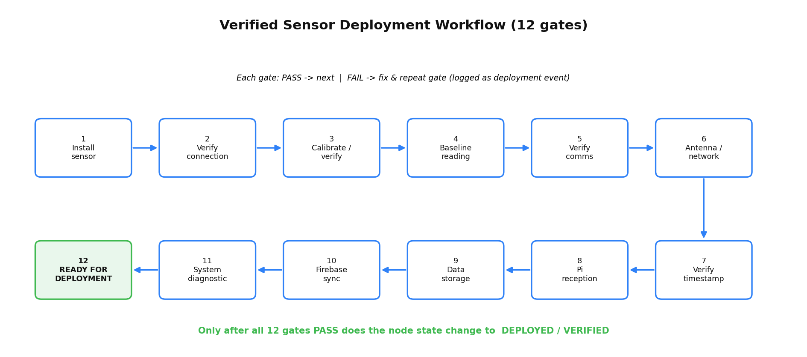</p>

<sub>Figure 42.1: 12-gate verified deployment workflow.</sub>

### 42.2 Node deployment states

```text
PROVISIONED ──► COMMISSIONING ──► READY_FOR_DEPLOYMENT ──► DEPLOYED_VERIFIED
      ▲               │ gate fail                               │
      │               └──────► (fix, repeat gate)               ├──► MAINTENANCE ──► (re-run affected gates) ──► DEPLOYED_VERIFIED
      └───────────────────────────────────────────────────────  └──► RETIRED
```

Every state change is an audited `NODE_STATE_CHANGE` event, including who, when and the checklist reference.

### 42.3 Deployment checklist

> Print this or use the debugger's guided mode. **All 12 gates must pass.** Record actual values, not just ticks.

**Site:** ____________  **Node ID:** SWN-______  **Gateway:** GW-____  **Date/time (UTC):** ____________
**Engineer:** ____________  **Firmware:** ________  **Edge version:** ________  **Config hash:** ________

| Gate | Step | Procedure | Acceptance criterion | Measured / observed | PASS / FAIL | Initials |
|:-:|---|---|---|---|:-:|:-:|
| 1 | **Install sensor** | Mount the probes in the guard pipe/flow cell at the specified depth; connect waterproof connectors; label cables | Probes fully immersed; no air pockets; labels match registry | | | |
| 2 | **Verify sensor connection** | `swdebug sensors SWN-xxxx` | All 5 sensors `CONNECTED`, present_ratio = 1.0 | | | |
| 3 | **Perform calibration/verification** | Run §43 procedures for pH, EC/TDS, turbidity; verify temperature against a reference thermometer | Each within its acceptance tolerance (TBD per sensor); cal versions recorded | | | |
| 4 | **Check baseline reading** | Log ≥ 30 min in site water | Noise σ < configured limit; no RNG/HLT/CON hits; values plausible for the site | | | |
| 5 | **Verify communication** | Check link counters | ESP32 → Pi frames ACKed; CRC error rate < 1%; 0 seq gaps | | | |
| 6 | **Verify antenna/network** | Modem registration + signal (if used); router uplink | Registered; CSQ ≥ `csq_min`; test upload OK | | | |
| 7 | **Verify timestamp** | Compare device ts, Pi ts and a reference clock | Skew < `max_clock_skew_s` (target ≪); RTC backup battery OK | | | |
| 8 | **Verify Raspberry Pi reception** | `swdebug status` | Last reading < 1 interval old; services active | | | |
| 9 | **Verify data storage** | Query `raw_readings`; `verify-chain` | Rows present; chain OK; integrity_check ok | | | |
| 10 | **Verify Firebase synchronisation** | Compare local/remote counts for the last hour | Equal; outbox pending = 0 | | | |
| 11 | **Run system diagnostic** | `swdebug diag run --full`; attach report | 0 FAIL; WARNs justified in writing | | | |
| 12 | **Mark READY FOR DEPLOYMENT** | Supervisor reviews checklist | All gates PASS → state `READY_FOR_DEPLOYMENT`, then after the observation period (TBD, e.g. 24 h) → `DEPLOYED_VERIFIED` | | | |

**Power checks (performed alongside gates 1–11):**

| Check | Criterion | Observed | PASS/FAIL |
|---|---|---|:-:|
| Battery polarity & voltage | Correct polarity; voltage in expected range for the chemistry | | |
| Solar channel | Non-zero in daylight; controller indicates charging | | |
| Wind channel | Non-zero when turbine spins; dump load wired; brake switch tested | | |
| LVD | Configured; threshold recorded | | |
| Fuses | Correct ratings installed per the wiring schedule | | |
| Earthing / bonding | Continuity verified | | |

**Physical checks:**

| Check | Observed | PASS/FAIL |
|---|---|:-:|
| Enclosure lid gasket seated, fasteners torqued | | |
| Cable glands tightened; unused glands blanked | | |
| Drip loops present | | |
| Breather vent + desiccant installed | | |
| Antenna mounted, surge arrestor earthed | | |
| Mast secure; turbine clearance adequate | | |
| Photos taken (enclosure interior, probes, mast) and attached | | |

**Sign-off:** Engineer ____________  Supervisor ____________  → Node state: **DEPLOYED / VERIFIED** ☐

### 42.4 Automated commissioning helper

```python
# smart-water-debugger/cli/swdebug/commission.py (excerpt)
GATES = [
    ("G2", "sensor connection", lambda c, n: all(s["state"] == "CONNECTED" for s in c.get("/api/v1/sensors", node=n).values())),
    ("G8", "pi reception",      lambda c, n: c.get("/api/v1/status")["last_reading"] is not None),
    ("G9", "data storage",      lambda c, n: c.post("/api/v1/chain/verify", node=n)["ok"]),
    ("G10","firebase sync",     lambda c, n: c.get("/api/v1/status")["outbox_pending"] == 0),
]

def run(client, node):
    results = []
    for gid, name, check in GATES:
        try:
            ok = bool(check(client, node))
        except Exception as e:           # a crashed check is a FAIL, not a skip
            ok, name = False, f"{name} ({e})"
        results.append((gid, name, "PASS" if ok else "FAIL"))
    return results   # manual gates (1,3,4,5,6,7,11,12) are recorded by the engineer in the checklist
```

---

## 43. Calibration Procedures

> Calibration tolerances, intervals and reference-solution values are `TBD / CONFIGURABLE` and must follow the **sensor manufacturer's instructions**. Use in-date, traceable reference solutions. Record the lot number and expiry date.

### 43.1 General rules

1. Calibrate at (or compensate to) a known temperature and record the temperature.
2. Rinse the probe with distilled/deionised water between solutions, and blot gently. Don't wipe glass pH bulbs.
3. Let the reading stabilise (criterion: change < `stability_delta` over `stability_s`).
4. Every calibration creates a new **calibration version**. Old coefficients stay in the audit log.
5. Readings taken with the previous calibration are **not** recomputed in place. If needed, a correction annotation is filed (§10.5).

### 43.2 pH (two- or three-point)

| Step | Action |
|---|---|
| 1 | Start a calibration session: `swdebug calibrate ph --points 2` (audited; requires SERVICE role) |
| 2 | Immerse in buffer A (e.g. pH 7.00): wait for stability → capture mV |
| 3 | Rinse; immerse in buffer B (e.g. pH 4.00 or 10.00): wait → capture mV |
| 4 | Firmware computes slope/offset (`Calibration::solveTwoPoint`) |
| 5 | Check slope against the expected electrode sensitivity (manufacturer guidance); reject if out of range |
| 6 | Verify in a third buffer if available: reading within tolerance |
| 7 | Store → cal version increments → `CALIBRATION_APPLIED` audit event (lots, temperature, mV, coefficients) |

### 43.3 EC / TDS

| Step | Action |
|---|---|
| 1 | Use a conductivity standard near the site's expected range |
| 2 | Confirm temperature compensation is enabled and the temperature sensor is valid |
| 3 | Capture mV at the standard → compute the coefficient; optionally two-point |
| 4 | TDS: determine factor k from EC (site-specific; ideally from paired lab TDS measurements). Record `tds_ec_factor` |
| 5 | Verify: CON-001 must not trigger on the standard |

### 43.4 Turbidity

| Step | Action |
|---|---|
| 1 | Low-cost optical modules are often **not** nephelometric. Treat their output as a relative index unless calibrated against formazin/equivalent standards |
| 2 | Zero point: particle-free (filtered) water in a clean, dark vessel |
| 3 | Span point(s): turbidity standard(s) if available |
| 4 | Record whether the sensor reports **calibrated NTU** or a **relative index**. The dashboard unit label must reflect this |

### 43.5 Temperature

Compare with a reference thermometer in a stirred water bath at two temperatures. Record the offset and apply it if it exceeds the tolerance.

### 43.6 Calibration record (audit payload)

```json
{
  "action": "CALIBRATION_APPLIED",
  "target_ref": "nodes/SWN-0001/sensors/PH-01",
  "previous_value": { "slope": -0.00592, "offset": 15.36, "version": 3 },
  "new_value":      { "slope": -0.00588, "offset": 15.29, "version": 4 },
  "reason": "Scheduled 30-day calibration",
  "evidence": {
    "points": [ { "ref": 7.00, "mv": 1412.2, "temp_c": 25.1, "lot": "B7-2291", "expiry": "2027-03" },
                { "ref": 4.00, "mv": 1922.6, "temp_c": 25.0, "lot": "B4-1180", "expiry": "2027-01" } ],
    "verification": { "ref": 10.00, "reading": 9.97 }
  },
  "actor_uid": "service:u_31a…", "actor_role": "SERVICE"
}
```

---

## 44. Maintenance

### 44.1 Schedule (initial proposal; adjust from field experience)

| Interval | Task | Role | Debugger check after |
|---|---|---|---|
| Weekly (remote) | Review alerts, verification failure rate, queue depth, power trends | Engineer | — |
| Monthly (site) | Visual inspection; clean probes; check glands, vent, desiccant; clean PV panel | Engineer | `diag run` |
| Per sensor calibration interval (TBD, e.g. 2–4 weeks for pH) | Calibrate per §43 | Service | `sensors`, cal age |
| Quarterly | Inspect turbine (blades, bearings, fasteners) with the turbine **braked**; check mast/guys; verify LVD; torque terminals | Service | power panel |
| Quarterly | Verify hash chain; compare local/cloud counts; review audit log | Supervisor | `verify-chain` |
| Semi-annual | Replace desiccant; inspect battery (swelling, terminals, capacity test if supported) | Service | battery check |
| Annual / per manufacturer | Replace pH electrode (typical lifetime is limited), other consumables | Service | full commissioning gates 2–4 |
| After storms | Site inspection: physical damage, water ingress, antenna, surge arrestor | Engineer | full diag |

### 44.2 Maintenance action logging

Maintenance actions are logged through the dashboard/debugger (`POST /api/v1/maintenance` or the Firestore `maintenance` task update). A maintenance log entry **never** modifies readings. While a sensor is out of the water for cleaning, the engineer sets **maintenance mode** for that sensor. Readings during that window are still stored, but flagged `mode: MAINTENANCE` in the event log, so the resulting MIS-001/ROC-001 hits are explainable.

### 44.3 Spare-parts kit (recommended)

| Item | Qty |
|---|:-:|
| pH probe (pre-conditioned, in storage solution) | 1 |
| Conductivity/TDS probe | 1 |
| Temperature probe | 1 |
| Calibration buffers/standards (in date) | 1 set |
| Fuses (each rating used) | 5 each |
| Desiccant packs | 4 |
| Cable glands + blanking plugs | 4 |
| Programmed spare ESP32 board (unprovisioned) | 1 |
| Spare SSD/SD with edge image | 1 |
| Self-amalgamating tape, cable ties (UV-rated) | — |

---

## 45. Troubleshooting Guide

### 45.1 Symptom index

| ID | Symptom | Likely causes | Checks | Resolution |
|---|---|---|---|---|
| **TSG-S01** | One sensor `null` (MIS-001) | Connector loose/corroded; cable damage; sensor board failure | `swdebug sensors`; reseat connector; measure mV at the board | Clean/replace connector; replace probe |
| **TSG-S02** | Out-of-range value (RNG-001) | Wiring short/open; wrong range config; probe failure | Raw mV; compare config to datasheet | Fix wiring; correct config (audited); replace |
| **TSG-S03** | Temperature `null` | 1-Wire pull-up missing; cable | Resistance; continuity | Repair |
| **TSG-S04** | Stuck value (HLT-001) | Frozen driver; railed ADC; very stable water | Raw mV varies? | Reboot node; if legitimate, tune window |
| **TSG-S05** | TDS/EC disagree (CON-001) | Fouled probe; wrong k; interference | Clean; check excitation groups | Clean/recalibrate; set k |
| **TSG-S06** | High noise | EMI; ground loop; poor shielding | Noise σ; switch modem/Pi off to compare | Shielding, isolation, cable routing |
| **TSG-S07** | Frequent ROC-001 | Air bubbles; flow surges; loose probe | Visual; probe holder | Re-seat probe; flow cell; tune limits (audited) |
| **TSG-N01** | Node offline | Power; ESP32 crash; UART cable | LEDs; battery V; serial console | Restore power; reflash; replace cable |
| **TSG-N02** | Frequent resets | Brownout (modem TX); watchdog | `reset_reason` | Supply/bulk capacitance; fix blocking code |
| **TSG-N03** | Firmware mismatch | Partial update | `fw` in frames vs expected | Reflash the release build |
| **TSG-N04** | Everything INVALID (TS-*) | RTC lost time | Device vs Pi time | Replace RTC battery; resync time |
| **TSG-C01** | CRC errors | Noise; long cable; baud | Counters | Shield/twist; RS-485; baud check |
| **TSG-C02** | Seq gaps (COM-001) | Buffer overflow; reboot mid-send | ring buffer dropped count | Larger buffer; investigate resets |
| **TSG-C03** | Cloud not syncing | Internet down; auth error; clock | `sw-sync` logs; `last_error` | Restore network; rotate key; fix time |
| **TSG-C04** | Modem not registered | No coverage; 2G sunset; SIM/APN; antenna | AT+CREG?, AT+CSQ | Relocate antenna; LTE module; APN |
| **TSG-E01** | Service inactive | Crash loop; config error | `journalctl -u sw-*` | Fix config; restart |
| **TSG-E02** | Disk nearly full | Archive not running | `df -h` | Run archive; larger SSD |
| **TSG-E03** | DB integrity error | Power loss on poor media | `PRAGMA integrity_check` | Restore from cloud + archive; replace media |
| **TSG-E04** | Pi overheating | Sun on enclosure; no shade | CPU temp | Sun shield; reduce load; heat-sinking |
| **TSG-P01** | Battery low repeatedly | Undersized harvest; failing battery; high load | Power history; energy budget | Clean panel; resize; replace battery; shed loads |
| **TSG-P02** | No solar in daylight | Panel disconnected/shaded; controller fault | V/I at panel and controller | Repair/clean |
| **TSG-P03** | No wind output in wind | Brake engaged; rectifier/controller fault | AC/DC voltages | Release brake; repair |
| **TSG-P04** | Brownout resets at night | Battery sag under load | Battery V under load | Battery health; thresholds |
| **TSG-D01** | High verification-failure rate | Sensor issue or mis-tuned rules | Rule histogram | Fix sensor; tune rules with audit |
| **TSG-D02** | Chain verification fails | Storage corruption or tampering | First bad record | Preserve evidence; compare with cloud; incident report |

### 45.2 Decision tree: "no data on the dashboard"

```text
No new data on dashboard?
├─ Stale banner shown?
│   ├─ YES → Edge may be fine; cloud sync issue → swdebug status (on site / VPN)
│   │         ├─ outbox_pending growing → TSG-C03
│   │         └─ last_reading old       → go to "Edge receiving?" below
│   └─ NO  → Browser/auth issue → sign out/in; check role claim
└─ Edge receiving? (swdebug status → last_reading)
    ├─ YES, recent → cloud path → TSG-C03
    └─ NO → Node alive? (LEDs, battery V)
        ├─ LEDs off → power path → TSG-P01 / fuses / LVD
        └─ LEDs on  → link → TSG-C01 / UART cable / baud / sw-receiver (TSG-E01)
```

---

## 46. Comprehensive Test Plan

<p align="center">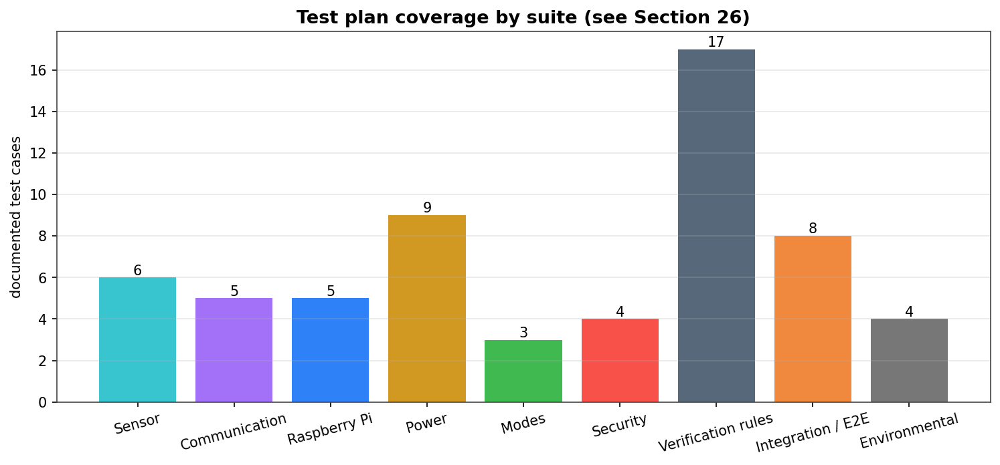</p>

<sub>Figure 46.1: Documented test cases by suite.</sub>

> **Format.** Every test uses **INPUT → PROCESS → EXPECTED RESULT → ACTUAL RESULT → PASS/FAIL**.
> "ACTUAL" and "PASS/FAIL" are filled in during execution. Rows marked ✅ **(executed)** were run against the reference implementation in this repository. All other rows are **planned** and must be executed on hardware/emulators in Phase 16.

### 46.1 Sensor tests

| ID | INPUT | PROCESS | EXPECTED RESULT | ACTUAL RESULT | PASS/FAIL |
|---|---|---|---|---|:-:|
| SN-01 | Normal readings in reference water | Acquire 30 samples | All present; VALID; σ below limit | | |
| SN-02 | Missing sensor (never connected) | Boot + acquire | Field `null`; MIS-001; `SENSOR_DISCONNECTED` alert after N | | |
| SN-03 | Disconnected sensor (unplug while running) | Acquire | `null` within 1 cycle; alert; reconnect → recovers | | |
| SN-04 | Out-of-range value (simulated mV injection) | Verify | RNG-001; SUSPECTED_SENSOR_ERROR; raw preserved | ✅ (executed: `test_out_of_range_is_suspected_sensor_error`) | PASS |
| SN-05 | Sudden change (pH 7.1 → 10.5 in 5 min) | Verify | ROC-001; ABNORMAL | ✅ (executed: `test_sudden_change_flagged`) | PASS |
| SN-06 | Cross-interference (TDS & EC powered together vs sequentially) | Compare | Difference < tolerance with grouping enabled | | |

### 46.2 Communication tests

| ID | INPUT | PROCESS | EXPECTED RESULT | ACTUAL RESULT | PASS/FAIL |
|---|---|---|---|---|:-:|
| CM-01 | Network available | Sync | Docs delivered < `stale_after_s` | | |
| CM-02 | Network unavailable 13 h | Queue | No loss; outbox grows; stale banner | ✅ (executed in simulation, Fig. 15.2; unit `test_offline_then_recover_no_duplicates`) | PASS (sim) |
| CM-03 | Firebase unavailable (503/timeout injected) | Sync | Backoff; no loss; recovery | | |
| CM-04 | Recovery after outage | Sync | Queue drains; local count = remote count | | |
| CM-05 | Duplicate prevention (replay frame + retry batch) | Store + sync | 1 local row, 1 remote doc | ✅ (executed: `test_duplicate_record_rejected`; P7 `test_retry_after_partial_success_is_idempotent`) | PASS |

### 46.3 Raspberry Pi tests

| ID | INPUT | PROCESS | EXPECTED RESULT | ACTUAL RESULT | PASS/FAIL |
|---|---|---|---|---|:-:|
| PI-01 | Raw frames over UART | Receive | Parsed, `received_ts` stamped, ACK sent | | |
| PI-02 | Malformed / partial / wrong-type messages | Validate | FMT-001/002/005; INVALID; payload logged as event | ✅ (executed: FMT tests) | PASS |
| PI-03 | 1000 frames | Store | 1000 rows; chain valid; UPDATE/DELETE blocked | | |
| PI-04 | Mixed-fault stream (24 h simulated) | Verify | All injected faults detected by the expected rule | ✅ (executed: `test_simulated_stream_triggers_expected_rules`) | PASS |
| PI-05 | Network down | Sync queue | Outbox PENDING rows = new records; survive reboot | | |

### 46.4 Verification-rule tests (reference implementation, executed)

| ID | Rule | INPUT | EXPECTED | ACTUAL | PASS/FAIL |
|---|---|---|---|---|:-:|
| VR-01 | — | Nominal reading | VALID / PASSED | VALID / PASSED | ✅ PASS |
| VR-02 | FMT-001 | `"garbage"` | INVALID | INVALID | ✅ PASS |
| VR-03 | FMT-002 | missing `timestamp` | INVALID | INVALID | ✅ PASS |
| VR-04 | FMT-005 | pH as string | INVALID | INVALID | ✅ PASS |
| VR-05 | RNG-001 | pH 15.2 | SUSPECTED_SENSOR_ERROR | SUSPECTED_SENSOR_ERROR | ✅ PASS |
| VR-06 | MIS-001 | turbidity null | MIS-001 hit | MIS-001 hit | ✅ PASS |
| VR-07 | ROC-001 | +3.4 pH / 5 min | ABNORMAL | ABNORMAL | ✅ PASS |
| VR-08 | TS-001 | naive timestamp | INVALID | INVALID | ✅ PASS |
| VR-09 | TS-002 | +60 min future | INVALID | INVALID | ✅ PASS |
| VR-10 | DUP-001 | repeated record_id | INVALID | INVALID | ✅ PASS |
| VR-11 | NID-001 | unregistered node | INVALID | INVALID | ✅ PASS |
| VR-12 | COM-001 | seq 1 → 5 | COMMUNICATION_ERROR | COMMUNICATION_ERROR | ✅ PASS |
| VR-13 | HLT-001 | identical ×6 | HLT-001 hit | HLT-001 hit | ✅ PASS |
| VR-14 | CON-001 | TDS 400 vs EC 420 (k 0.5) | CON-001 hit | CON-001 hit | ✅ PASS |
| VR-15 | ABN-001 | pH 5.0 with/without band | only when configured | only when configured | ✅ PASS |
| VR-16 | invariant | any | raw input unchanged | unchanged | ✅ PASS |
| VR-17 | integrity | same msg twice | identical SHA-256 | identical | ✅ PASS |

### 46.5 Security tests

| ID | INPUT | PROCESS | EXPECTED RESULT | ACTUAL RESULT | PASS/FAIL |
|---|---|---|---|---|:-:|
| SC-01 | Unauthorised access: no token / wrong token / unauthenticated Firestore read | Request | 401 / PERMISSION_DENIED | | |
| SC-02 | Data modification attempt: update/delete reading as each role; SQL UPDATE on edge | Request / SQL | Denied at every layer; attempt logged | (edge SQL: executed in P4 unit tests) | |
| SC-03 | Invalid input: fuzzed frames, oversized payload, script in ack note | Receive / UI | No crash; rejected or escaped; ack note length-limited | | |
| SC-04 | Audit logging: acknowledge alert, change config, apply calibration | Action | Audit entry with uid, role, server ts, prev/new, reason; not editable | | |

### 46.6 Power tests

| ID | INPUT | PROCESS | EXPECTED RESULT | ACTUAL RESULT | PASS/FAIL |
|---|---|---|---|---|:-:|
| PW-01 | Solar available | Measure | Solar V/I/P > 0; source contains SOLAR | | |
| PW-02 | Solar unavailable (daylight, covered) | Observe | `SOLAR_UNAVAILABLE` after debounce | | |
| PW-03 | Wind available | Measure | Wind V/I/P > 0; source contains WIND | | |
| PW-04 | Wind unavailable (braked/calm) | Observe | `WIND_UNAVAILABLE` after debounce | | |
| PW-05 | Both available | Classify | SOLAR+WIND; CHARGING | (classifier unit test) | |
| PW-06 | Both unavailable | Classify | BATTERY; DISCHARGING | (classifier unit test) | |
| PW-07 | Battery backup (renewable < load) | Observe | RENEWABLE+BATTERY or BATTERY; system keeps running | | |
| PW-08 | Low battery | Discharge | `BATTERY_LOW`; LOW-POWER; P4 off | | |
| PW-09 | Critical battery | Discharge | `BATTERY_CRITICAL`; Pi graceful shutdown; P1 continues | | |

### 46.7 Mode tests

| ID | INPUT | PROCESS | EXPECTED RESULT | ACTUAL RESULT | PASS/FAIL |
|---|---|---|---|---|:-:|
| MD-01 | Normal | 1 h run | ~12 samples at 300 s; NORMAL | | |
| MD-02 | Low-power | SoC below enter | Deep sleep cycle; burst uplink | | |
| MD-03 | Emergency | Configured trigger, network down | Increased rate; local alert; stored; sent after reconnect | | |

### 46.8 Integration / end-to-end tests

| ID | INPUT | PROCESS | EXPECTED RESULT | ACTUAL RESULT | PASS/FAIL |
|---|---|---|---|---|:-:|
| IT-01 … IT-08 | See Phase 15 | | | | |

### 46.9 Environmental & enclosure tests (future / pilot)

> These are **informal engineering checks**, not certification tests. They don't establish an IP rating.

| ID | INPUT | PROCESS | EXPECTED RESULT | ACTUAL RESULT | PASS/FAIL |
|---|---|---|---|---|:-:|
| EN-01 | Garden-hose spray, 10 min, all faces | Inspect inside | No water inside (informal) | | |
| EN-02 | Enclosure in direct sun, 1 day | Log internal temp | Within component ratings (TBD) | | |
| EN-03 | Humidity logging, 2 weeks | Internal RH trend | No sustained condensation | | |
| EN-04 | 30-day outdoor pilot | Full system | KPIs met; inspection report | | |

---

# PART G: HONEST ASSESSMENT AND THE ROAD AHEAD

## 47. Prototype vs Future Industrial Capability

> This table is the single source of truth for what the project **is** today and what it **could become**. Anything in the right-hand column is a *target*, not a claim.

| Area | ✅ Prototype functionality (this project) | 🔭 Future industrial deployment capability (requires further work) |
|---|---|---|
| Sensors | Low-cost analog pH/EC/TDS/turbidity + digital temperature; bench calibration | Industrial-grade probes with digital outputs (e.g. RS-485/Modbus), self-cleaning, drift diagnostics |
| Contaminant screening | **Not included.** Architecture slot only | Integrated dedicated analysers / lab workflow with chain of custody |
| Node hardware | ESP32 dev board / module on a prototype carrier PCB | Custom PCB with isolated analog front-ends, conformal coating, EMC design |
| Edge | Raspberry Pi with SSD | Industrial-temperature edge computer, eMMC, hardware watchdog, UPS supervision |
| Enclosure | Weather-resistant enclosure per §9. **No rating claimed** | Tested to a relevant IP rating by an accredited lab; UV/corrosion testing |
| Power | Solar + wind hybrid, measured, with load shedding | Engineered sizing from site resource data; certified charge controllers; lightning protection design review |
| Communication | UART to Pi; optional 2G/LTE modem; Firebase over TLS | LTE-M/NB-IoT with fallback; private APN/VPN; store-and-forward gateways; satellite option |
| Data integrity | Append-only tables, Security Rules, hash chain, audit log | Signed frames (per-device keys in secure element), external timestamp anchoring, WORM storage |
| Security | Reasonable practices (§17) | Formal threat model, penetration testing, secure boot + flash encryption, SBOM, vulnerability disclosure process |
| Software quality | Unit + integration tests, CI | Coverage targets, HIL rigs in CI, formal release process, long-term support branches |
| Operations | Manual deployment checklist; debugger | Fleet management, OTA with staged roll-out, remote configuration with approvals |
| Compliance | **None claimed** | Electrical safety, EMC, radio approvals for the target country; water-sector requirements as applicable |
| Scale | 1–few nodes | Hundreds of nodes, multi-tenant, regional dashboards |

---

## 48. Limitations

### 48.1 Measurement limitations

1. **No contaminant identification.** pH, turbidity, TDS, EC and temperature are general indicators. They can't identify or quantify arsenic, heavy metals, fluoride, nitrate, organic pollutants or microbiological contamination.
2. **"Normal" readings don't mean "safe water".** Water can have unremarkable pH/EC/turbidity and still be unsafe.
3. **Low-cost sensor accuracy.** Accuracy, drift and lifetime of low-cost probes are limited and must be characterised. Published "accuracy" figures on module listings are often unverified.
4. **Turbidity units.** Many low-cost turbidity modules don't produce true NTU without calibration against standards.
5. **TDS is derived.** TDS is typically estimated from EC with a composition-dependent factor.
6. **Fouling and drift.** Readings degrade between maintenance visits; verification rules detect some, but not all, degradation.

### 48.2 Verification limitations

1. The engine classifies **data quality against rules**. It can't prove a reading is correct.
2. Slow drift within range and within rate limits won't trigger any rule. Periodic calibration is the only control.
3. Thresholds (rates, windows, tolerances) need site-specific tuning. Bad tuning produces false positives or missed faults.
4. Attention bands are only as good as their documented source.

### 48.3 Power limitations

1. **No guaranteed operation in every weather condition.** Long periods of low sun *and* low wind will deplete the battery.
2. Small wind turbines often perform below their rated output at low sites or in turbulent air; real output must be measured.
3. SoC estimation is approximate.
4. Battery capacity, chemistry and lifetime are **not specified** here and must be engineered per site.

### 48.4 Communication limitations

1. 2G availability is declining in many regions.
2. Cellular coverage at remote sites may be absent; data then waits in the local queue until a connection or site visit.
3. Firebase is a third-party cloud service with quotas, pricing and availability outside the project's control.

### 48.5 Integrity and security limitations

1. Physical access to the edge device enables tampering, which the hash chain makes **detectable**, not impossible.
2. The local UART link isn't authenticated in the prototype.
3. The security posture hasn't been independently assessed.

### 48.6 Physical limitations

1. No IP, UV, salt-spray, vibration or temperature-cycling tests have been performed.
2. No surge/lightning testing.
3. Theft and vandalism mitigation is basic.

### 48.7 Simulated evidence

Figures 6.2, 6.3, 12.2, 12.3, 14.2 and 15.2 come from **deterministic simulators** in this repository. They illustrate *behaviour of the logic*, not field performance.

---

## 49. Risk Register

<p align="center">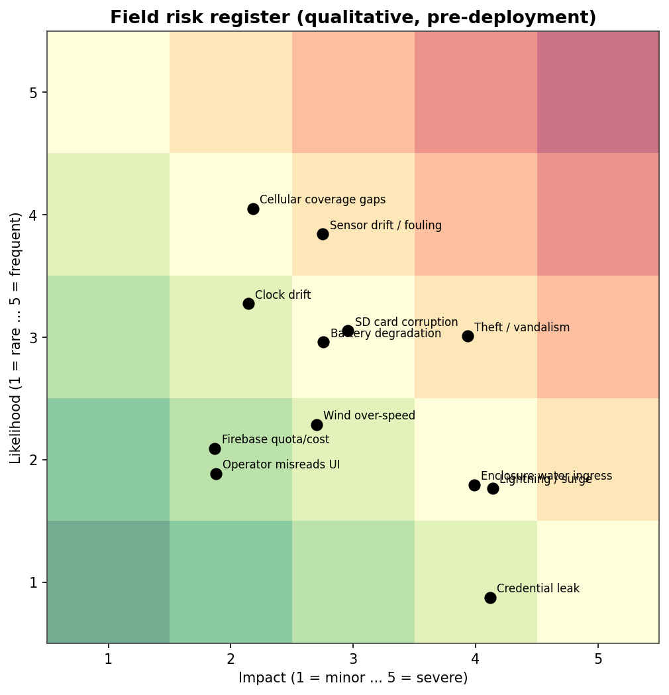</p>

<sub>Figure 49.1: Qualitative pre-deployment risk matrix.</sub>

| ID | Risk | L (1–5) | I (1–5) | Mitigation | Owner | Status |
|---|---|:-:|:-:|---|---|---|
| R-01 | Sensor drift / fouling | 4 | 3 | Calibration schedule; HLT/CON/ROC rules; guard pipe | Service | Open |
| R-02 | Cellular coverage gaps | 4 | 2 | Offline-first queue; site survey; LTE option | Architect | Mitigated (design) |
| R-03 | Battery degradation | 3 | 3 | SoC trend monitoring; capacity checks; replacement plan | Power | Open |
| R-04 | Enclosure water ingress | 2 | 4 | Glands on bottom, vent, drip loops; EN tests | Mechanical | Open |
| R-05 | Lightning / surge | 2 | 4 | Arrestor, TVS, earthing; design review | Electrical | Open |
| R-06 | Theft / vandalism | 3 | 4 | Lockable enclosure; height; door-open event | Ops | Open |
| R-07 | SD-card corruption | 3 | 3 | SSD; WAL + synchronous FULL; graceful shutdown; cloud replica | Edge | Mitigated (design) |
| R-08 | Clock drift | 3 | 2 | RTC; NTP/GSM time; TS rules | Firmware | Mitigated (design) |
| R-09 | Firebase quota / cost | 2 | 2 | Batching; emergency max duration; monitoring | Cloud | Open |
| R-10 | Credential leak | 1 | 4 | gitleaks, .gitignore, rotation procedure | All | Mitigated (process) |
| R-11 | Wind turbine over-speed | 2 | 3 | Controller + dump load + brake; inspection | Power | Open |
| R-12 | Operator misreads UI | 2 | 2 | Plain language; usability test P8-T6 | UI | Open |
| R-13 | Over-claiming capability | 2 | 5 | Claims policy §3.2; release claim review | Docs | Mitigated (process) |

---

## 50. Future Scalability

### 50.1 Scaling dimensions

<p align="center">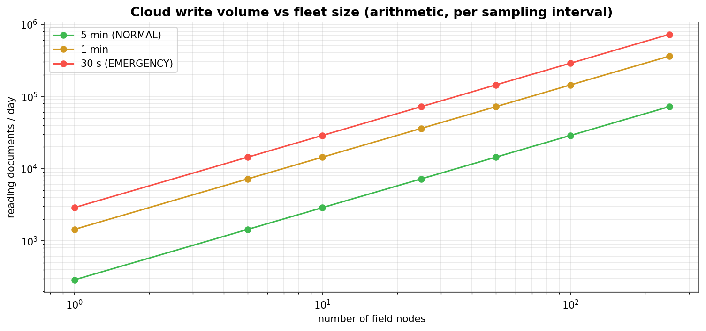</p>

<sub>Figure 50.1: Arithmetic write volume vs fleet size for different sampling intervals (readings only; excludes power samples, events and results).</sub>

| Dimension | Current (prototype) | Scaling approach |
|---|---|---|
| Nodes per gateway | 1 (T1) | RS-485 multi-drop / local wireless star (T2); node addressing already in the schema |
| Gateways | 1 | Gateway ID in every record; per-gateway service accounts |
| Cloud writes | 1 doc per reading | Batch documents (e.g. hourly bundles) for NORMAL mode, keep per-reading docs for emergencies; archive to cold storage/BigQuery |
| Dashboard | Per-node views | Site → region hierarchy; map view; aggregated KPIs |
| Configuration | Per-node files | Central config with approval workflow → pushed to edge, audited |
| Firmware updates | USB | Signed OTA with staged rollout and automatic rollback |
| Analytics | Rule-based verification | Statistical baselines per site; anomaly scores as **advisory** extra fields (never replacing raw or rule results) |
| Sensors | 5 parameters | Plug-in sensor abstraction (`SensorBase`); additional parameters (e.g. dissolved oxygen, ORP) via schema v2 |
| Screening | None | Dedicated screening subsystem with its own collection and chain of custody (§9.6) |

### 50.2 Schema evolution

- `schema_version` in every frame; the edge accepts a configured list of versions.
- New optional fields are backward-compatible; new required fields → new major schema version.
- Schemas live in `smart-water-main/schema/` and are tagged; consumers pin a tag.

### 50.3 Roadmap after Phase 17

| Milestone | Content |
|---|---|
| M1: Pilot | 1–3 sites, 30–90 days, EN tests, measured energy budgets, first field test report |
| M2: Hardening | Custom PCB with isolated analog front-end; signed frames; secure boot; LTE-M modem |
| M3: Fleet | OTA, central config, multi-site dashboard, alert routing (SMS/e-mail) |
| M4: Compliance path | Identify applicable standards per target country; pre-compliance testing; accredited testing |
| M5: Screening integration | Partner with domain experts/labs to integrate a dedicated contaminant screening method |

---

## 51. Figure Generation (Python)

All figures in this README except the concept render (Figure 0) are **generated by Python** with matplotlib and numpy. No figures are hand-drawn or pulled from external services.

```bash
python scripts/generate_diagrams.py
```

| # | File | Generator function | Type | Data source |
|:-:|---|---|---|---|
| 0 | `00_hero_concept.png` | (AI image model) | Concept illustration | none, labelled as illustration |
| 1 | `01_system_architecture.png` | `fig_system_architecture` | Architecture diagram | design |
| 2 | `02_power_architecture.png` | `fig_power_architecture` | Architecture diagram | design |
| 3 | `03_data_pipeline.png` | `fig_data_pipeline` | Flow diagram | design |
| 4 | `04_verification_flowchart.png` | `fig_verification_flowchart` | Flowchart | rule catalogue |
| 5 | `05_mode_state_machine.png` | `fig_mode_state_machine` | State machine | design |
| 6 | `06_deployment_workflow.png` | `fig_deployment_workflow` | Workflow | §42 |
| 7 | `07_offline_sync_sequence.png` | `fig_offline_sync_sequence` | Sequence diagram | design |
| 8 | `08_repository_map.png` | `fig_repo_map` | Map | §23 |
| 9 | `09_sensor_timeseries_flags.png` | `fig_sensor_timeseries` | Time series | **SIMULATED** stream + real engine |
| 10 | `10_verification_distribution.png` | `fig_verification_distribution` | Bar charts | **SIMULATED** stream + real engine |
| 11 | `11_hybrid_power_4day.png` | `fig_hybrid_power` | Area + line chart | **SIMULATED** |
| 12 | `12_power_source_timeline.png` | `fig_power_source_timeline` | Timeline + donut | **SIMULATED** |
| 13 | `13_weather_scenario_matrix.png` | `fig_weather_matrix` | Heat map | qualitative design expectation |
| 14 | `14_mode_energy_model.png` | `fig_mode_energy` | Stacked bars + waveform | **ILLUSTRATIVE** model |
| 15 | `15_sync_queue_backlog.png` | `fig_sync_backlog` | Line chart | **SIMULATED** |
| 16 | `16_load_priority_matrix.png` | `fig_load_priority` | Matrix | configuration default |
| 17 | `17_dashboard_mockup.png` | `fig_dashboard_mockup` | UI mock-up | layout reference |
| 18 | `18_debugger_mockup.png` | `fig_debugger_mockup` | UI mock-up | layout reference |
| 19 | `19_phase_roadmap.png` | `fig_roadmap` | Gantt | plan |
| 20 | `20_risk_matrix.png` | `fig_risk_matrix` | Risk matrix | §49 |
| 21 | `21_test_plan_coverage.png` | `fig_test_matrix` | Bar chart | §46 |
| 22 | `22_enclosure_concept.png` | `fig_enclosure` | Concept layout | design |
| 23 | `23_alert_lifecycle.png` | `fig_alert_escalation` | State flow | §18.5 |
| 24 | `24_data_model.png` | `fig_data_model` | ER-style diagram | §10.4 |
| 25 | `25_hash_chain.png` | `fig_hash_chain` | Diagram | §13.4 |
| 26 | `26_scaling_write_volume.png` | `fig_scaling` | Log-log chart | arithmetic |

**Reproducibility:** all simulators use fixed random seeds, so a fresh run reproduces the figures exactly (given the same matplotlib version and fonts).

**Generator excerpt: how data-driven figures use the real engine:**

```python
def _stream_results():
    msgs = water_stream()                      # deterministic SIMULATED stream (seed=7)
    eng = VerificationEngine()                 # the SAME engine the tests exercise
    res = []
    for m in msgs:
        ts = datetime.fromisoformat(m["timestamp"].replace("Z", "+00:00"))
        res.append(eng.verify(m, ts + timedelta(seconds=3)))
    return msgs, res
```

---

## 52. Contributing, Git Workflow & Commit Conventions

### 52.1 Branching

```text
main ─────●────────●────────────●──────── (protected, always releasable)
           \        \            \
            feat/…   fix/…        docs/…   (short-lived, PR → main)
tags: v0.1.0 (release), tr-v0.1.0 (test report), schema-v1 (contracts)
```

### 52.2 Conventional Commits

| Type | Use for | Example |
|---|---|---|
| `feat` | New capability | `feat(validator): add CON-001 TDS/EC consistency rule` |
| `fix` | Bug fix | `fix(sync): treat ALREADY_EXISTS as success` |
| `test` | Tests only | `test(power): add four-scenario classifier tests` |
| `docs` | Documentation | `docs(main): add calibration record example` |
| `refactor` | No behaviour change | `refactor(receiver): extract frame decoder` |
| `chore` | Tooling, scaffolding | `chore: add gitleaks pre-commit hook` |
| `perf` | Performance | `perf(sync): batch creates with BulkWriter` |
| `security` | Security hardening | `security(api): constant-time token comparison` |

Scopes: `sensors`, `link`, `modes`, `power`, `receiver`, `validator`, `storage`, `sync`, `rules`, `dashboard`, `debugger`, `main`.

### 52.3 Full commit log for the 17 phases

```text
chore: scaffold repository structure, CI and secret scanning                               (P1)
feat(sensors): add acquisition for pH, turbidity, TDS, EC, temperature with null-on-disconnect and NVS calibration (P2)
feat(link): add CRC16-framed UART link with ACK/NACK, retries and replay ring buffer       (P3)
feat(receiver): add frame decoder and serial receiver with idempotent ACK                 (P3)
feat(storage): append-only SQLite raw store with SHA-256 hash chain and DB-level immutability (P4)
feat(validator): implement documented verification rule catalogue with append-only results (P5)
feat(sync): add durable idempotent outbox queue for offline-first operation               (P6)
feat(sync): idempotent Firestore sync with backoff and auth-error handling                (P7)
feat(rules): immutable readings/audit, ack-only alerts, role claims, emulator tests       (P7)
feat(dashboard): five-tab engineer dashboard with verification status, stale banner and ack-only alerts (P8)
feat(debugger): LAN diagnostic API (read-only DB), swdebug CLI, chain verification and reports (P9)
feat(power): solar channel measurement and debounced availability events                  (P10)
feat(power): wind channel with protection status and long-debounce availability           (P11)
feat(power): hybrid source classification, charge state and debounced switching events    (P12)
feat(power): SoC estimator, hysteresis battery policy, load shedding and energy budget tool (P13)
feat(modes): normal, low-power burst and local-first emergency modes with hysteresis      (P14)
test(integration): end-to-end offline/recovery test against Firestore emulator and soak KPIs (P15)
test: execute full test plan and publish TR-v0.1.0                                        (P16)
docs: complete system documentation, regenerate figures, claim review                     (P17)
```

### 52.4 Definition of Done (every PR)

- [ ] Code builds; all tests pass in CI
- [ ] New behaviour has tests (INPUT → EXPECTED)
- [ ] No secrets; `.example` files updated
- [ ] Docs updated (README/docs; rule catalogue if rules changed)
- [ ] No unsupported claims introduced
- [ ] Reviewer approved

### 52.5 Reporting security issues

Don't open public issues for vulnerabilities. Email the maintainers (address in `SECURITY.md`) with details and reproduction steps. We aim to acknowledge reports within a reasonable time frame. No specific response time is guaranteed for this student/prototype project.

---

## 53. Glossary

| Term | Definition |
|---|---|
| **ADC** | Analog-to-digital converter |
| **Attention band** | Project-configured range, with a documented source, outside which a reading is flagged ABNORMAL for follow-up |
| **Audit event** | Immutable record of a human or system action (who, what, when, why, before, after) |
| **Boot ID** | Counter persisted in ESP32 NVS, incremented on each boot, part of the record ID |
| **Burst** | Transmitting several buffered frames in one radio/Pi power-up window |
| **Chain hash** | SHA-256 over the previous chain hash and the current record hash |
| **CRC-16/CCITT** | Checksum used to detect transmission errors in local frames |
| **DoD** | Depth of discharge |
| **EC** | Electrical conductivity (µS/cm), temperature-compensated to 25 °C |
| **Edge** | Local computing layer (Raspberry Pi) between field node and cloud |
| **FRU** | Field-replaceable unit |
| **HIL** | Hardware-in-the-loop testing |
| **Hysteresis** | Different entry and exit thresholds to prevent rapid switching |
| **Idempotent** | An operation that has the same effect however many times it is repeated |
| **LVD** | Low-voltage disconnect: hardware battery protection |
| **MPPT / PWM** | Solar charge-controller types (maximum power point tracking / pulse-width modulation) |
| **NTU** | Nephelometric turbidity unit |
| **NVS** | Non-volatile storage (ESP32 flash key-value store) |
| **Outbox** | Local queue of records awaiting cloud delivery |
| **Raw reading** | The original value as produced by the node, stored unchanged |
| **RBAC** | Role-based access control |
| **RTC** | Real-time clock |
| **Screening** | Dedicated method targeting a specific contaminant; separate from core monitoring |
| **SoC** | State of charge (estimated) |
| **TDS** | Total dissolved solids (ppm), typically derived from EC |
| **TVS** | Transient-voltage-suppression diode |
| **Verification** | Applying documented data-quality rules to a raw reading |
| **WAL** | Write-ahead logging (SQLite journal mode) |

---

## 54. Appendices

### Appendix A: JSON Schema: raw reading v1

```json
{
  "$schema": "https://json-schema.org/draft/2020-12/schema",
  "$id": "https://github.com/YOUR-ORG/smart-water-main/schema/raw-reading.v1.json",
  "title": "Smart Water raw reading v1",
  "type": "object",
  "required": ["schema_version", "record_id", "node_id", "sensor_ids", "timestamp", "seq", "mode", "raw", "power", "comm"],
  "additionalProperties": true,
  "properties": {
    "schema_version": { "const": 1 },
    "record_id": { "type": "string", "pattern": "^SWN-[0-9]{4}-[0-9]{5}-[0-9]{8}$" },
    "node_id":   { "type": "string", "pattern": "^SWN-[0-9]{4}$" },
    "boot_id":   { "type": "integer", "minimum": 0 },
    "seq":       { "type": "integer", "minimum": 0 },
    "sensor_ids": {
      "type": "object",
      "additionalProperties": { "type": "string", "pattern": "^[A-Z]{2}-[0-9]{2}$" }
    },
    "timestamp":   { "type": "string", "format": "date-time" },
    "time_source": { "enum": ["RTC", "NTP", "GSM", "UNSYNCED"] },
    "mode":        { "enum": ["NORMAL", "LOW_POWER", "EMERGENCY", "MAINTENANCE", "COMMISSIONING"] },
    "raw": {
      "type": "object",
      "required": ["ph", "turbidity_ntu", "tds_ppm", "ec_us_cm", "temperature_c"],
      "properties": {
        "ph":            { "type": ["number", "null"] },
        "turbidity_ntu": { "type": ["number", "null"] },
        "tds_ppm":       { "type": ["number", "null"] },
        "ec_us_cm":      { "type": ["number", "null"] },
        "temperature_c": { "type": ["number", "null"] }
      }
    },
    "raw_electrical": { "type": "object", "additionalProperties": { "type": ["number", "null"] } },
    "cal_version":    { "type": "object", "additionalProperties": { "type": "string" } },
    "power": {
      "type": "object",
      "properties": {
        "battery_v": { "type": ["number", "null"] },
        "battery_state": { "enum": ["CHARGING", "DISCHARGING", "IDLE", "FAULT", "UNKNOWN"] },
        "source": { "enum": ["SOLAR", "WIND", "SOLAR+WIND", "RENEWABLE+BATTERY", "BATTERY"] },
        "solar_w": { "type": ["number", "null"] },
        "wind_w":  { "type": ["number", "null"] },
        "load_w":  { "type": ["number", "null"] }
      }
    },
    "comm": {
      "type": "object",
      "properties": {
        "link":     { "enum": ["UART", "RS485", "WIFI", "CELLULAR"] },
        "modem":    { "type": "string" },
        "rssi_csq": { "type": ["integer", "null"] },
        "retries":  { "type": "integer", "minimum": 0 }
      }
    },
    "fw": { "type": "string" }
  }
}
```

### Appendix B: Event type catalogue

| Category | Type | Severity (default) | Alert? |
|---|---|---|:-:|
| SENSOR | `SENSOR_DISCONNECTED` | ALARM | ✅ |
| SENSOR | `SENSOR_RECOVERED` | INFO | |
| SENSOR | `SENSOR_STUCK` | WARNING | ✅ |
| SENSOR | `SENSOR_INCONSISTENT` | WARNING | ✅ |
| VERIFICATION | `ABNORMAL_READING` | WARNING | ✅ |
| VERIFICATION | `SUDDEN_CHANGE` | WARNING | ✅ |
| VERIFICATION | `VERIFICATION_FAILURE_RATE` | WARNING | ✅ |
| VERIFICATION | `ENGINE_ERROR` | ALARM | ✅ |
| COMM | `NODE_OFFLINE` | ALARM | ✅ |
| COMM | `NODE_ONLINE` | INFO | |
| COMM | `COMMUNICATION_FAILURE` | WARNING | ✅ |
| COMM | `CLOUD_AUTH_ERROR` | ALARM | ✅ (admin) |
| COMM | `SYNC_CONFLICT` | ALARM | ✅ (admin) |
| COMM | `FRAME_ERROR` | INFO | |
| POWER | `SOLAR_UNAVAILABLE` | INFO | |
| POWER | `WIND_UNAVAILABLE` | INFO | |
| POWER | `POWER_SOURCE_SWITCH` | INFO | |
| POWER | `RENEWABLE_RESTORED` | INFO | |
| POWER | `POWER_FAILURE` | WARNING | ✅ |
| POWER | `BATTERY_LOW` | WARNING | ✅ |
| POWER | `BATTERY_CRITICAL` | CRITICAL | ✅ |
| POWER | `BATTERY_RECOVERED` | INFO | |
| POWER | `CHARGING_FAILURE` | ALARM | ✅ |
| POWER | `OVERSPEED_PROTECTION` | INFO | |
| POWER | `LOAD_PROFILE_APPLIED` | INFO | |
| POWER | `POWER_MONITOR_FAULT` | WARNING | ✅ |
| SYSTEM | `MODE_CHANGE` | INFO | |
| SYSTEM | `EMERGENCY_ENTERED` | ALARM | ✅ |
| SYSTEM | `EMERGENCY_EXITED` | INFO | |
| SYSTEM | `STORAGE_LOW` | WARNING | ✅ |
| SYSTEM | `SERVICE_RESTARTED` | INFO | |
| SYSTEM | `ENCLOSURE_OPENED` (if switch fitted) | WARNING | ✅ |
| MAINTENANCE | `MAINTENANCE_DUE` | INFO | ✅ |
| MAINTENANCE | `MAINTENANCE_LOGGED` | INFO | |
| MAINTENANCE | `CALIBRATION_APPLIED` | INFO | |
| DEPLOYMENT | `NODE_STATE_CHANGE` | INFO | |
| DEPLOYMENT | `GATE_FAILED` | WARNING | |

### Appendix C: `architecture/` and `documentation/` file contents (outline)

| File | Sections |
|---|---|
| `architecture/system-architecture.md` | Layers (§4.2), responsibilities (§4.3), topologies (§4.5), interfaces (§4.6) |
| `architecture/data-flow.md` | Pipeline (§5), frame format, IDs, retention |
| `architecture/power-flow.md` | Hybrid architecture (§6), scenarios, budget template, failover (§22) |
| `architecture/communication-flow.md` | Paths (§7), framing, status model, cellular notes |
| `documentation/deployment.md` | Checklist (§42) as a printable form |
| `documentation/calibration.md` | §43 procedures + record template |
| `documentation/troubleshooting.md` | §45 symptom index + decision trees |
| `documentation/maintenance.md` | §44 schedule, logging, spares |

### Appendix D: `repository-links.md`

```markdown
# Repository links
| Repository | URL | Default branch | Latest release |
|---|---|---|---|
| smart-water-main | https://github.com/YOUR-ORG/smart-water-main | main | v0.1.0 |
| smart-water-esp32 | https://github.com/YOUR-ORG/smart-water-esp32 | main | v0.4.2 |
| smart-water-raspberry-pi | https://github.com/YOUR-ORG/smart-water-raspberry-pi | main | v0.3.0 |
| smart-water-dashboard | https://github.com/YOUR-ORG/smart-water-dashboard | main | v0.2.0 |
| smart-water-debugger | https://github.com/YOUR-ORG/smart-water-debugger | main | v0.2.0 |
| smart-water-firebase | https://github.com/YOUR-ORG/smart-water-firebase | main | v0.2.0 |
| smart-water-power | https://github.com/YOUR-ORG/smart-water-power | main | v0.3.0 |
| smart-water-testing | https://github.com/YOUR-ORG/smart-water-testing | main | tr-v0.1.0 |
```

> Version numbers above are placeholders to show the format.

### Appendix E: Pre-deployment site survey

| Item | Record |
|---|---|
| Site ID / GPS / access notes | |
| Water source type (well / tank / stream / other) | |
| Flow conditions, seasonal level variation | |
| Solar exposure (shading objects, horizon) | |
| Wind exposure (obstacles, typical direction), local wind data if available | |
| Cellular coverage per operator (measured CSQ, technology available) | |
| Security (fenced? guarded? community contact) | |
| Earthing possibility (soil type) | |
| Maintenance access frequency | |
| Local contact person | |
| Relevant local authority / water-quality programme contact | |

### Appendix F: Frequently asked questions

<details>
<summary><b>Can this system tell whether water is safe to drink?</b></summary>

No. It monitors general water-quality parameters and verifies data quality. Safety assessment needs appropriate testing (microbiological, chemical) by qualified people and laboratories.
</details>

<details>
<summary><b>Can it detect arsenic or heavy metals near mines?</b></summary>

Not with pH/TDS/EC/turbidity/temperature. Changes in these parameters may *prompt* further investigation, and a dedicated screening subsystem (§9.6) would be needed for specific contaminants.
</details>

<details>
<summary><b>Why not store just SAFE/UNSAFE to save space?</b></summary>

Because the decision can't be audited or re-evaluated without the raw data. Storage is cheap; lost evidence can't be recovered.
</details>

<details>
<summary><b>What happens if the internet is down for a week?</b></summary>

The node keeps sampling, the Pi keeps storing and verifying, and local alerts keep working. The outbox grows and drains when connectivity returns. Storage headroom is the limit (§5.5).
</details>

<details>
<summary><b>Can an administrator fix a wrong reading?</b></summary>

They can file a **correction annotation** in the audit log with a reason. The original reading stays unchanged and visible.
</details>

<details>
<summary><b>Why both solar and wind?</b></summary>

They're often complementary (e.g. cloudy but windy periods, or windy nights), which improves energy availability. It's not a guarantee: calm, overcast periods still happen, so battery reserve and low-power mode remain essential.
</details>

<details>
<summary><b>Is it waterproof?</b></summary>

It's *designed* for outdoor use with weather-protection measures (§9). No ingress-protection rating has been tested or is claimed.
</details>

---

## 55. License & Acknowledgements

### License

Code in these repositories is intended to be released under the **MIT License** (see `LICENSE` in each repository). Documentation and figures may be released under **CC BY 4.0**. *Confirm the license choice with your institution before publishing.*

```text
MIT License

Copyright (c) 2026 Smart Water Monitoring & Purification System contributors

Permission is hereby granted, free of charge, to any person obtaining a copy
of this software and associated documentation files (the "Software"), to deal
in the Software without restriction, including without limitation the rights
to use, copy, modify, merge, publish, distribute, sublicense, and/or sell
copies of the Software, and to permit persons to whom the Software is
furnished to do so, subject to the following conditions:

The above copyright notice and this permission notice shall be included in all
copies or substantial portions of the Software.

THE SOFTWARE IS PROVIDED "AS IS", WITHOUT WARRANTY OF ANY KIND, EXPRESS OR
IMPLIED, INCLUDING BUT NOT LIMITED TO THE WARRANTIES OF MERCHANTABILITY,
FITNESS FOR A PARTICULAR PURPOSE AND NONINFRINGEMENT. IN NO EVENT SHALL THE
AUTHORS OR COPYRIGHT HOLDERS BE LIABLE FOR ANY CLAIM, DAMAGES OR OTHER
LIABILITY, WHETHER IN AN ACTION OF CONTRACT, TORT OR OTHERWISE, ARISING FROM,
OUT OF OR IN CONNECTION WITH THE SOFTWARE OR THE USE OR OTHER DEALINGS IN THE
SOFTWARE.
```

### Safety disclaimer

This is a prototype for research and education. It must not be used as the sole basis for decisions about drinking-water safety. Electrical work on batteries, solar and wind systems carries risk of fire, electric shock and injury. It must be carried out by competent persons in line with local regulations and the manufacturers' instructions.

### Acknowledgements

- Open-source projects: ESP32 Arduino core, PlatformIO, Python, SQLite, Firebase SDKs, React, matplotlib, numpy, pytest, Unity.
- Field communities and engineers whose constraints shaped the offline-first, maintainable design.

---

<div align="center">

**SMART WATER MONITORING & PURIFICATION SYSTEM**

`RUGGED` · `TRACEABLE` · `OFFLINE-FIRST` · `TAMPER-RESISTANT` · `ENERGY-AWARE` · `RENEWABLE-POWERED` · `SIMPLE TO OPERATE` · `MODULAR` · `TESTABLE` · `SCALABLE`

<sub>Engineering correctness over impressive but unsupported claims.</sub>

[⬆ Back to top](#-smart-water-monitoring--purification-system)

</div>
